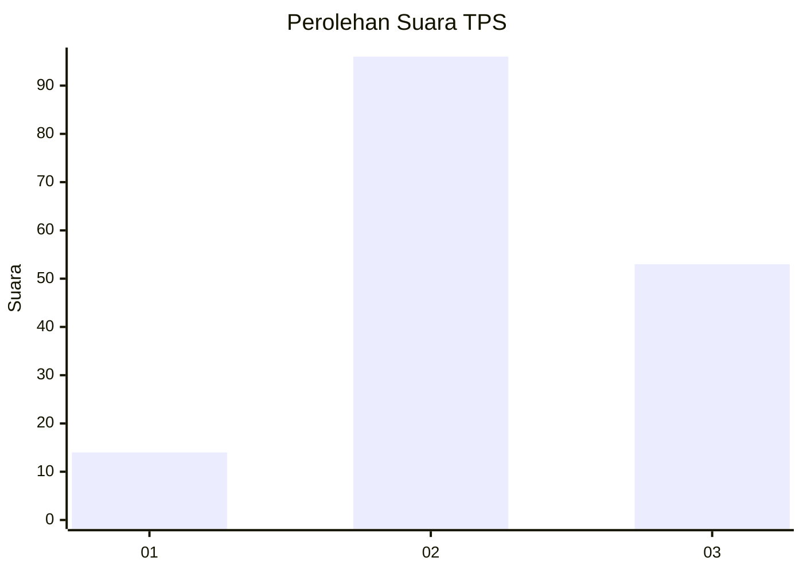
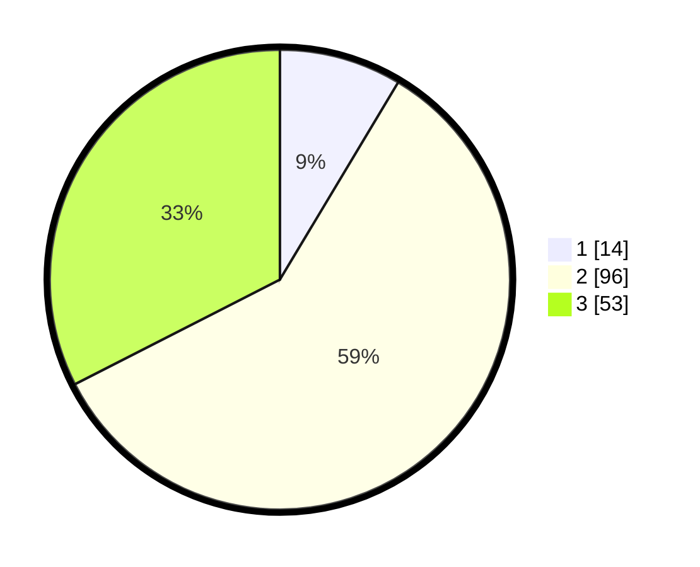

# Hasil

## Grafik

## Tabel

| No. | Nama Paslon    | Suara | Suara (raw) | Persentase |
|:--- |:-------------- | -----:| -----------:| ----------:|
| 1   | ANIES MUHAIMIN | 14    | [14][p-1]   | 8,59       |
| 2   | PRABOWO GIBRAN | 96    | [96][p-2]   | 58,90      |
| 3   | GANJAR MAHFUD  | 53    | [53][p-3]   | 32,52      |

[p-1]: https://github.com/gigit-pemilu/pemilu-2024-91-papua/blob/main/pilpres/hitung-suara/sub/91-papua/sub/15-waropen/sub/08-urei-faisei/sub/2012-ronggaiwa/sub/001-tps/sub/paslon-1.txt
[p-2]: https://github.com/gigit-pemilu/pemilu-2024-91-papua/blob/main/pilpres/hitung-suara/sub/91-papua/sub/15-waropen/sub/08-urei-faisei/sub/2012-ronggaiwa/sub/001-tps/sub/paslon-2.txt
[p-3]: https://github.com/gigit-pemilu/pemilu-2024-91-papua/blob/main/pilpres/hitung-suara/sub/91-papua/sub/15-waropen/sub/08-urei-faisei/sub/2012-ronggaiwa/sub/001-tps/sub/paslon-3.txt

## Foto C Plano

https://sirekap-obj-formc.kpu.go.id/3435/pemilu/ppwp/91/15/08/20/12/9115082012001-20240216-112002--fb72449c-25c5-401e-9a24-698f04cad942.jpg

https://sirekap-obj-formc.kpu.go.id/3435/pemilu/ppwp/91/15/08/20/12/9115082012001-20240215-145748--07d3ec87-3b18-49da-9595-94674e436472.jpg

https://sirekap-obj-formc.kpu.go.id/3435/pemilu/ppwp/91/15/08/20/12/9115082012001-20240215-150029--e4ac4c0b-fd8c-4f8a-8664-fed0b5387421.jpg

## Metadata

| Key        | Value               |
| ---------- | ------------------- |
| Time Stamp | 2024-02-25 11:00:00 |

