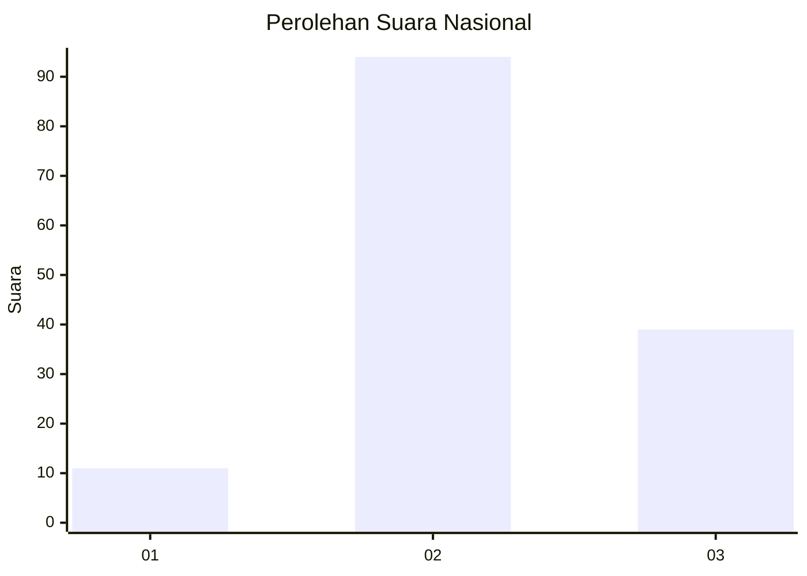
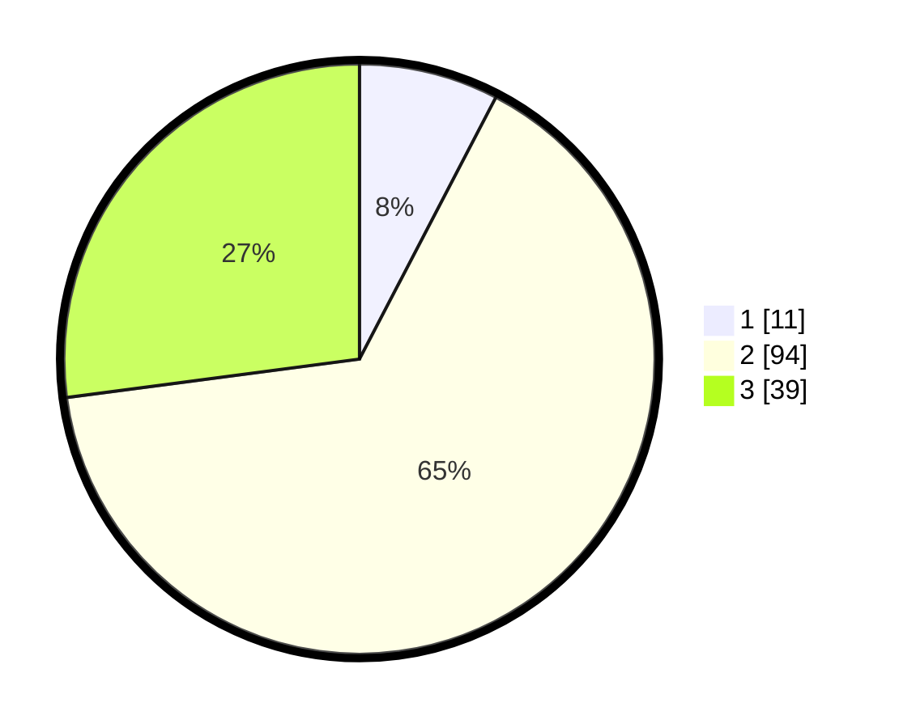

# Hasil

## Grafik

## Tabel

| No. | Nama Paslon    | Suara | Suara (raw) | Persentase |
|:--- |:-------------- | -----:| -----------:| ----------:|
| 1   | ANIES MUHAIMIN | 11    | [11][p-1]   | 7,64       |
| 2   | PRABOWO GIBRAN | 94    | [94][p-2]   | 65,28      |
| 3   | GANJAR MAHFUD  | 39    | [39][p-3]   | 27,08      |

[p-1]: https://github.com/gigit-pemilu/pemilu-2024/blob/main/pilpres/hitung-suara/sub/91-papua/sub/15-waropen/sub/08-urei-faisei/sub/2012-ronggaiwa/sub/002-tps/sub/paslon-1.txt
[p-2]: https://github.com/gigit-pemilu/pemilu-2024/blob/main/pilpres/hitung-suara/sub/91-papua/sub/15-waropen/sub/08-urei-faisei/sub/2012-ronggaiwa/sub/002-tps/sub/paslon-2.txt
[p-3]: https://github.com/gigit-pemilu/pemilu-2024/blob/main/pilpres/hitung-suara/sub/91-papua/sub/15-waropen/sub/08-urei-faisei/sub/2012-ronggaiwa/sub/002-tps/sub/paslon-3.txt

## Foto C Plano

https://sirekap-obj-formc.kpu.go.id/8da7/pemilu/ppwp/91/15/08/20/12/9115082012002-20240215-220635--f41dfc87-8199-47ce-baf7-00c210f2cfc0.jpg

https://sirekap-obj-formc.kpu.go.id/8da7/pemilu/ppwp/91/15/08/20/12/9115082012002-20240215-145000--03ca3322-8db9-481c-952c-6d6ff581662b.jpg

https://sirekap-obj-formc.kpu.go.id/8da7/pemilu/ppwp/91/15/08/20/12/9115082012002-20240215-145146--9e607746-7071-4c04-bd19-2f31f7b4a8d1.jpg

## Metadata

| Key        | Value               |
| ---------- | ------------------- |
| Time Stamp | 2024-02-25 13:00:00 |

