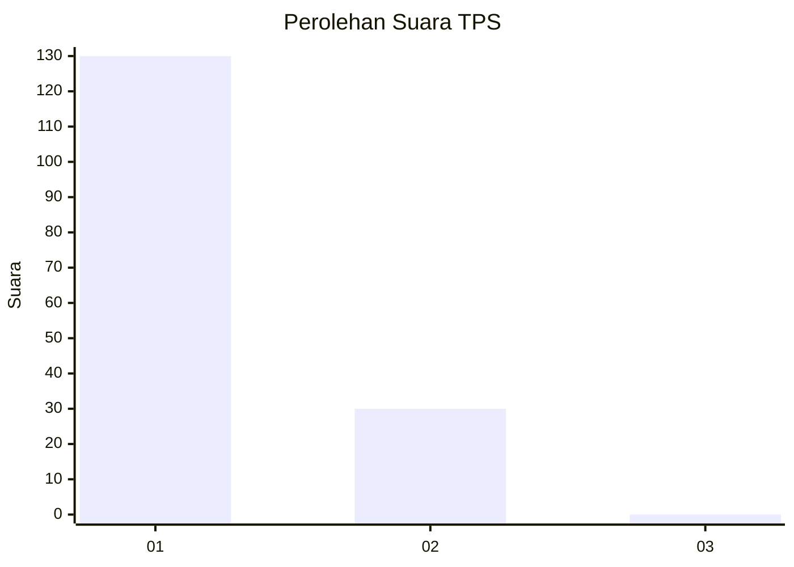
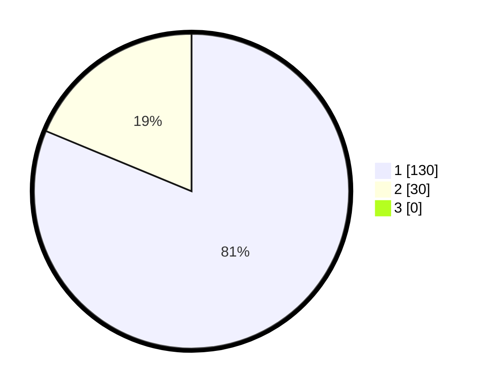

# Hasil

## Grafik

## Tabel

| No. | Nama Paslon    | Suara | Suara (raw) | Persentase |
|:--- |:-------------- | -----:| -----------:| ----------:|
| 1   | ANIES MUHAIMIN | 130   | [130][p-1]  | 81,25      |
| 2   | PRABOWO GIBRAN | 30    | [30][p-2]   | 18,75      |
| 3   | GANJAR MAHFUD  | 0     | [0][p-3]    | 0,00       |

[p-1]: https://github.com/gigit-pemilu/pemilu-2024-91-papua/blob/main/pilpres/hitung-suara/sub/91-papua/sub/15-waropen/sub/09-inggerus/sub/2008-otodemo/sub/001-tps/sub/paslon-1.txt
[p-2]: https://github.com/gigit-pemilu/pemilu-2024-91-papua/blob/main/pilpres/hitung-suara/sub/91-papua/sub/15-waropen/sub/09-inggerus/sub/2008-otodemo/sub/001-tps/sub/paslon-2.txt
[p-3]: https://github.com/gigit-pemilu/pemilu-2024-91-papua/blob/main/pilpres/hitung-suara/sub/91-papua/sub/15-waropen/sub/09-inggerus/sub/2008-otodemo/sub/001-tps/sub/paslon-3.txt

## Foto C Plano

https://sirekap-obj-formc.kpu.go.id/fd04/pemilu/ppwp/91/15/09/20/08/9115092008001-20240221-193936--eb35174c-bcb1-4bf9-8dd9-8f874e248b82.jpg

https://sirekap-obj-formc.kpu.go.id/fd04/pemilu/ppwp/91/15/09/20/08/9115092008001-20240221-194041--0f5ee74c-3472-4269-a8d6-16f7840cece3.jpg

https://sirekap-obj-formc.kpu.go.id/fd04/pemilu/ppwp/91/15/09/20/08/9115092008001-20240221-194155--1867d6f2-1d3e-474e-9613-55224c7493ee.jpg

## Metadata

| Key        | Value               |
| ---------- | ------------------- |
| Time Stamp | 2024-02-24 23:00:00 |

