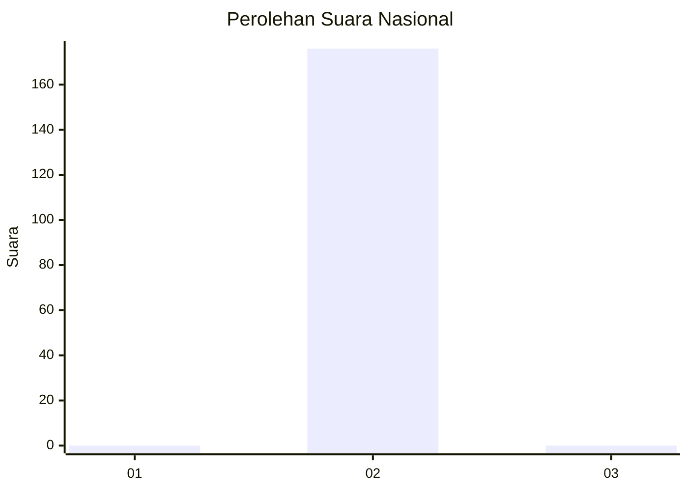
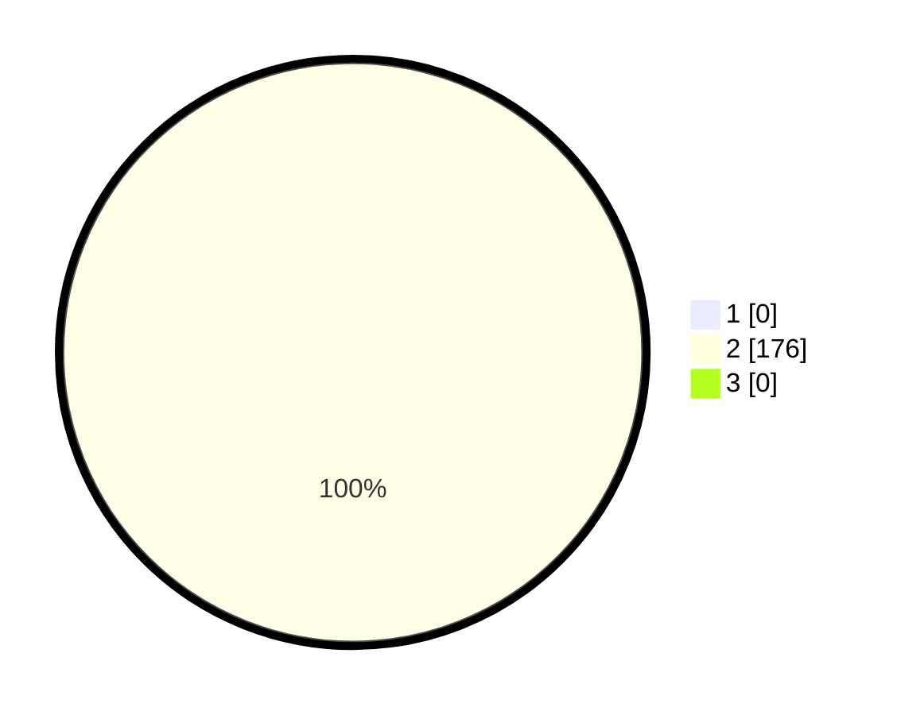

# Hasil

## Grafik

## Tabel

| No. | Nama Paslon    | Suara | Suara (raw) | Persentase |
|:--- |:-------------- | -----:| -----------:| ----------:|
| 1   | ANIES MUHAIMIN | 0     | [0][p-1]    | 0,00       |
| 2   | PRABOWO GIBRAN | 176   | [176][p-2]  | 100,00     |
| 3   | GANJAR MAHFUD  | 0     | [0][p-3]    | 0,00       |

[p-1]: https://github.com/gigit-pemilu/pemilu-2024/blob/main/pilpres/hitung-suara/sub/91-papua/sub/15-waropen/sub/09-inggerus/sub/2008-otodemo/sub/002-tps/sub/paslon-1.txt
[p-2]: https://github.com/gigit-pemilu/pemilu-2024/blob/main/pilpres/hitung-suara/sub/91-papua/sub/15-waropen/sub/09-inggerus/sub/2008-otodemo/sub/002-tps/sub/paslon-2.txt
[p-3]: https://github.com/gigit-pemilu/pemilu-2024/blob/main/pilpres/hitung-suara/sub/91-papua/sub/15-waropen/sub/09-inggerus/sub/2008-otodemo/sub/002-tps/sub/paslon-3.txt

## Foto C Plano

https://sirekap-obj-formc.kpu.go.id/f1b5/pemilu/ppwp/91/15/09/20/08/9115092008002-20240221-203728--94e15aa2-4569-463e-8703-ef96fef40b75.jpg

https://sirekap-obj-formc.kpu.go.id/f1b5/pemilu/ppwp/91/15/09/20/08/9115092008002-20240221-203808--961184e1-321c-41fe-b40c-615649e7822c.jpg

https://sirekap-obj-formc.kpu.go.id/f1b5/pemilu/ppwp/91/15/09/20/08/9115092008002-20240221-205246--5f11c4cd-7ded-4779-9a3e-f7b0810a3794.jpg

## Metadata

| Key        | Value               |
| ---------- | ------------------- |
| Time Stamp | 2024-02-25 12:00:00 |

