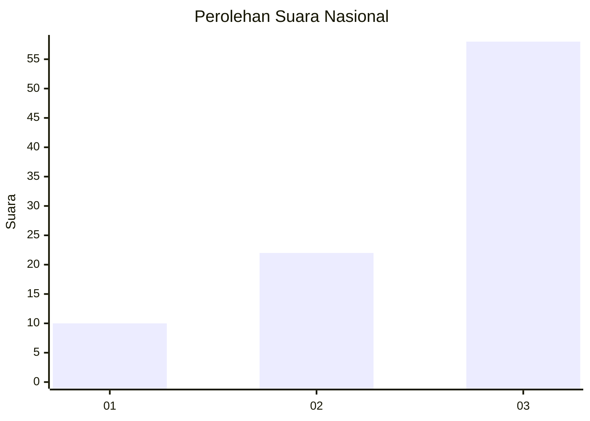
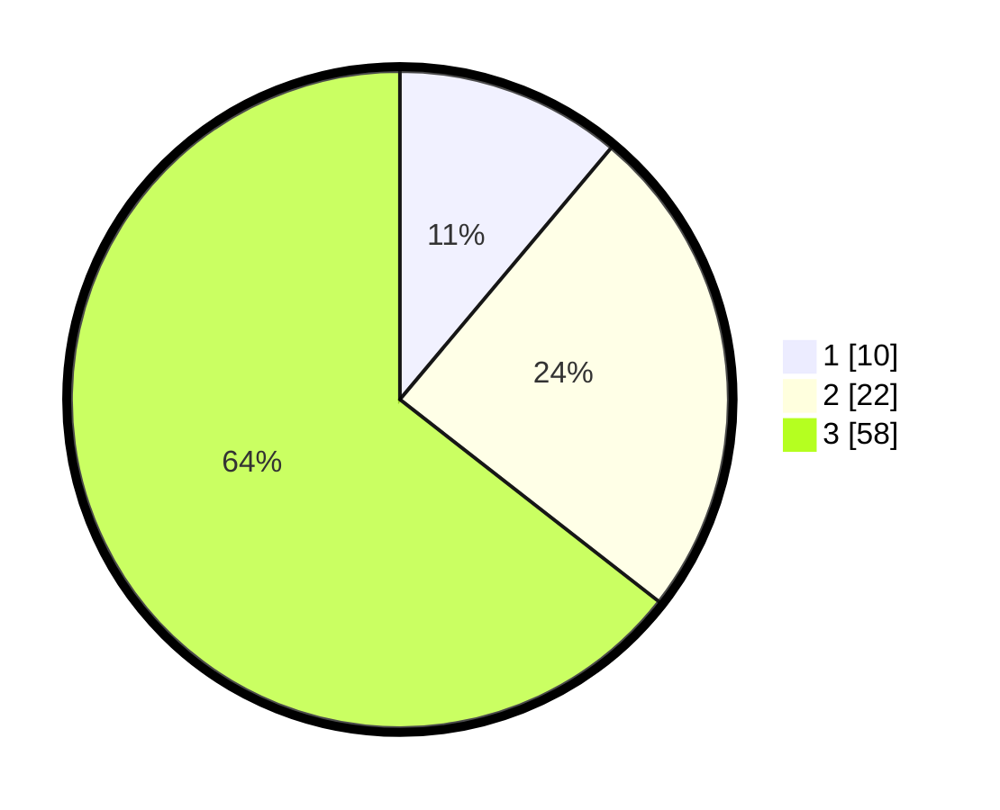

# Hasil

## Grafik

## Tabel

| No. | Nama Paslon    | Suara | Suara (raw) | Persentase |
|:--- |:-------------- | -----:| -----------:| ----------:|
| 1   | ANIES MUHAIMIN | 10    | [10][p-1]   | 11,11      |
| 2   | PRABOWO GIBRAN | 22    | [22][p-2]   | 24,44      |
| 3   | GANJAR MAHFUD  | 58    | [58][p-3]   | 64,44      |

[p-1]: https://github.com/gigit-pemilu/pemilu-2024/blob/main/pilpres/hitung-suara/sub/91-papua/sub/15-waropen/sub/09-inggerus/sub/2012-firo/sub/001-tps/sub/paslon-1.txt
[p-2]: https://github.com/gigit-pemilu/pemilu-2024/blob/main/pilpres/hitung-suara/sub/91-papua/sub/15-waropen/sub/09-inggerus/sub/2012-firo/sub/001-tps/sub/paslon-2.txt
[p-3]: https://github.com/gigit-pemilu/pemilu-2024/blob/main/pilpres/hitung-suara/sub/91-papua/sub/15-waropen/sub/09-inggerus/sub/2012-firo/sub/001-tps/sub/paslon-3.txt

## Foto C Plano

https://sirekap-obj-formc.kpu.go.id/69b6/pemilu/ppwp/91/15/09/20/12/9115092012001-20240221-190805--65f5a001-687b-48b4-b55f-efd2cf09e64c.jpg

https://sirekap-obj-formc.kpu.go.id/69b6/pemilu/ppwp/91/15/09/20/12/9115092012001-20240221-190959--e6eb1d6c-3740-4462-b328-0c32959f26dd.jpg

https://sirekap-obj-formc.kpu.go.id/69b6/pemilu/ppwp/91/15/09/20/12/9115092012001-20240221-191109--6d8cb334-fdf1-4a5a-8116-d5173b66a646.jpg

## Metadata

| Key        | Value               |
| ---------- | ------------------- |
| Time Stamp | 2024-02-25 05:00:00 |

## DATA PEMILIH TETAP

Jumlah pemilih dalam DPT: **102**.
 * L: **53**.
 * P: **49**.

## DATA PENGGUNA HAK PILIH

Jumlah pengguna hak pilih dalam DPT: **90**.
 * L: **46**.
 * P: **44**.

Jumlah pengguna hak pilih dalam DPTb: **0**.
 * L: **0**.
 * P: **0**.

Jumlah pengguna hak pilih dalam DPK: **0**.
 * L: **0**.
 * P: **0**.

Jumlah pengguna hak pilih: **90**.
 * L: **46**.
 * P: **44**.

## JUMLAH SUARA SAH DAN TIDAK SAH

JUMLAH SELURUH SUARA SAH: **90**.

JUMLAH SUARA TIDAK SAH: **0**.

JUMLAH SELURUH SUARA SAH DAN SUARA TIDAK SAH: **90**.

