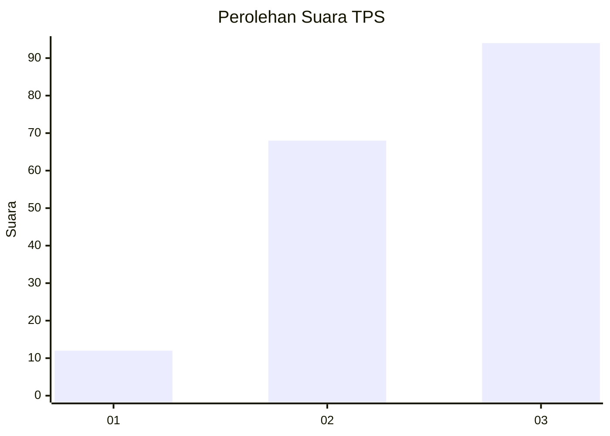
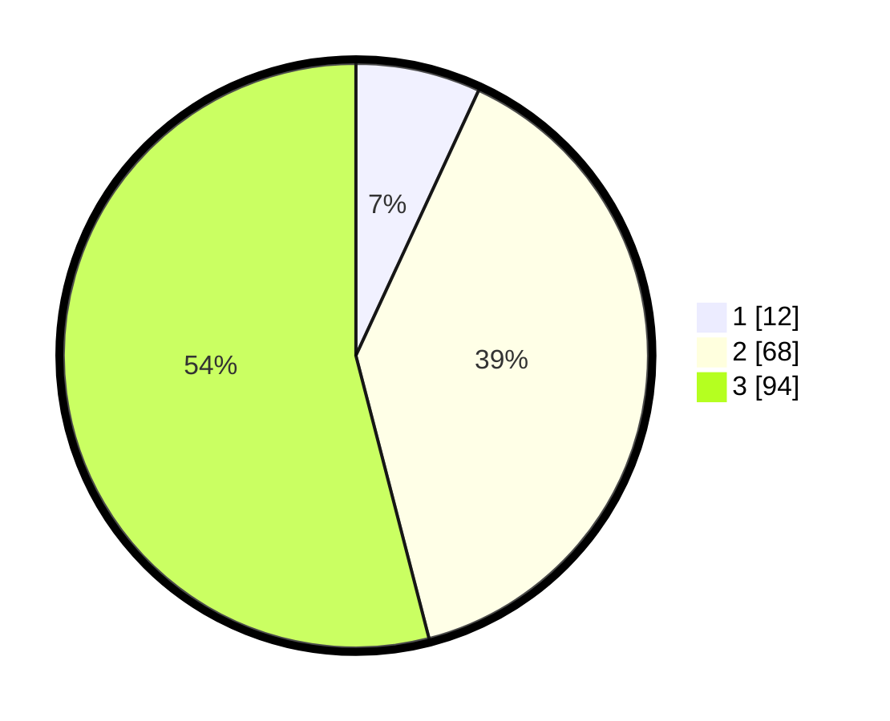

# Hasil

## Grafik

## Tabel

| No. | Nama Paslon    | Suara | Suara (raw) | Persentase |
|:--- |:-------------- | -----:| -----------:| ----------:|
| 1   | ANIES MUHAIMIN | 12    | [12][p-1]   | 6,90       |
| 2   | PRABOWO GIBRAN | 68    | [68][p-2]   | 39,08      |
| 3   | GANJAR MAHFUD  | 94    | [94][p-3]   | 54,02      |

[p-1]: https://github.com/gigit-pemilu/pemilu-2024-91-papua/blob/main/pilpres/hitung-suara/sub/91-papua/sub/15-waropen/sub/11-oudate/sub/2004-nau/sub/002-tps/sub/paslon-1.txt
[p-2]: https://github.com/gigit-pemilu/pemilu-2024-91-papua/blob/main/pilpres/hitung-suara/sub/91-papua/sub/15-waropen/sub/11-oudate/sub/2004-nau/sub/002-tps/sub/paslon-2.txt
[p-3]: https://github.com/gigit-pemilu/pemilu-2024-91-papua/blob/main/pilpres/hitung-suara/sub/91-papua/sub/15-waropen/sub/11-oudate/sub/2004-nau/sub/002-tps/sub/paslon-3.txt

## Foto C Plano

https://sirekap-obj-formc.kpu.go.id/926f/pemilu/ppwp/91/15/11/20/04/9115112004002-20240216-130752--6b884f1f-bed8-40f3-af03-55ddcea2b447.jpg

https://sirekap-obj-formc.kpu.go.id/926f/pemilu/ppwp/91/15/11/20/04/9115112004002-20240216-130911--7ad82ae0-5a5a-4376-91a2-be1e2cc5d046.jpg

https://sirekap-obj-formc.kpu.go.id/926f/pemilu/ppwp/91/15/11/20/04/9115112004002-20240216-131014--aab8b41e-c42c-429f-b5cc-8aa70e15b958.jpg

## Metadata

| Key        | Value               |
| ---------- | ------------------- |
| Time Stamp | 2024-02-16 13:30:32 |

## DATA PEMILIH TETAP

Jumlah pemilih dalam DPT: **178**.
 * L: **882**.
 * P: **887**.

## DATA PENGGUNA HAK PILIH

Jumlah pengguna hak pilih dalam DPT: **179**.
 * L: **887**.
 * P: **884**.

Jumlah pengguna hak pilih dalam DPTb: **0**.
 * L: **0**.
 * P: **0**.

Jumlah pengguna hak pilih dalam DPK: **0**.
 * L: **0**.
 * P: **0**.

Jumlah pengguna hak pilih: **0**.
 * L: **0**.
 * P: **0**.

## JUMLAH SUARA SAH DAN TIDAK SAH

JUMLAH SELURUH SUARA SAH: **179**.

JUMLAH SUARA TIDAK SAH: **842**.

JUMLAH SELURUH SUARA SAH DAN SUARA TIDAK SAH: **170**.

