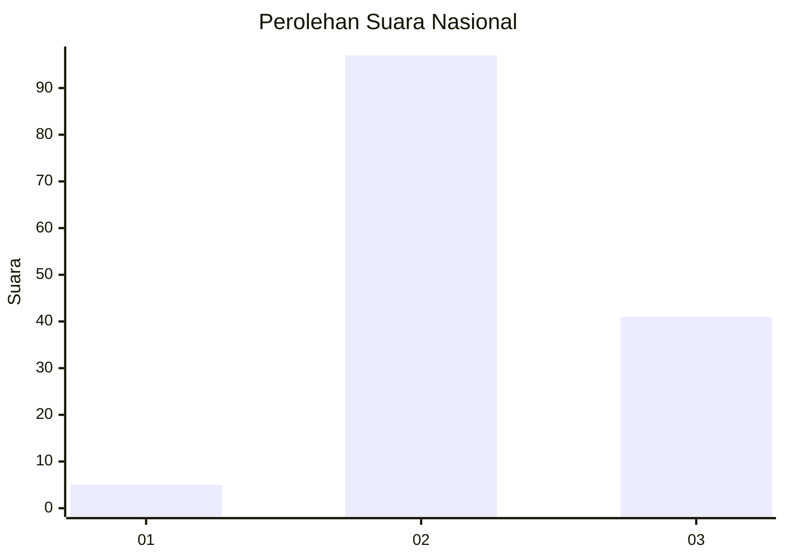
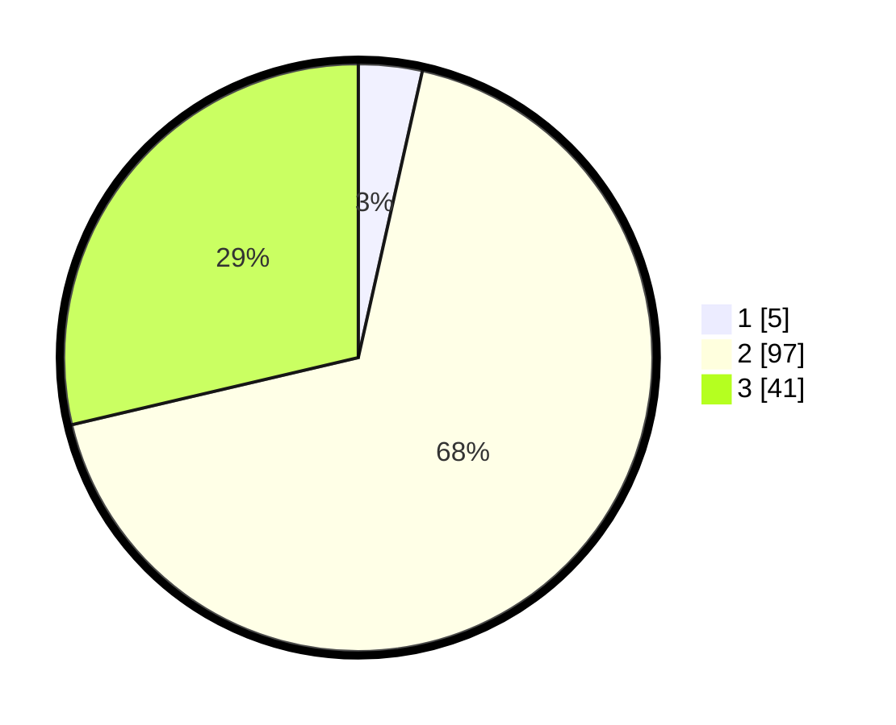

# Hasil

## Grafik

## Tabel

| No. | Nama Paslon    | Suara | Suara (raw) | Persentase |
|:--- |:-------------- | -----:| -----------:| ----------:|
| 1   | ANIES MUHAIMIN | 5     | [5][p-1]    | 3,50       |
| 2   | PRABOWO GIBRAN | 97    | [97][p-2]   | 67,83      |
| 3   | GANJAR MAHFUD  | 41    | [41][p-3]   | 28,67      |

[p-1]: https://github.com/gigit-pemilu/pemilu-2024/blob/main/pilpres/hitung-suara/sub/91-papua/sub/15-waropen/sub/11-oudate/sub/2006-ruambak-jaya/sub/001-tps/sub/paslon-1.txt
[p-2]: https://github.com/gigit-pemilu/pemilu-2024/blob/main/pilpres/hitung-suara/sub/91-papua/sub/15-waropen/sub/11-oudate/sub/2006-ruambak-jaya/sub/001-tps/sub/paslon-2.txt
[p-3]: https://github.com/gigit-pemilu/pemilu-2024/blob/main/pilpres/hitung-suara/sub/91-papua/sub/15-waropen/sub/11-oudate/sub/2006-ruambak-jaya/sub/001-tps/sub/paslon-3.txt

## Foto C Plano

https://sirekap-obj-formc.kpu.go.id/0da9/pemilu/ppwp/91/15/11/20/06/9115112006001-20240218-074515--c073af10-96de-4200-8fa1-74394dcea636.jpg

https://sirekap-obj-formc.kpu.go.id/0da9/pemilu/ppwp/91/15/11/20/06/9115112006001-20240218-074800--3a44b02e-ca9a-43c0-af55-a2c71a389043.jpg

https://sirekap-obj-formc.kpu.go.id/0da9/pemilu/ppwp/91/15/11/20/06/9115112006001-20240218-074922--863b0d1d-ab78-4fc2-a6f4-79c3970017d8.jpg

## Metadata

| Key        | Value               |
| ---------- | ------------------- |
| Time Stamp | 2024-02-25 13:00:00 |

