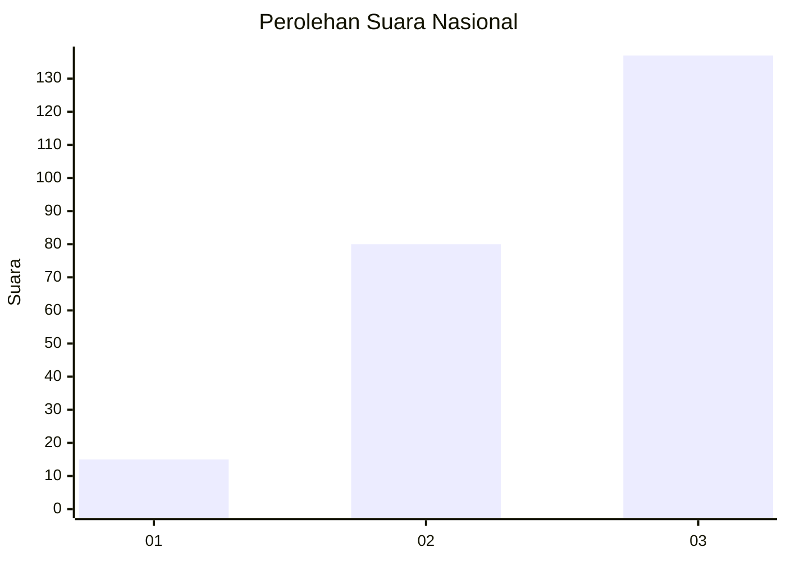
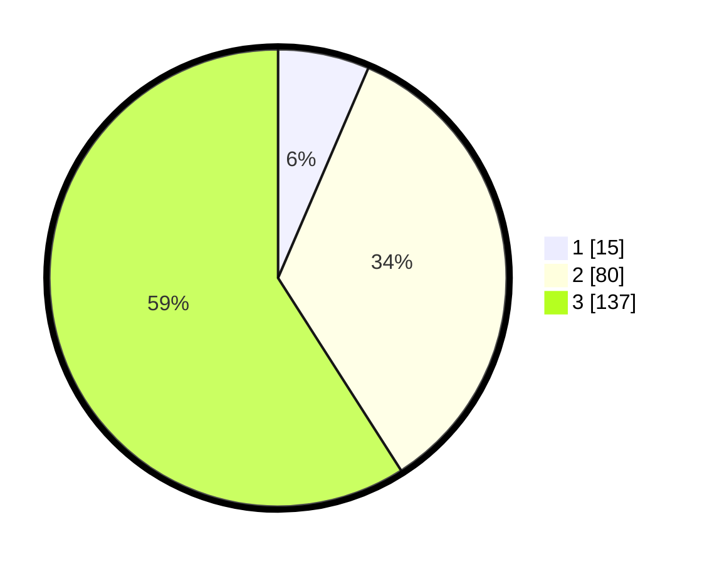

# Hasil

## Grafik

## Tabel

| No. | Nama Paslon    | Suara | Suara (raw) | Persentase |
|:--- |:-------------- | -----:| -----------:| ----------:|
| 1   | ANIES MUHAIMIN | 15    | [15][p-1]   | 6,47       |
| 2   | PRABOWO GIBRAN | 80    | [80][p-2]   | 34,48      |
| 3   | GANJAR MAHFUD  | 137   | [137][p-3]  | 59,05      |

[p-1]: https://github.com/gigit-pemilu/pemilu-2024/blob/main/pilpres/hitung-suara/sub/91-papua/sub/15-waropen/sub/11-oudate/sub/2007-moroa/sub/001-tps/sub/paslon-1.txt
[p-2]: https://github.com/gigit-pemilu/pemilu-2024/blob/main/pilpres/hitung-suara/sub/91-papua/sub/15-waropen/sub/11-oudate/sub/2007-moroa/sub/001-tps/sub/paslon-2.txt
[p-3]: https://github.com/gigit-pemilu/pemilu-2024/blob/main/pilpres/hitung-suara/sub/91-papua/sub/15-waropen/sub/11-oudate/sub/2007-moroa/sub/001-tps/sub/paslon-3.txt

## Foto C Plano

https://sirekap-obj-formc.kpu.go.id/abbd/pemilu/ppwp/91/15/11/20/07/9115112007001-20240216-074534--23ffa4df-e7b8-463f-accb-50b26c630a6f.jpg

https://sirekap-obj-formc.kpu.go.id/abbd/pemilu/ppwp/91/15/11/20/07/9115112007001-20240216-074234--914691d5-9333-48b9-8c23-163caa8d26b1.jpg

https://sirekap-obj-formc.kpu.go.id/abbd/pemilu/ppwp/91/15/11/20/07/9115112007001-20240216-074350--f9448dd0-8da4-4faa-a1d5-ffdf63e715a1.jpg

## Metadata

| Key        | Value               |
| ---------- | ------------------- |
| Time Stamp | 2024-02-16 14:00:34 |

