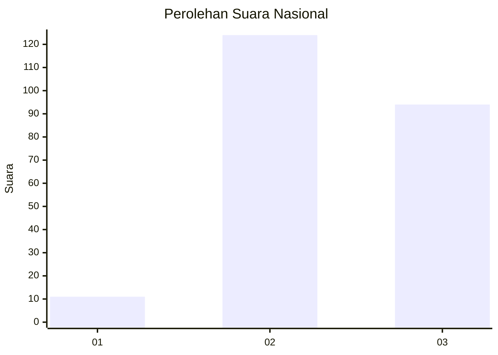
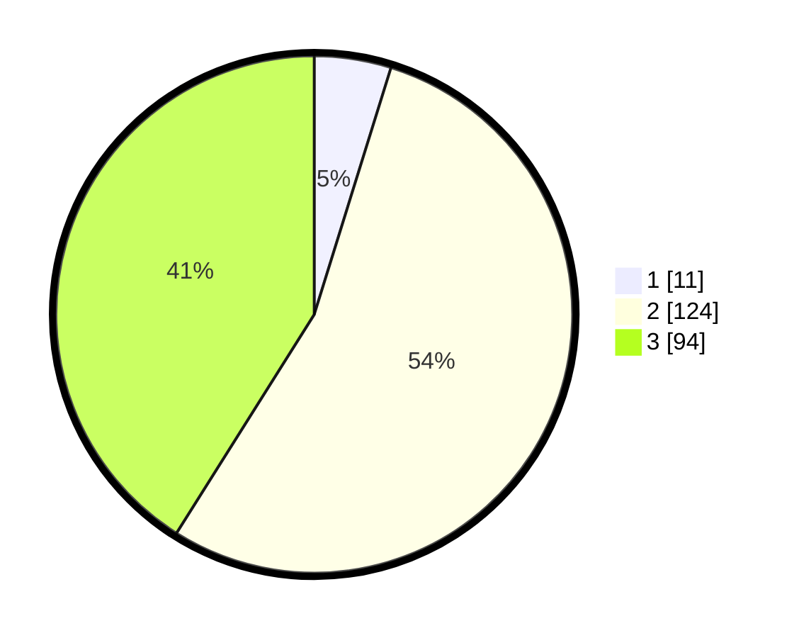

# Hasil

## Grafik

## Tabel

| No. | Nama Paslon    | Suara | Suara (raw) | Persentase |
|:--- |:-------------- | -----:| -----------:| ----------:|
| 1   | ANIES MUHAIMIN | 11    | [11][p-1]   | 4,80       |
| 2   | PRABOWO GIBRAN | 124   | [124][p-2]  | 54,15      |
| 3   | GANJAR MAHFUD  | 94    | [94][p-3]   | 41,05      |

[p-1]: https://github.com/gigit-pemilu/pemilu-2024/blob/main/pilpres/hitung-suara/sub/91-papua/sub/15-waropen/sub/12-wapoga/sub/2002-pirare/sub/001-tps/sub/paslon-1.txt
[p-2]: https://github.com/gigit-pemilu/pemilu-2024/blob/main/pilpres/hitung-suara/sub/91-papua/sub/15-waropen/sub/12-wapoga/sub/2002-pirare/sub/001-tps/sub/paslon-2.txt
[p-3]: https://github.com/gigit-pemilu/pemilu-2024/blob/main/pilpres/hitung-suara/sub/91-papua/sub/15-waropen/sub/12-wapoga/sub/2002-pirare/sub/001-tps/sub/paslon-3.txt

## Foto C Plano

https://sirekap-obj-formc.kpu.go.id/6d21/pemilu/ppwp/91/15/12/20/02/9115122002001-20240215-134843--93240c16-cfda-4542-b762-299082efb41e.jpg

https://sirekap-obj-formc.kpu.go.id/6d21/pemilu/ppwp/91/15/12/20/02/9115122002001-20240215-135155--cde2452e-4952-4cc6-9159-6ec00d078ec9.jpg

https://sirekap-obj-formc.kpu.go.id/6d21/pemilu/ppwp/91/15/12/20/02/9115122002001-20240215-135750--58f882e9-53f2-4b45-9c13-18d84fa39d23.jpg

## Metadata

| Key        | Value               |
| ---------- | ------------------- |
| Time Stamp | 2024-02-25 12:00:00 |

