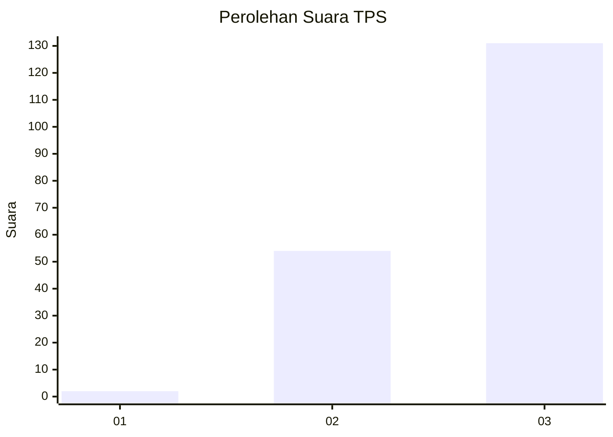
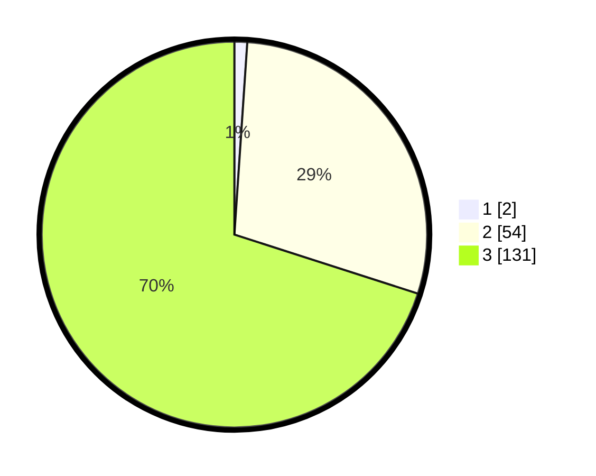

# Hasil

## Grafik

## Tabel

| No. | Nama Paslon    | Suara | Suara (raw) | Persentase |
|:--- |:-------------- | -----:| -----------:| ----------:|
| 1   | ANIES MUHAIMIN | 2     | [2][p-1]    | 1,07       |
| 2   | PRABOWO GIBRAN | 54    | [54][p-2]   | 28,88      |
| 3   | GANJAR MAHFUD  | 131   | [131][p-3]  | 70,05      |

[p-1]: https://github.com/gigit-pemilu/pemilu-2024-91-papua/blob/main/pilpres/hitung-suara/sub/91-papua/sub/15-waropen/sub/12-wapoga/sub/2004-syewa-merare/sub/001-tps/sub/paslon-1.txt
[p-2]: https://github.com/gigit-pemilu/pemilu-2024-91-papua/blob/main/pilpres/hitung-suara/sub/91-papua/sub/15-waropen/sub/12-wapoga/sub/2004-syewa-merare/sub/001-tps/sub/paslon-2.txt
[p-3]: https://github.com/gigit-pemilu/pemilu-2024-91-papua/blob/main/pilpres/hitung-suara/sub/91-papua/sub/15-waropen/sub/12-wapoga/sub/2004-syewa-merare/sub/001-tps/sub/paslon-3.txt

## Foto C Plano

https://sirekap-obj-formc.kpu.go.id/62c1/pemilu/ppwp/91/15/12/20/04/9115122004001-20240216-154326--387a8994-881e-4011-bfd2-d76317c2421e.jpg

https://sirekap-obj-formc.kpu.go.id/62c1/pemilu/ppwp/91/15/12/20/04/9115122004001-20240216-155223--1b71e2c6-79ae-48fa-b943-2c1b8e898835.jpg

https://sirekap-obj-formc.kpu.go.id/62c1/pemilu/ppwp/91/15/12/20/04/9115122004001-20240216-155614--48123fbd-0a77-4b96-acce-79d7ea4ebb75.jpg

## Metadata

| Key        | Value               |
| ---------- | ------------------- |
| Time Stamp | 2024-02-25 08:00:00 |

