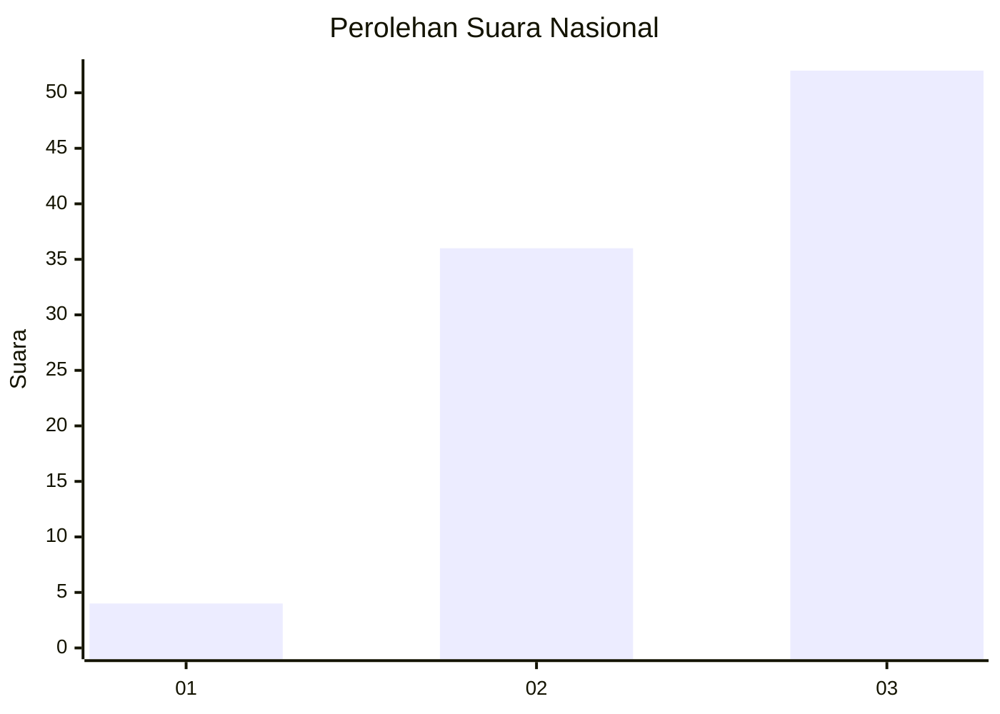
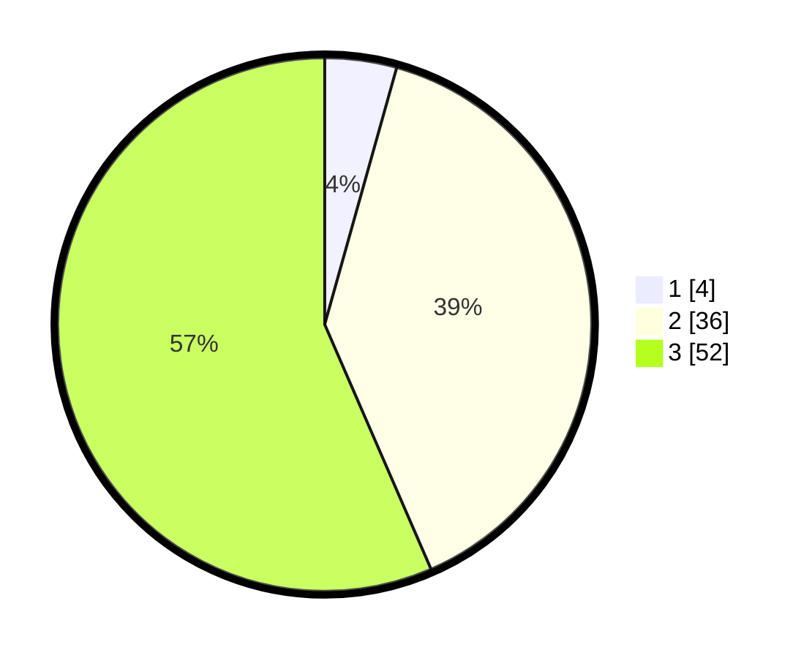

# Hasil

## Grafik

## Tabel

| No. | Nama Paslon    | Suara | Suara (raw) | Persentase |
|:--- |:-------------- | -----:| -----------:| ----------:|
| 1   | ANIES MUHAIMIN | 4     | [4][p-1]    | 4,35       |
| 2   | PRABOWO GIBRAN | 36    | [36][p-2]   | 39,13      |
| 3   | GANJAR MAHFUD  | 52    | [52][p-3]   | 56,52      |

[p-1]: https://github.com/gigit-pemilu/pemilu-2024/blob/main/pilpres/hitung-suara/sub/91-papua/sub/15-waropen/sub/13-demba/sub/2001-urato/sub/001-tps/sub/paslon-1.txt
[p-2]: https://github.com/gigit-pemilu/pemilu-2024/blob/main/pilpres/hitung-suara/sub/91-papua/sub/15-waropen/sub/13-demba/sub/2001-urato/sub/001-tps/sub/paslon-2.txt
[p-3]: https://github.com/gigit-pemilu/pemilu-2024/blob/main/pilpres/hitung-suara/sub/91-papua/sub/15-waropen/sub/13-demba/sub/2001-urato/sub/001-tps/sub/paslon-3.txt

## Foto C Plano

https://sirekap-obj-formc.kpu.go.id/307f/pemilu/ppwp/91/15/13/20/01/9115132001001-20240218-234456--78141da5-8b0d-459c-a149-44836a1799c6.jpg

https://sirekap-obj-formc.kpu.go.id/307f/pemilu/ppwp/91/15/13/20/01/9115132001001-20240218-224951--77a1846f-6e16-4727-8b04-05fefafca498.jpg

https://sirekap-obj-formc.kpu.go.id/307f/pemilu/ppwp/91/15/13/20/01/9115132001001-20240218-225153--b109e409-d308-456c-9b5f-a416b758f267.jpg

## Metadata

| Key        | Value               |
| ---------- | ------------------- |
| Time Stamp | 2024-02-19 06:16:00 |

## DATA PEMILIH TETAP

Jumlah pemilih dalam DPT: **100**.
 * L: **52**.
 * P: **48**.

## DATA PENGGUNA HAK PILIH

Jumlah pengguna hak pilih dalam DPT: **49**.
 * L: **49**.
 * P: **44**.

Jumlah pengguna hak pilih dalam DPTb: **0**.
 * L: **0**.
 * P: **0**.

Jumlah pengguna hak pilih dalam DPK: **0**.
 * L: **0**.
 * P: **0**.

Jumlah pengguna hak pilih: **93**.
 * L: **49**.
 * P: **44**.

## JUMLAH SUARA SAH DAN TIDAK SAH

JUMLAH SELURUH SUARA SAH: **92**.

JUMLAH SUARA TIDAK SAH: **1**.

JUMLAH SELURUH SUARA SAH DAN SUARA TIDAK SAH: **93**.

