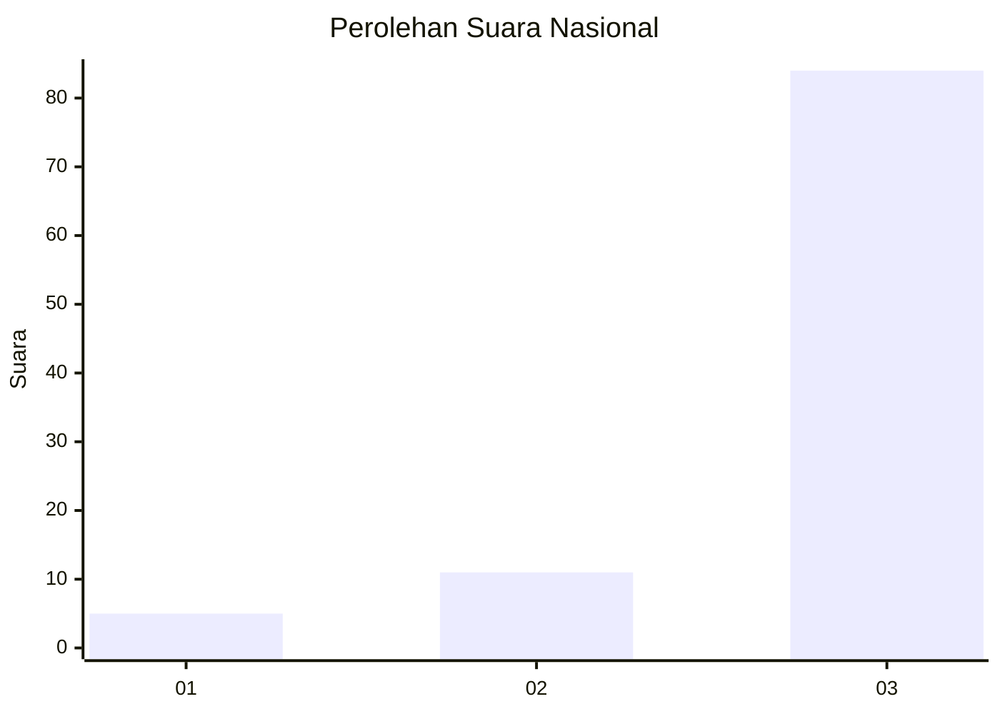
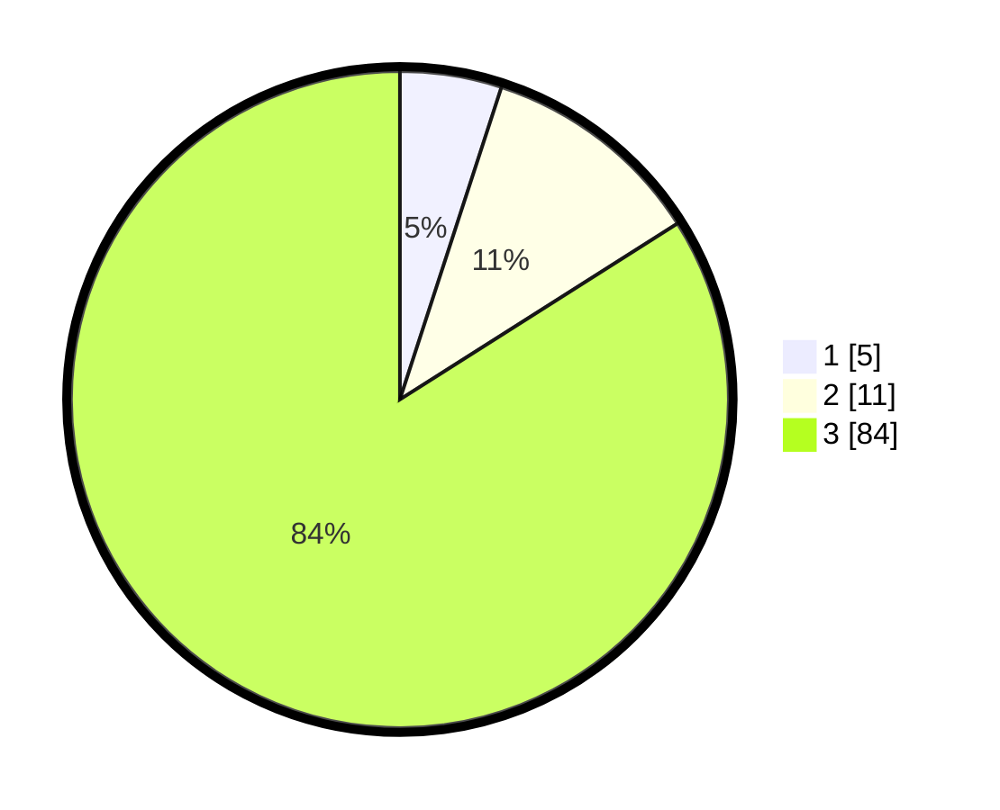

# Hasil

## Grafik

## Tabel

| No. | Nama Paslon    | Suara | Suara (raw) | Persentase |
|:--- |:-------------- | -----:| -----------:| ----------:|
| 1   | ANIES MUHAIMIN | 5     | [5][p-1]    | 5,00       |
| 2   | PRABOWO GIBRAN | 11    | [11][p-2]   | 11,00      |
| 3   | GANJAR MAHFUD  | 84    | [84][p-3]   | 84,00      |

[p-1]: https://github.com/gigit-pemilu/pemilu-2024/blob/main/pilpres/hitung-suara/sub/91-papua/sub/15-waropen/sub/13-demba/sub/2002-mayaghaido/sub/001-tps/sub/paslon-1.txt
[p-2]: https://github.com/gigit-pemilu/pemilu-2024/blob/main/pilpres/hitung-suara/sub/91-papua/sub/15-waropen/sub/13-demba/sub/2002-mayaghaido/sub/001-tps/sub/paslon-2.txt
[p-3]: https://github.com/gigit-pemilu/pemilu-2024/blob/main/pilpres/hitung-suara/sub/91-papua/sub/15-waropen/sub/13-demba/sub/2002-mayaghaido/sub/001-tps/sub/paslon-3.txt

## Foto C Plano

https://sirekap-obj-formc.kpu.go.id/4f9f/pemilu/ppwp/91/15/13/20/02/9115132002001-20240219-134423--5b1a7fe4-2b7c-427a-93eb-cda8c4598a71.jpg

https://sirekap-obj-formc.kpu.go.id/4f9f/pemilu/ppwp/91/15/13/20/02/9115132002001-20240219-122549--b3660f4b-3eec-401d-9b49-7302a4096431.jpg

https://sirekap-obj-formc.kpu.go.id/4f9f/pemilu/ppwp/91/15/13/20/02/9115132002001-20240219-124201--93fee506-5989-4a98-856d-c1712d619697.jpg

## Metadata

| Key        | Value               |
| ---------- | ------------------- |
| Time Stamp | 2024-02-19 14:00:00 |

## DATA PEMILIH TETAP

Jumlah pemilih dalam DPT: **129**.
 * L: **68**.
 * P: **61**.

## DATA PENGGUNA HAK PILIH

Jumlah pengguna hak pilih dalam DPT: **102**.
 * L: **50**.
 * P: **52**.

Jumlah pengguna hak pilih dalam DPTb: **0**.
 * L: **0**.
 * P: **0**.

Jumlah pengguna hak pilih dalam DPK: **0**.
 * L: **0**.
 * P: **0**.

Jumlah pengguna hak pilih: **102**.
 * L: **50**.
 * P: **52**.

## JUMLAH SUARA SAH DAN TIDAK SAH

JUMLAH SELURUH SUARA SAH: **100**.

JUMLAH SUARA TIDAK SAH: **2**.

JUMLAH SELURUH SUARA SAH DAN SUARA TIDAK SAH: **102**.

