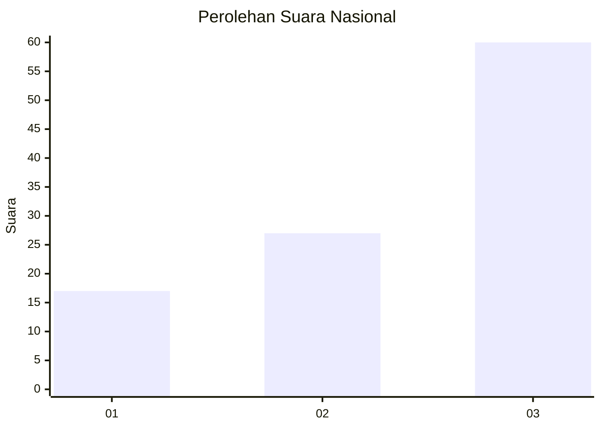
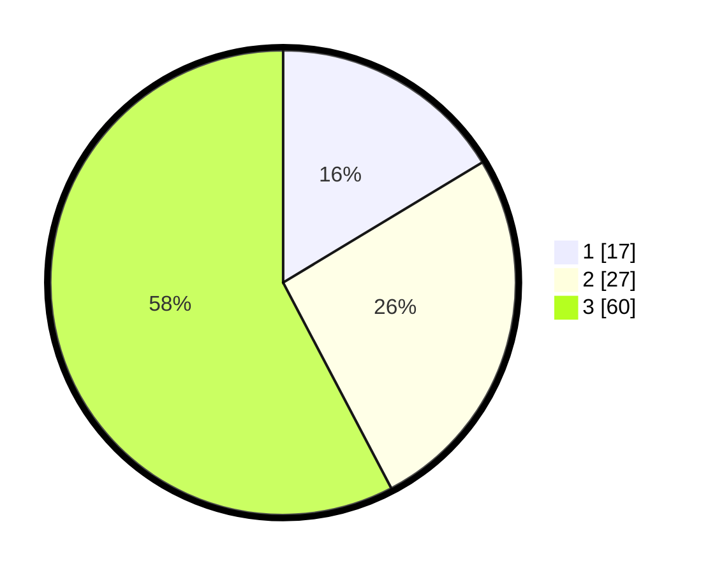

# Hasil

## Grafik

## Tabel

| No. | Nama Paslon    | Suara | Suara (raw) | Persentase |
|:--- |:-------------- | -----:| -----------:| ----------:|
| 1   | ANIES MUHAIMIN | 17    | [17][p-1]   | 16,35      |
| 2   | PRABOWO GIBRAN | 27    | [27][p-2]   | 25,96      |
| 3   | GANJAR MAHFUD  | 60    | [60][p-3]   | 57,69      |

[p-1]: https://github.com/gigit-pemilu/pemilu-2024/blob/main/pilpres/hitung-suara/sub/91-papua/sub/15-waropen/sub/13-demba/sub/2003-aniboi/sub/001-tps/sub/paslon-1.txt
[p-2]: https://github.com/gigit-pemilu/pemilu-2024/blob/main/pilpres/hitung-suara/sub/91-papua/sub/15-waropen/sub/13-demba/sub/2003-aniboi/sub/001-tps/sub/paslon-2.txt
[p-3]: https://github.com/gigit-pemilu/pemilu-2024/blob/main/pilpres/hitung-suara/sub/91-papua/sub/15-waropen/sub/13-demba/sub/2003-aniboi/sub/001-tps/sub/paslon-3.txt

## Foto C Plano

https://sirekap-obj-formc.kpu.go.id/d94c/pemilu/ppwp/91/15/13/20/03/9115132003001-20240220-233509--7f21500e-7ebb-4a69-bc8c-5b2eb0e66e3a.jpg

https://sirekap-obj-formc.kpu.go.id/d94c/pemilu/ppwp/91/15/13/20/03/9115132003001-20240220-234709--f8450c03-f13e-4a1a-b561-0a28555288c3.jpg

https://sirekap-obj-formc.kpu.go.id/d94c/pemilu/ppwp/91/15/13/20/03/9115132003001-20240221-000818--c1be6a62-da89-4a3c-ae58-b5a7aec12133.jpg

## Metadata

| Key        | Value               |
| ---------- | ------------------- |
| Time Stamp | 2024-02-24 22:31:28 |

## DATA PEMILIH TETAP

Jumlah pemilih dalam DPT: **105**.
 * L: **59**.
 * P: **46**.

## DATA PENGGUNA HAK PILIH

Jumlah pengguna hak pilih dalam DPT: **105**.
 * L: **59**.
 * P: **46**.

Jumlah pengguna hak pilih dalam DPTb: **0**.
 * L: **0**.
 * P: **0**.

Jumlah pengguna hak pilih dalam DPK: **0**.
 * L: **0**.
 * P: **0**.

Jumlah pengguna hak pilih: **105**.
 * L: **59**.
 * P: **46**.

## JUMLAH SUARA SAH DAN TIDAK SAH

JUMLAH SELURUH SUARA SAH: **104**.

JUMLAH SUARA TIDAK SAH: **1**.

JUMLAH SELURUH SUARA SAH DAN SUARA TIDAK SAH: **105**.

