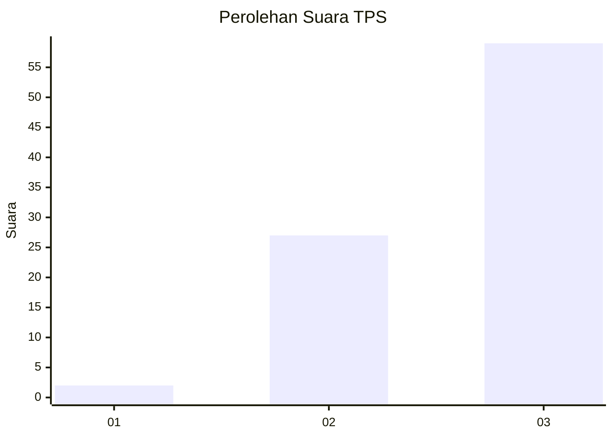
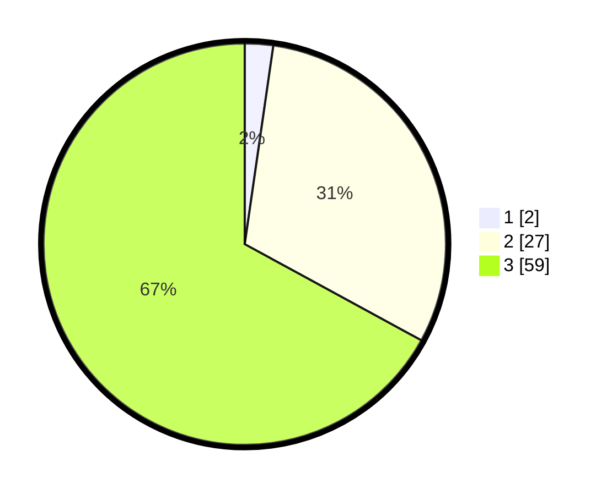

# Hasil

## Grafik

## Tabel

| No. | Nama Paslon    | Suara | Suara (raw) | Persentase |
|:--- |:-------------- | -----:| -----------:| ----------:|
| 1   | ANIES MUHAIMIN | 2     | [2][p-1]    | 2,27       |
| 2   | PRABOWO GIBRAN | 27    | [27][p-2]   | 30,68      |
| 3   | GANJAR MAHFUD  | 59    | [59][p-3]   | 67,05      |

[p-1]: https://github.com/gigit-pemilu/pemilu-2024-91-papua/blob/main/pilpres/hitung-suara/sub/91-papua/sub/15-waropen/sub/13-demba/sub/2007-tetui/sub/001-tps/sub/paslon-1.txt
[p-2]: https://github.com/gigit-pemilu/pemilu-2024-91-papua/blob/main/pilpres/hitung-suara/sub/91-papua/sub/15-waropen/sub/13-demba/sub/2007-tetui/sub/001-tps/sub/paslon-2.txt
[p-3]: https://github.com/gigit-pemilu/pemilu-2024-91-papua/blob/main/pilpres/hitung-suara/sub/91-papua/sub/15-waropen/sub/13-demba/sub/2007-tetui/sub/001-tps/sub/paslon-3.txt

## Foto C Plano

https://sirekap-obj-formc.kpu.go.id/1113/pemilu/ppwp/91/15/13/20/07/9115132007001-20240219-095757--bd19051c-be81-4a0e-b490-98362233f6ca.jpg

https://sirekap-obj-formc.kpu.go.id/1113/pemilu/ppwp/91/15/13/20/07/9115132007001-20240219-100219--8147203f-9927-4488-a70c-fdb4e7241b7d.jpg

https://sirekap-obj-formc.kpu.go.id/1113/pemilu/ppwp/91/15/13/20/07/9115132007001-20240219-100448--b2036997-a491-4efe-9231-7a544b041139.jpg

## Metadata

| Key        | Value               |
| ---------- | ------------------- |
| Time Stamp | 2024-02-19 11:00:00 |

## DATA PEMILIH TETAP

Jumlah pemilih dalam DPT: **100**.
 * L: **53**.
 * P: **47**.

## DATA PENGGUNA HAK PILIH

Jumlah pengguna hak pilih dalam DPT: **89**.
 * L: **46**.
 * P: **43**.

Jumlah pengguna hak pilih dalam DPTb: **0**.
 * L: **0**.
 * P: **0**.

Jumlah pengguna hak pilih dalam DPK: **0**.
 * L: **0**.
 * P: **0**.

Jumlah pengguna hak pilih: **89**.
 * L: **46**.
 * P: **43**.

## JUMLAH SUARA SAH DAN TIDAK SAH

JUMLAH SELURUH SUARA SAH: **88**.

JUMLAH SUARA TIDAK SAH: **1**.

JUMLAH SELURUH SUARA SAH DAN SUARA TIDAK SAH: **89**.

