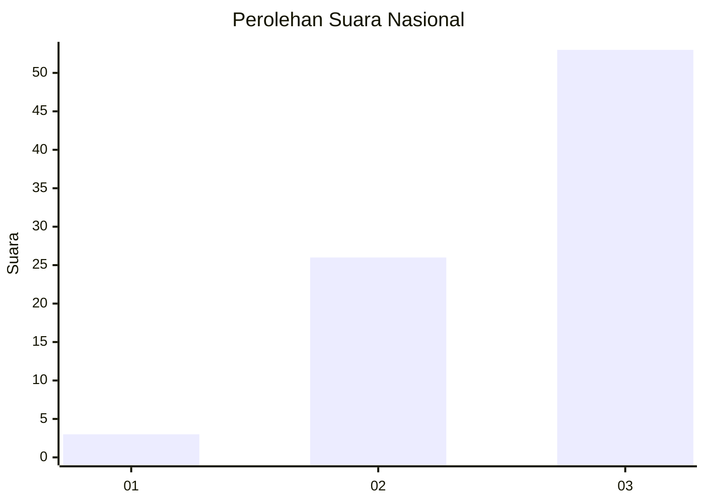
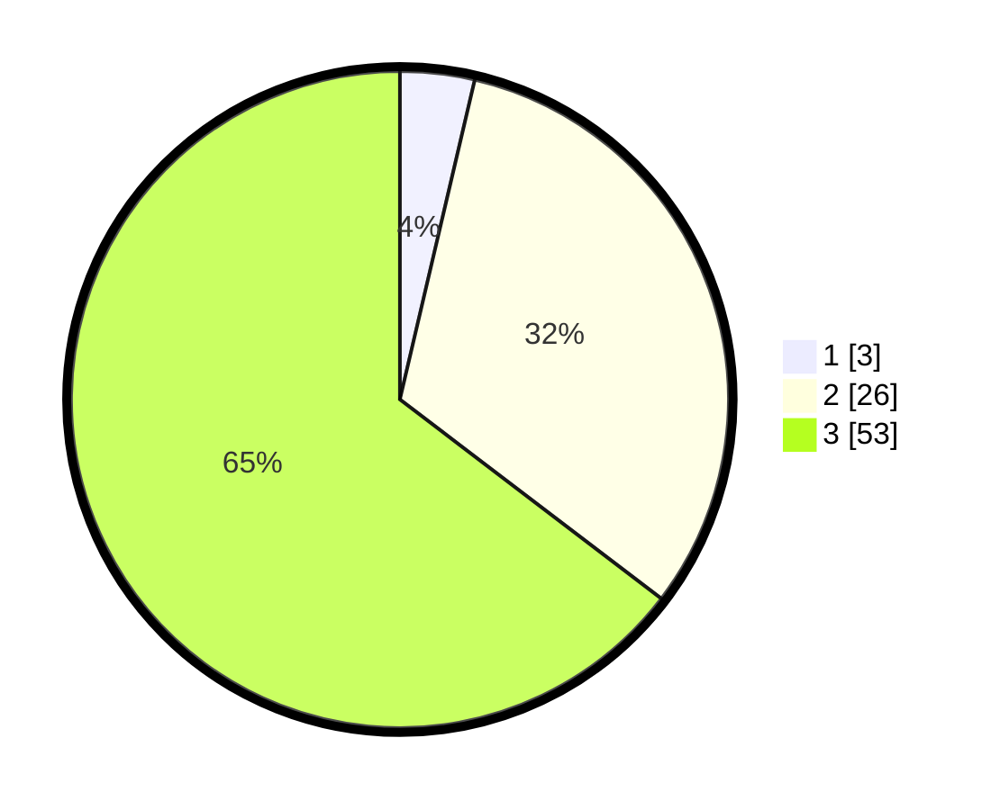

# Hasil

## Grafik

## Tabel

| No. | Nama Paslon    | Suara | Suara (raw) | Persentase |
|:--- |:-------------- | -----:| -----------:| ----------:|
| 1   | ANIES MUHAIMIN | 3     | [3][p-1]    | 3,66       |
| 2   | PRABOWO GIBRAN | 26    | [26][p-2]   | 31,71      |
| 3   | GANJAR MAHFUD  | 53    | [53][p-3]   | 64,63      |

[p-1]: https://github.com/gigit-pemilu/pemilu-2024/blob/main/pilpres/hitung-suara/sub/91-papua/sub/15-waropen/sub/13-demba/sub/2017-wudokuri/sub/001-tps/sub/paslon-1.txt
[p-2]: https://github.com/gigit-pemilu/pemilu-2024/blob/main/pilpres/hitung-suara/sub/91-papua/sub/15-waropen/sub/13-demba/sub/2017-wudokuri/sub/001-tps/sub/paslon-2.txt
[p-3]: https://github.com/gigit-pemilu/pemilu-2024/blob/main/pilpres/hitung-suara/sub/91-papua/sub/15-waropen/sub/13-demba/sub/2017-wudokuri/sub/001-tps/sub/paslon-3.txt

## Foto C Plano

https://sirekap-obj-formc.kpu.go.id/76bb/pemilu/ppwp/91/15/13/20/17/9115132017001-20240219-142954--fcd19684-a4e3-4dfe-9f08-1f853f0229f7.jpg

https://sirekap-obj-formc.kpu.go.id/76bb/pemilu/ppwp/91/15/13/20/17/9115132017001-20240219-195305--771bc216-4436-4937-b07f-2e60a20f3496.jpg

https://sirekap-obj-formc.kpu.go.id/76bb/pemilu/ppwp/91/15/13/20/17/9115132017001-20240219-195705--2c5a5edb-ed78-4ebd-8235-e3698b1886b0.jpg

## Metadata

| Key        | Value               |
| ---------- | ------------------- |
| Time Stamp | 2024-02-25 13:00:00 |

