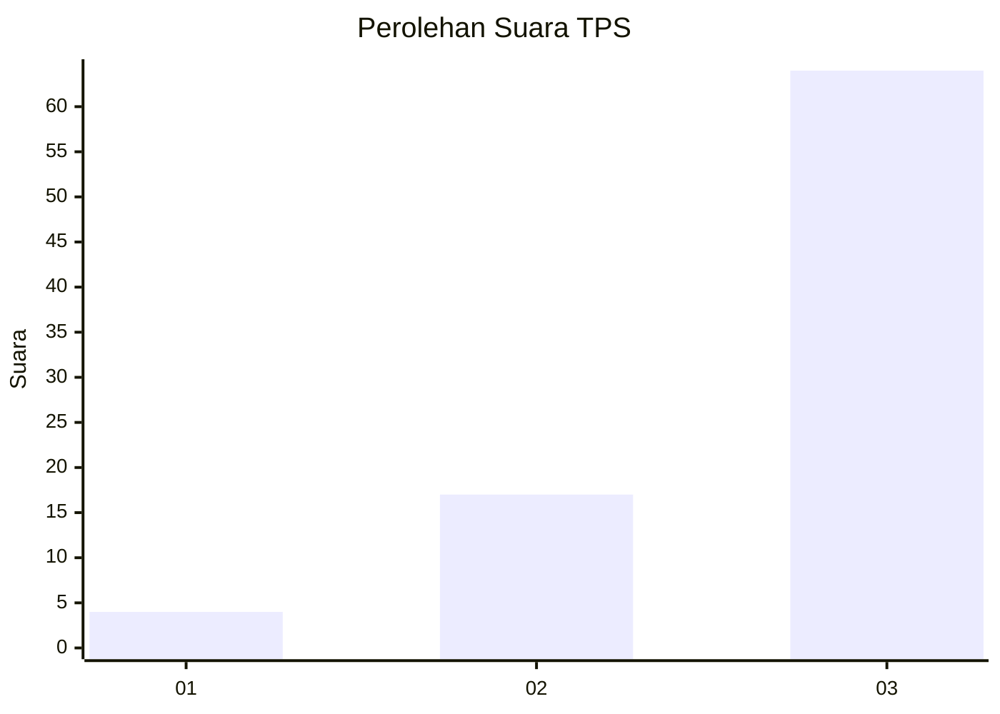
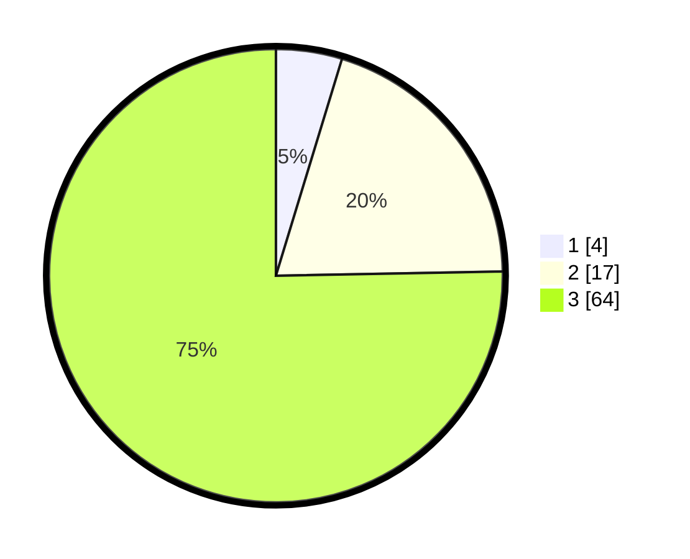

# Hasil

## Grafik

## Tabel

| No. | Nama Paslon    | Suara | Suara (raw) | Persentase |
|:--- |:-------------- | -----:| -----------:| ----------:|
| 1   | ANIES MUHAIMIN | 4     | [4][p-1]    | 4,71       |
| 2   | PRABOWO GIBRAN | 17    | [17][p-2]   | 20,00      |
| 3   | GANJAR MAHFUD  | 64    | [64][p-3]   | 75,29      |

[p-1]: https://github.com/gigit-pemilu/pemilu-2024-91-papua/blob/main/pilpres/hitung-suara/sub/91-papua/sub/15-waropen/sub/13-demba/sub/2019-biati/sub/001-tps/sub/paslon-1.txt
[p-2]: https://github.com/gigit-pemilu/pemilu-2024-91-papua/blob/main/pilpres/hitung-suara/sub/91-papua/sub/15-waropen/sub/13-demba/sub/2019-biati/sub/001-tps/sub/paslon-2.txt
[p-3]: https://github.com/gigit-pemilu/pemilu-2024-91-papua/blob/main/pilpres/hitung-suara/sub/91-papua/sub/15-waropen/sub/13-demba/sub/2019-biati/sub/001-tps/sub/paslon-3.txt

## Foto C Plano

https://sirekap-obj-formc.kpu.go.id/d197/pemilu/ppwp/91/15/13/20/19/9115132019001-20240219-213757--0581b788-bdb7-4306-9700-54ef54dd226b.jpg

https://sirekap-obj-formc.kpu.go.id/d197/pemilu/ppwp/91/15/13/20/19/9115132019001-20240219-205637--067ed710-91e7-4249-9ac5-5ccdeeb81382.jpg

https://sirekap-obj-formc.kpu.go.id/d197/pemilu/ppwp/91/15/13/20/19/9115132019001-20240219-212336--2cd63b89-ef62-4d2c-8213-0dec63f5e805.jpg

## Metadata

| Key        | Value               |
| ---------- | ------------------- |
| Time Stamp | 2024-02-19 22:00:00 |

