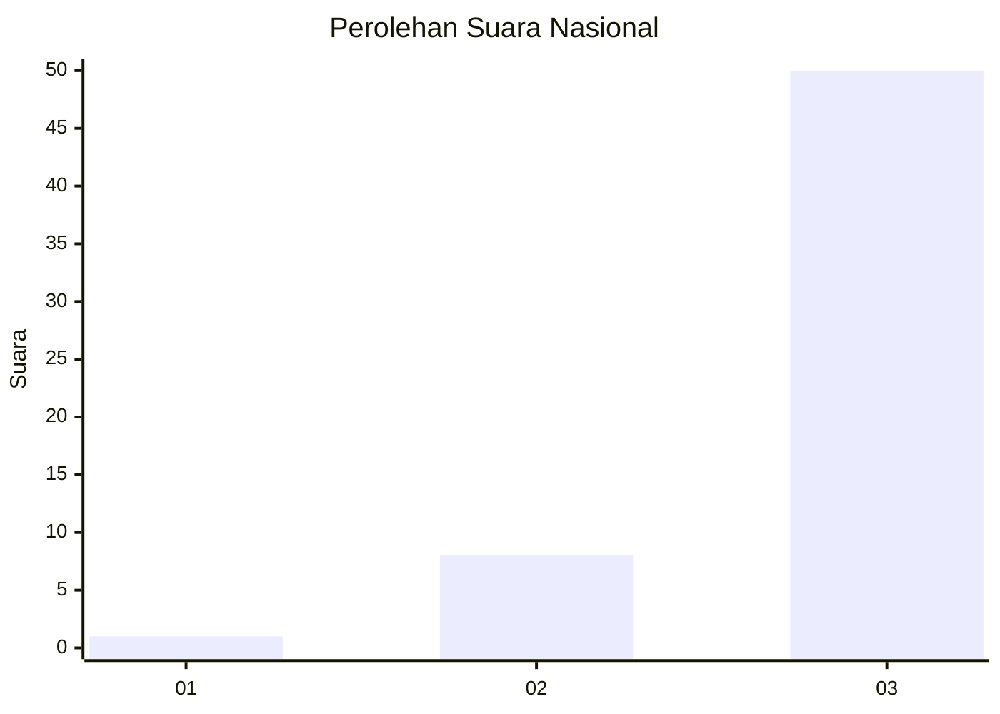
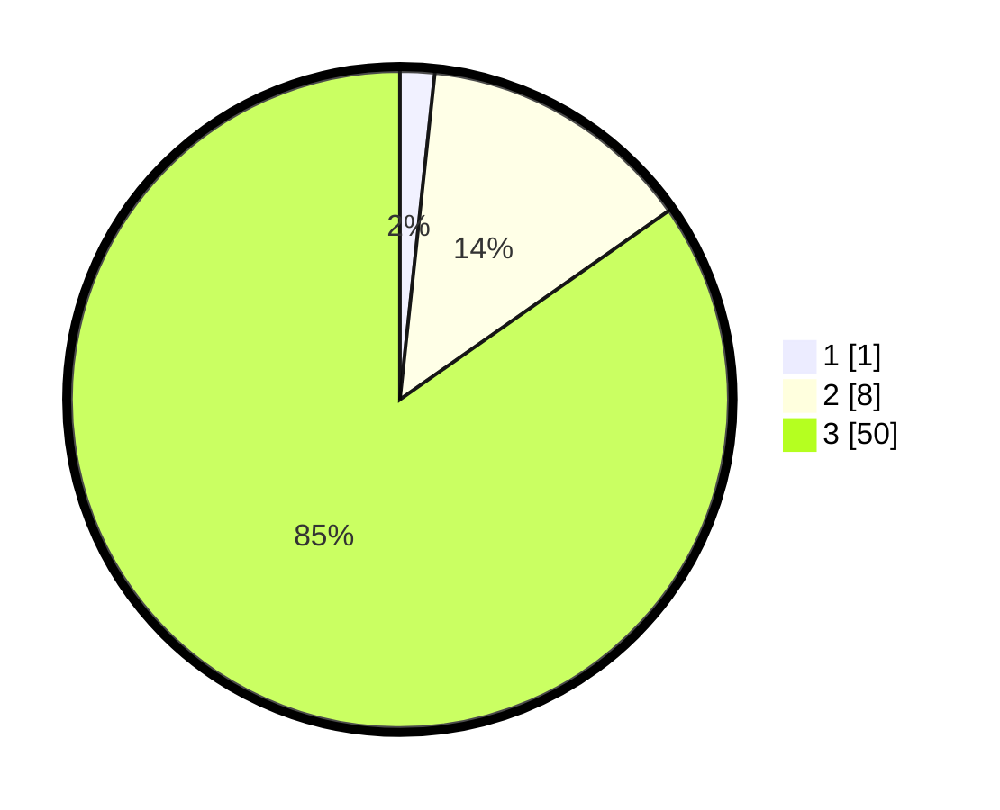

# Hasil

## Grafik

## Tabel

| No. | Nama Paslon    | Suara | Suara (raw) | Persentase |
|:--- |:-------------- | -----:| -----------:| ----------:|
| 1   | ANIES MUHAIMIN | 1     | [1][p-1]    | 1,69       |
| 2   | PRABOWO GIBRAN | 8     | [8][p-2]    | 13,56      |
| 3   | GANJAR MAHFUD  | 50    | [50][p-3]   | 84,75      |

[p-1]: https://github.com/gigit-pemilu/pemilu-2024/blob/main/pilpres/hitung-suara/sub/91-papua/sub/15-waropen/sub/14-wonti/sub/2003-bakadaro/sub/001-tps/sub/paslon-1.txt
[p-2]: https://github.com/gigit-pemilu/pemilu-2024/blob/main/pilpres/hitung-suara/sub/91-papua/sub/15-waropen/sub/14-wonti/sub/2003-bakadaro/sub/001-tps/sub/paslon-2.txt
[p-3]: https://github.com/gigit-pemilu/pemilu-2024/blob/main/pilpres/hitung-suara/sub/91-papua/sub/15-waropen/sub/14-wonti/sub/2003-bakadaro/sub/001-tps/sub/paslon-3.txt

## Foto C Plano

https://sirekap-obj-formc.kpu.go.id/a6cc/pemilu/ppwp/91/15/14/20/03/9115142003001-20240220-211700--87100475-437c-4ca6-82ce-142fabad0acd.jpg

https://sirekap-obj-formc.kpu.go.id/a6cc/pemilu/ppwp/91/15/14/20/03/9115142003001-20240220-211741--9f0144a8-047f-4977-93f8-f2c8c33f99f0.jpg

https://sirekap-obj-formc.kpu.go.id/a6cc/pemilu/ppwp/91/15/14/20/03/9115142003001-20240220-211835--c88fd14a-f5df-4511-a103-a9457dbe1a7d.jpg

## Metadata

| Key        | Value               |
| ---------- | ------------------- |
| Time Stamp | 2024-02-20 22:00:00 |

## DATA PEMILIH TETAP

Jumlah pemilih dalam DPT: **61**.
 * L: **32**.
 * P: **29**.

## DATA PENGGUNA HAK PILIH

Jumlah pengguna hak pilih dalam DPT: **60**.
 * L: **32**.
 * P: **28**.

Jumlah pengguna hak pilih dalam DPTb: **0**.
 * L: **0**.
 * P: **0**.

Jumlah pengguna hak pilih dalam DPK: **1**.
 * L: **0**.
 * P: **1**.

Jumlah pengguna hak pilih: **61**.
 * L: **32**.
 * P: **29**.

## JUMLAH SUARA SAH DAN TIDAK SAH

JUMLAH SELURUH SUARA SAH: **59**.

JUMLAH SUARA TIDAK SAH: **2**.

JUMLAH SELURUH SUARA SAH DAN SUARA TIDAK SAH: **61**.

