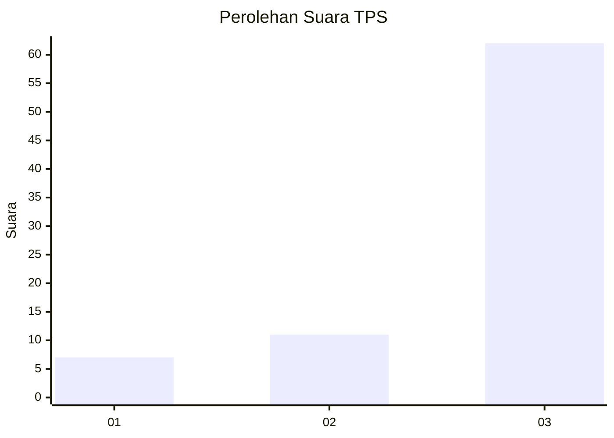
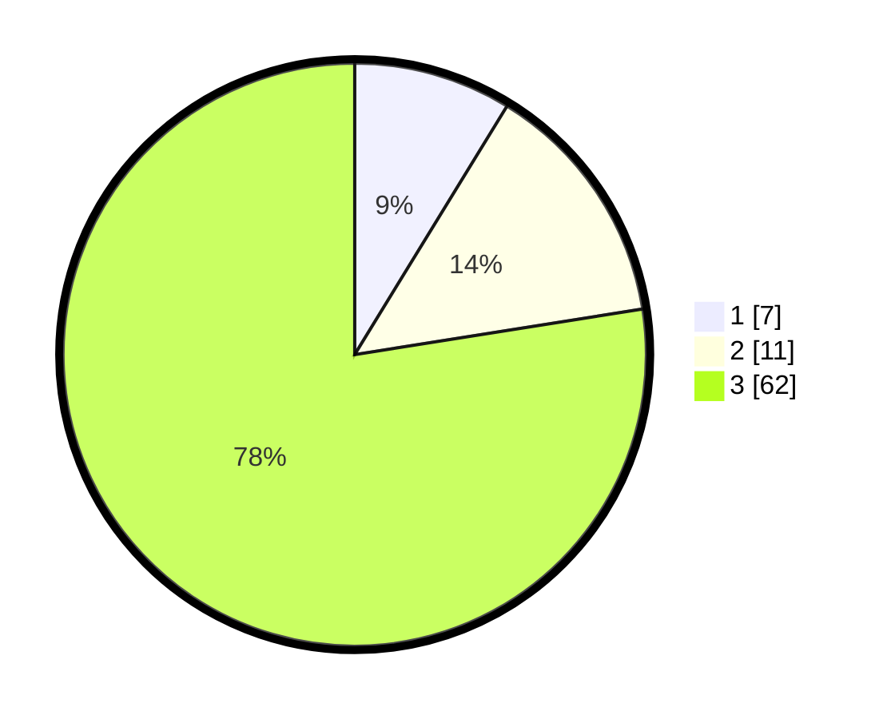

# Hasil

## Grafik

## Tabel

| No. | Nama Paslon    | Suara | Suara (raw) | Persentase |
|:--- |:-------------- | -----:| -----------:| ----------:|
| 1   | ANIES MUHAIMIN | 7     | [7][p-1]    | 8,75       |
| 2   | PRABOWO GIBRAN | 11    | [11][p-2]   | 13,75      |
| 3   | GANJAR MAHFUD  | 62    | [62][p-3]   | 77,50      |

[p-1]: https://github.com/gigit-pemilu/pemilu-2024-91-papua/blob/main/pilpres/hitung-suara/sub/91-papua/sub/15-waropen/sub/14-wonti/sub/2005-wonti-kai/sub/001-tps/sub/paslon-1.txt
[p-2]: https://github.com/gigit-pemilu/pemilu-2024-91-papua/blob/main/pilpres/hitung-suara/sub/91-papua/sub/15-waropen/sub/14-wonti/sub/2005-wonti-kai/sub/001-tps/sub/paslon-2.txt
[p-3]: https://github.com/gigit-pemilu/pemilu-2024-91-papua/blob/main/pilpres/hitung-suara/sub/91-papua/sub/15-waropen/sub/14-wonti/sub/2005-wonti-kai/sub/001-tps/sub/paslon-3.txt

## Foto C Plano

https://sirekap-obj-formc.kpu.go.id/5c42/pemilu/ppwp/91/15/14/20/05/9115142005001-20240219-103048--f96f33e7-038f-4d43-8fa9-3cc8aa03830c.jpg

https://sirekap-obj-formc.kpu.go.id/5c42/pemilu/ppwp/91/15/14/20/05/9115142005001-20240221-023221--61fea912-a111-43a7-adda-07089649ad64.jpg

https://sirekap-obj-formc.kpu.go.id/5c42/pemilu/ppwp/91/15/14/20/05/9115142005001-20240219-103204--1f3e42ed-c641-4cb6-b19e-be93f8953d25.jpg

## Metadata

| Key        | Value               |
| ---------- | ------------------- |
| Time Stamp | 2024-02-21 03:00:00 |

## DATA PEMILIH TETAP

Jumlah pemilih dalam DPT: **80**.
 * L: **44**.
 * P: **36**.

## DATA PENGGUNA HAK PILIH

Jumlah pengguna hak pilih dalam DPT: **60**.
 * L: **33**.
 * P: **27**.

Jumlah pengguna hak pilih dalam DPTb: **20**.
 * L: **7**.
 * P: **13**.

Jumlah pengguna hak pilih dalam DPK: **0**.
 * L: **0**.
 * P: **0**.

Jumlah pengguna hak pilih: **80**.
 * L: **40**.
 * P: **40**.

## JUMLAH SUARA SAH DAN TIDAK SAH

JUMLAH SELURUH SUARA SAH: **80**.

JUMLAH SUARA TIDAK SAH: **0**.

JUMLAH SELURUH SUARA SAH DAN SUARA TIDAK SAH: **80**.

