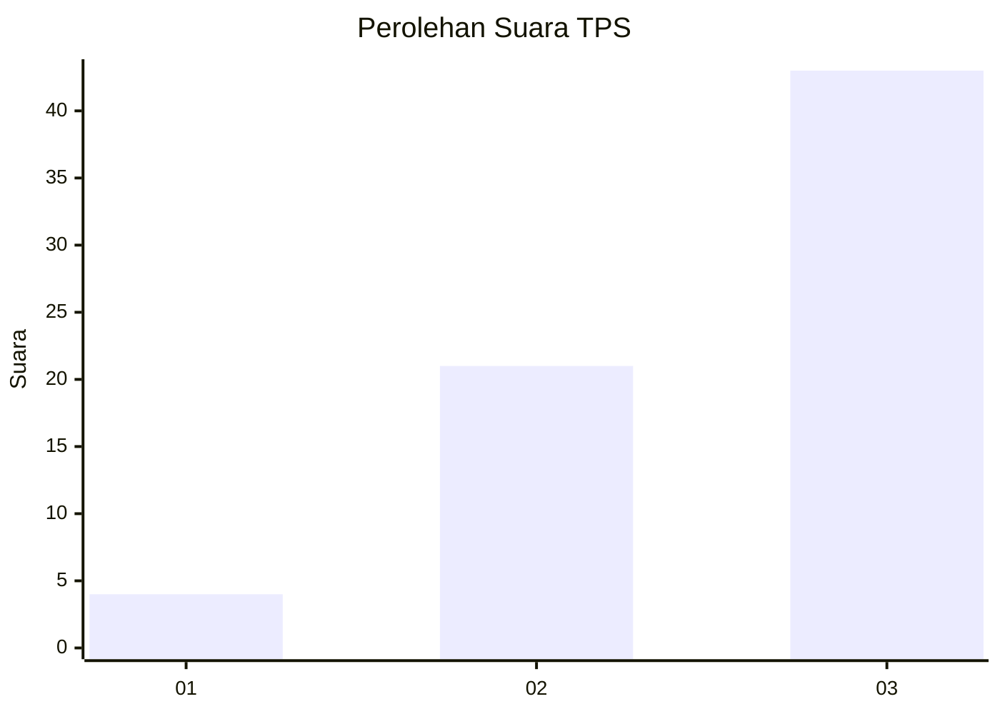
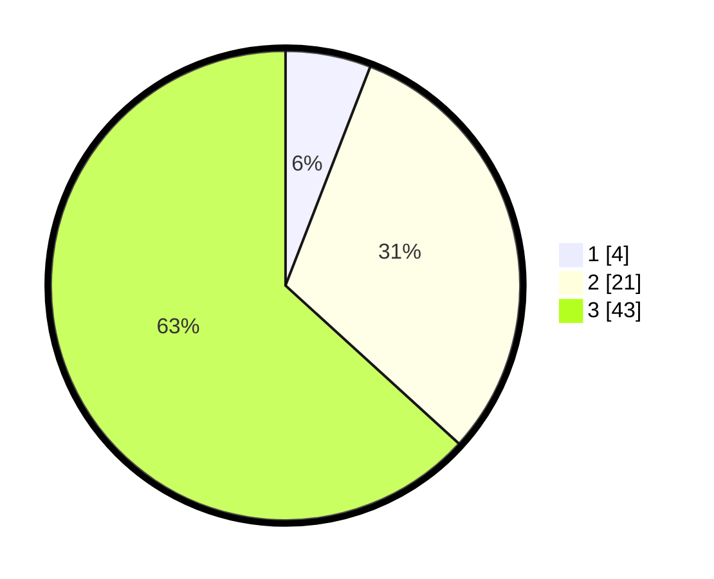

# Hasil

## Grafik

## Tabel

| No. | Nama Paslon    | Suara | Suara (raw) | Persentase |
|:--- |:-------------- | -----:| -----------:| ----------:|
| 1   | ANIES MUHAIMIN | 4     | [4][p-1]    | 5,88       |
| 2   | PRABOWO GIBRAN | 21    | [21][p-2]   | 30,88      |
| 3   | GANJAR MAHFUD  | 43    | [43][p-3]   | 63,24      |

[p-1]: https://github.com/gigit-pemilu/pemilu-2024-91-papua/blob/main/pilpres/hitung-suara/sub/91-papua/sub/15-waropen/sub/15-soyoi-mambai/sub/2001-mambai/sub/001-tps/sub/paslon-1.txt
[p-2]: https://github.com/gigit-pemilu/pemilu-2024-91-papua/blob/main/pilpres/hitung-suara/sub/91-papua/sub/15-waropen/sub/15-soyoi-mambai/sub/2001-mambai/sub/001-tps/sub/paslon-2.txt
[p-3]: https://github.com/gigit-pemilu/pemilu-2024-91-papua/blob/main/pilpres/hitung-suara/sub/91-papua/sub/15-waropen/sub/15-soyoi-mambai/sub/2001-mambai/sub/001-tps/sub/paslon-3.txt

## Foto C Plano

https://sirekap-obj-formc.kpu.go.id/86a9/pemilu/ppwp/91/15/15/20/01/9115152001001-20240219-114801--cb7738cb-2801-4ec9-8be3-0e431c71ae05.jpg

https://sirekap-obj-formc.kpu.go.id/86a9/pemilu/ppwp/91/15/15/20/01/9115152001001-20240216-110023--59b518e2-1d98-432e-a16c-bb88db1a50af.jpg

https://sirekap-obj-formc.kpu.go.id/86a9/pemilu/ppwp/91/15/15/20/01/9115152001001-20240219-115321--29e9efdc-3872-4ba5-a4a1-1e6214b413e4.jpg

## Metadata

| Key        | Value               |
| ---------- | ------------------- |
| Time Stamp | 2024-02-19 13:00:00 |

## DATA PEMILIH TETAP

Jumlah pemilih dalam DPT: **76**.
 * L: **38**.
 * P: **38**.

## DATA PENGGUNA HAK PILIH

Jumlah pengguna hak pilih dalam DPT: **69**.
 * L: **32**.
 * P: **37**.

Jumlah pengguna hak pilih dalam DPTb: **0**.
 * L: **0**.
 * P: **0**.

Jumlah pengguna hak pilih dalam DPK: **0**.
 * L: **0**.
 * P: **0**.

Jumlah pengguna hak pilih: **69**.
 * L: **32**.
 * P: **37**.

## JUMLAH SUARA SAH DAN TIDAK SAH

JUMLAH SELURUH SUARA SAH: **69**.

JUMLAH SUARA TIDAK SAH: **7**.

JUMLAH SELURUH SUARA SAH DAN SUARA TIDAK SAH: **76**.

