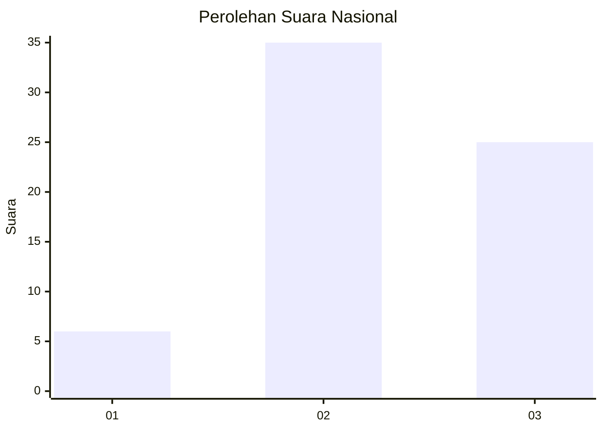
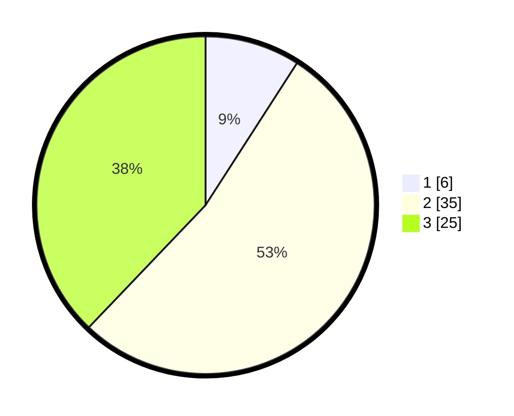

# Hasil

## Grafik

## Tabel

| No. | Nama Paslon    | Suara | Suara (raw) | Persentase |
|:--- |:-------------- | -----:| -----------:| ----------:|
| 1   | ANIES MUHAIMIN | 6     | [6][p-1]    | 9,09       |
| 2   | PRABOWO GIBRAN | 35    | [35][p-2]   | 53,03      |
| 3   | GANJAR MAHFUD  | 25    | [25][p-3]   | 37,88      |

[p-1]: https://github.com/gigit-pemilu/pemilu-2024/blob/main/pilpres/hitung-suara/sub/91-papua/sub/15-waropen/sub/15-soyoi-mambai/sub/2002-soyoi/sub/001-tps/sub/paslon-1.txt
[p-2]: https://github.com/gigit-pemilu/pemilu-2024/blob/main/pilpres/hitung-suara/sub/91-papua/sub/15-waropen/sub/15-soyoi-mambai/sub/2002-soyoi/sub/001-tps/sub/paslon-2.txt
[p-3]: https://github.com/gigit-pemilu/pemilu-2024/blob/main/pilpres/hitung-suara/sub/91-papua/sub/15-waropen/sub/15-soyoi-mambai/sub/2002-soyoi/sub/001-tps/sub/paslon-3.txt

## Foto C Plano

https://sirekap-obj-formc.kpu.go.id/606d/pemilu/ppwp/91/15/15/20/02/9115152002001-20240219-190636--88655e24-f870-4d34-bf4b-dc4045187fa3.jpg

https://sirekap-obj-formc.kpu.go.id/606d/pemilu/ppwp/91/15/15/20/02/9115152002001-20240219-190907--44d95f08-444d-4394-b9df-81fd9686bb50.jpg

https://sirekap-obj-formc.kpu.go.id/606d/pemilu/ppwp/91/15/15/20/02/9115152002001-20240219-191227--6377d692-786e-4650-b578-6ce2694e6b4a.jpg

## Metadata

| Key        | Value               |
| ---------- | ------------------- |
| Time Stamp | 2024-02-25 12:00:00 |

