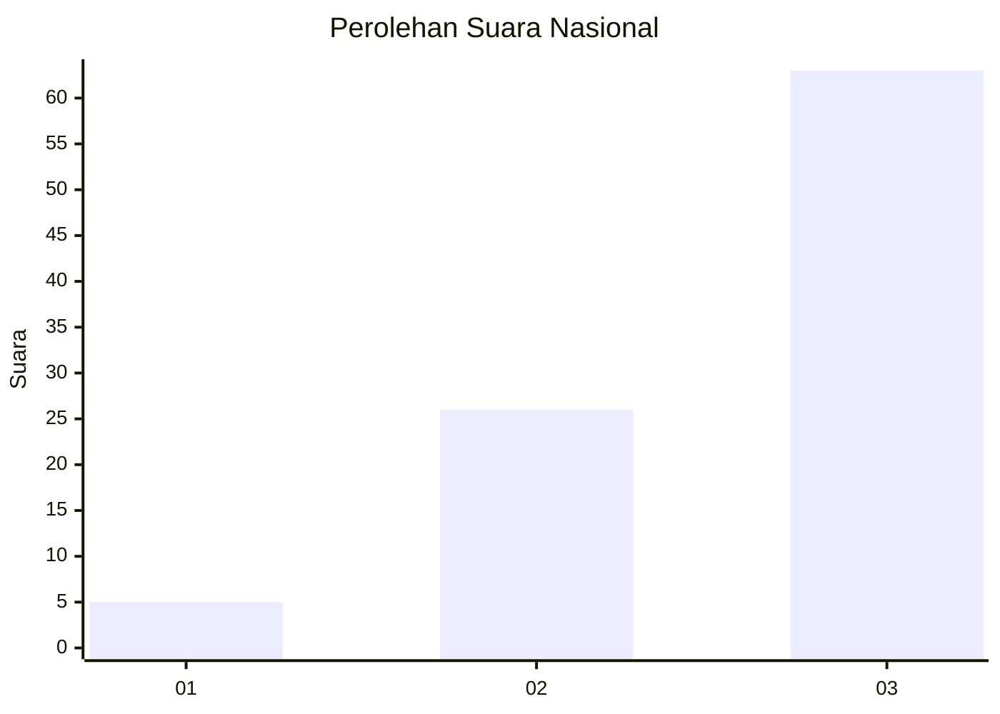
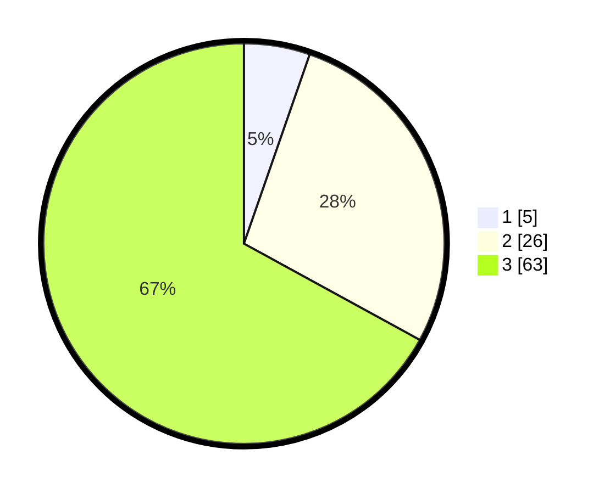

# Hasil

## Grafik

## Tabel

| No. | Nama Paslon    | Suara | Suara (raw) | Persentase |
|:--- |:-------------- | -----:| -----------:| ----------:|
| 1   | ANIES MUHAIMIN | 5     | [5][p-1]    | 5,32       |
| 2   | PRABOWO GIBRAN | 26    | [26][p-2]   | 27,66      |
| 3   | GANJAR MAHFUD  | 63    | [63][p-3]   | 67,02      |

[p-1]: https://github.com/gigit-pemilu/pemilu-2024/blob/main/pilpres/hitung-suara/sub/91-papua/sub/15-waropen/sub/15-soyoi-mambai/sub/2003-daimboa/sub/001-tps/sub/paslon-1.txt
[p-2]: https://github.com/gigit-pemilu/pemilu-2024/blob/main/pilpres/hitung-suara/sub/91-papua/sub/15-waropen/sub/15-soyoi-mambai/sub/2003-daimboa/sub/001-tps/sub/paslon-2.txt
[p-3]: https://github.com/gigit-pemilu/pemilu-2024/blob/main/pilpres/hitung-suara/sub/91-papua/sub/15-waropen/sub/15-soyoi-mambai/sub/2003-daimboa/sub/001-tps/sub/paslon-3.txt

## Foto C Plano

https://sirekap-obj-formc.kpu.go.id/7c51/pemilu/ppwp/91/15/15/20/03/9115152003001-20240215-235356--f471530e-90c5-45c1-8fe6-498f743a329e.jpg

https://sirekap-obj-formc.kpu.go.id/7c51/pemilu/ppwp/91/15/15/20/03/9115152003001-20240215-200050--4c2b47ec-5b33-4a84-afb4-93ed276748b2.jpg

https://sirekap-obj-formc.kpu.go.id/7c51/pemilu/ppwp/91/15/15/20/03/9115152003001-20240215-235523--e62905a5-e96b-4b1f-89b8-0175e2b318d3.jpg

## Metadata

| Key        | Value               |
| ---------- | ------------------- |
| Time Stamp | 2024-02-16 00:00:26 |

## DATA PEMILIH TETAP

Jumlah pemilih dalam DPT: **94**.
 * L: **45**.
 * P: **54**.

## DATA PENGGUNA HAK PILIH

Jumlah pengguna hak pilih dalam DPT: **44**.
 * L: **43**.
 * P: **58**.

Jumlah pengguna hak pilih dalam DPTb: **0**.
 * L: **0**.
 * P: **80**.

Jumlah pengguna hak pilih dalam DPK: **8**.
 * L: **0**.
 * P: **0**.

Jumlah pengguna hak pilih: **94**.
 * L: **43**.
 * P: **54**.

## JUMLAH SUARA SAH DAN TIDAK SAH

JUMLAH SELURUH SUARA SAH: **94**.

JUMLAH SUARA TIDAK SAH: **888**.

JUMLAH SELURUH SUARA SAH DAN SUARA TIDAK SAH: **94**.

