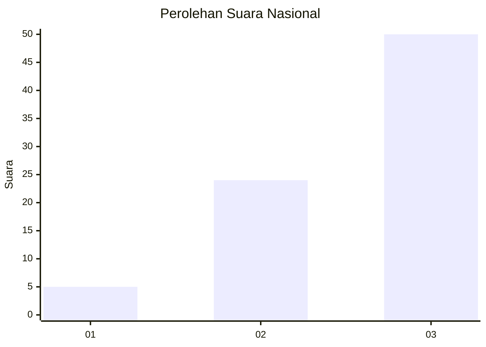
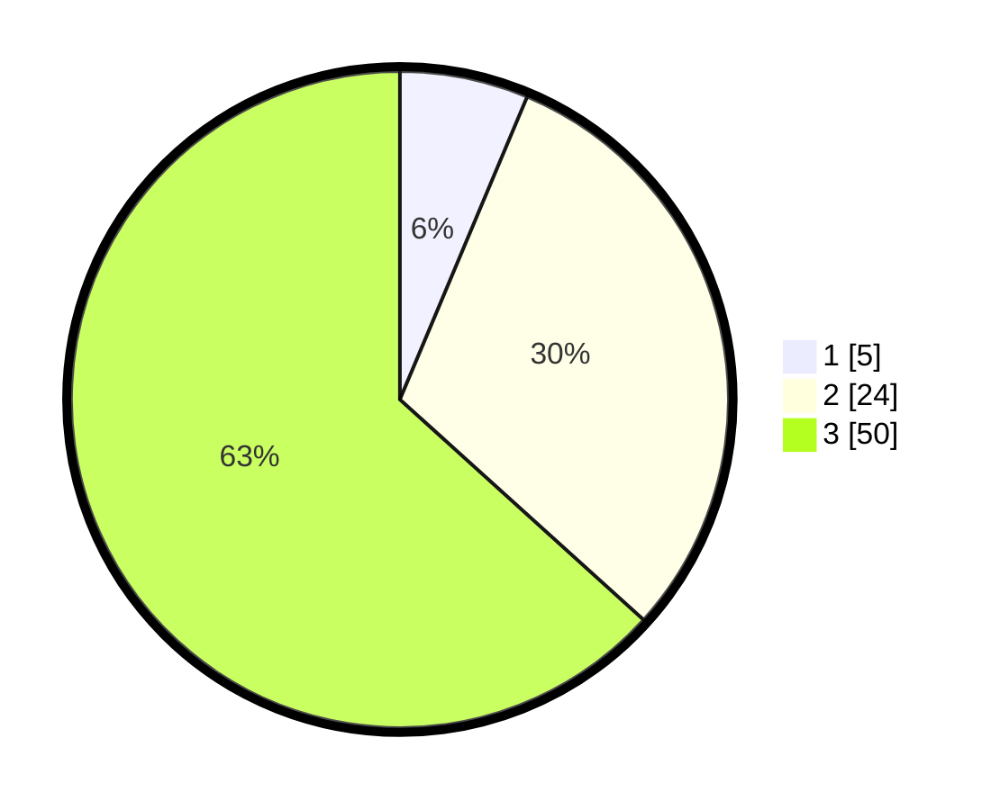

# Hasil

## Grafik

## Tabel

| No. | Nama Paslon    | Suara | Suara (raw) | Persentase |
|:--- |:-------------- | -----:| -----------:| ----------:|
| 1   | ANIES MUHAIMIN | 5     | [5][p-1]    | 6,33       |
| 2   | PRABOWO GIBRAN | 24    | [24][p-2]   | 30,38      |
| 3   | GANJAR MAHFUD  | 50    | [50][p-3]   | 63,29      |

[p-1]: https://github.com/gigit-pemilu/pemilu-2024/blob/main/pilpres/hitung-suara/sub/91-papua/sub/15-waropen/sub/15-soyoi-mambai/sub/2004-napani/sub/001-tps/sub/paslon-1.txt
[p-2]: https://github.com/gigit-pemilu/pemilu-2024/blob/main/pilpres/hitung-suara/sub/91-papua/sub/15-waropen/sub/15-soyoi-mambai/sub/2004-napani/sub/001-tps/sub/paslon-2.txt
[p-3]: https://github.com/gigit-pemilu/pemilu-2024/blob/main/pilpres/hitung-suara/sub/91-papua/sub/15-waropen/sub/15-soyoi-mambai/sub/2004-napani/sub/001-tps/sub/paslon-3.txt

## Foto C Plano

https://sirekap-obj-formc.kpu.go.id/1921/pemilu/ppwp/91/15/15/20/04/9115152004001-20240216-104009--9efad8c9-a655-41db-9b31-3d9bbbdceb16.jpg

https://sirekap-obj-formc.kpu.go.id/1921/pemilu/ppwp/91/15/15/20/04/9115152004001-20240216-083952--86036dfc-6927-4e3c-b1b2-62cea9e821d9.jpg

https://sirekap-obj-formc.kpu.go.id/1921/pemilu/ppwp/91/15/15/20/04/9115152004001-20240215-202820--de38d8fc-496b-400f-bc3c-1f65406a9e8d.jpg

## Metadata

| Key        | Value               |
| ---------- | ------------------- |
| Time Stamp | 2024-02-16 11:00:29 |

## DATA PEMILIH TETAP

Jumlah pemilih dalam DPT: **97**.
 * L: **57**.
 * P: **40**.

## DATA PENGGUNA HAK PILIH

Jumlah pengguna hak pilih dalam DPT: **75**.
 * L: **43**.
 * P: **32**.

Jumlah pengguna hak pilih dalam DPTb: **0**.
 * L: **0**.
 * P: **0**.

Jumlah pengguna hak pilih dalam DPK: **5**.
 * L: **3**.
 * P: **2**.

Jumlah pengguna hak pilih: **80**.
 * L: **46**.
 * P: **34**.

## JUMLAH SUARA SAH DAN TIDAK SAH

JUMLAH SELURUH SUARA SAH: **79**.

JUMLAH SUARA TIDAK SAH: **1**.

JUMLAH SELURUH SUARA SAH DAN SUARA TIDAK SAH: **80**.

