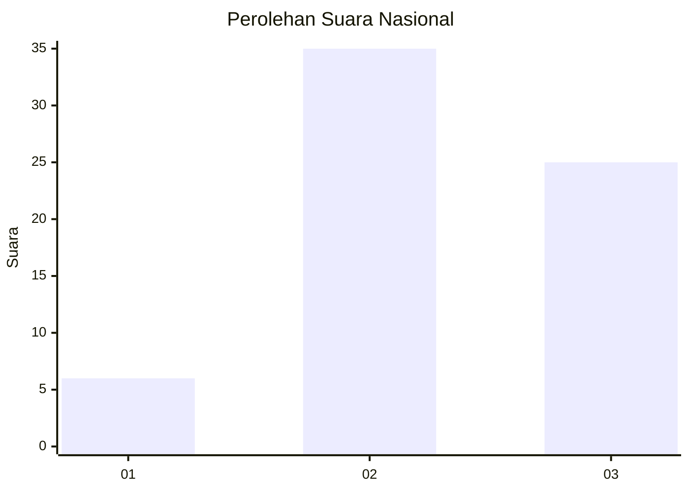
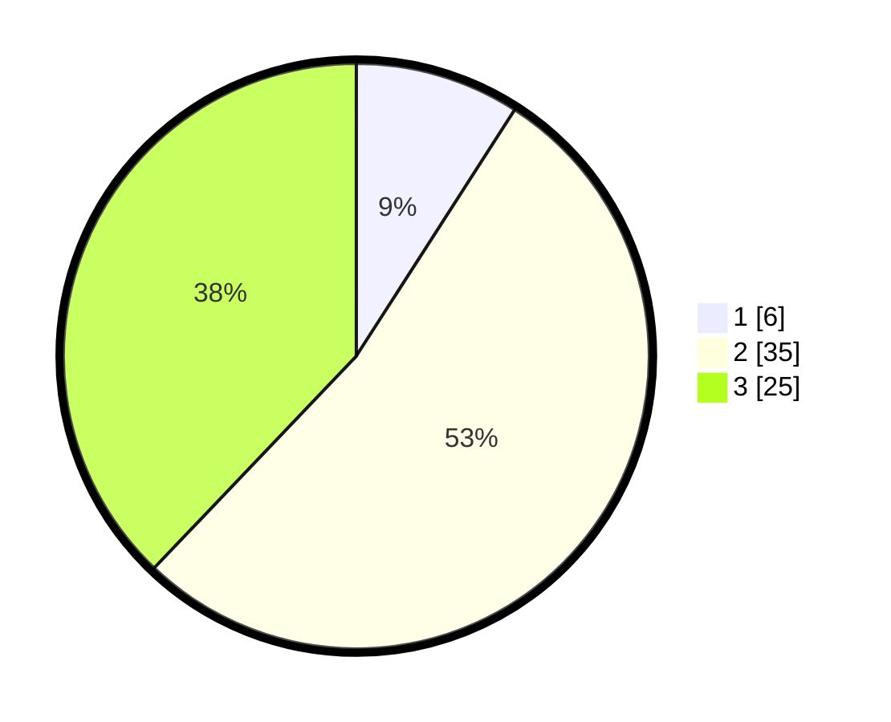

# Hasil

## Grafik

## Tabel

| No. | Nama Paslon    | Suara | Suara (raw) | Persentase |
|:--- |:-------------- | -----:| -----------:| ----------:|
| 1   | ANIES MUHAIMIN | 6     | [6][p-1]    | 9,09       |
| 2   | PRABOWO GIBRAN | 35    | [35][p-2]   | 53,03      |
| 3   | GANJAR MAHFUD  | 25    | [25][p-3]   | 37,88      |

[p-1]: https://github.com/gigit-pemilu/pemilu-2024/blob/main/pilpres/hitung-suara/sub/91-papua/sub/15-waropen/sub/15-soyoi-mambai/sub/2005-segha/sub/001-tps/sub/paslon-1.txt
[p-2]: https://github.com/gigit-pemilu/pemilu-2024/blob/main/pilpres/hitung-suara/sub/91-papua/sub/15-waropen/sub/15-soyoi-mambai/sub/2005-segha/sub/001-tps/sub/paslon-2.txt
[p-3]: https://github.com/gigit-pemilu/pemilu-2024/blob/main/pilpres/hitung-suara/sub/91-papua/sub/15-waropen/sub/15-soyoi-mambai/sub/2005-segha/sub/001-tps/sub/paslon-3.txt

## Foto C Plano

https://sirekap-obj-formc.kpu.go.id/37d7/pemilu/ppwp/91/15/15/20/05/9115152005001-20240217-122624--75b2aa95-30be-46b8-854b-2db6e596d490.jpg

https://sirekap-obj-formc.kpu.go.id/37d7/pemilu/ppwp/91/15/15/20/05/9115152005001-20240216-073101--b52409f0-3c23-40ed-9203-fa023d4835b3.jpg

https://sirekap-obj-formc.kpu.go.id/37d7/pemilu/ppwp/91/15/15/20/05/9115152005001-20240216-071845--94b2664f-e714-4276-9cc3-3d4bf500dfdd.jpg

## Metadata

| Key        | Value               |
| ---------- | ------------------- |
| Time Stamp | 2024-02-17 13:37:34 |

## DATA PEMILIH TETAP

Jumlah pemilih dalam DPT: **92**.
 * L: **45**.
 * P: **47**.

## DATA PENGGUNA HAK PILIH

Jumlah pengguna hak pilih dalam DPT: **67**.
 * L: **38**.
 * P: **29**.

Jumlah pengguna hak pilih dalam DPTb: **0**.
 * L: **0**.
 * P: **0**.

Jumlah pengguna hak pilih dalam DPK: **0**.
 * L: **0**.
 * P: **0**.

Jumlah pengguna hak pilih: **67**.
 * L: **38**.
 * P: **29**.

## JUMLAH SUARA SAH DAN TIDAK SAH

JUMLAH SELURUH SUARA SAH: **66**.

JUMLAH SUARA TIDAK SAH: **1**.

JUMLAH SELURUH SUARA SAH DAN SUARA TIDAK SAH: **67**.

