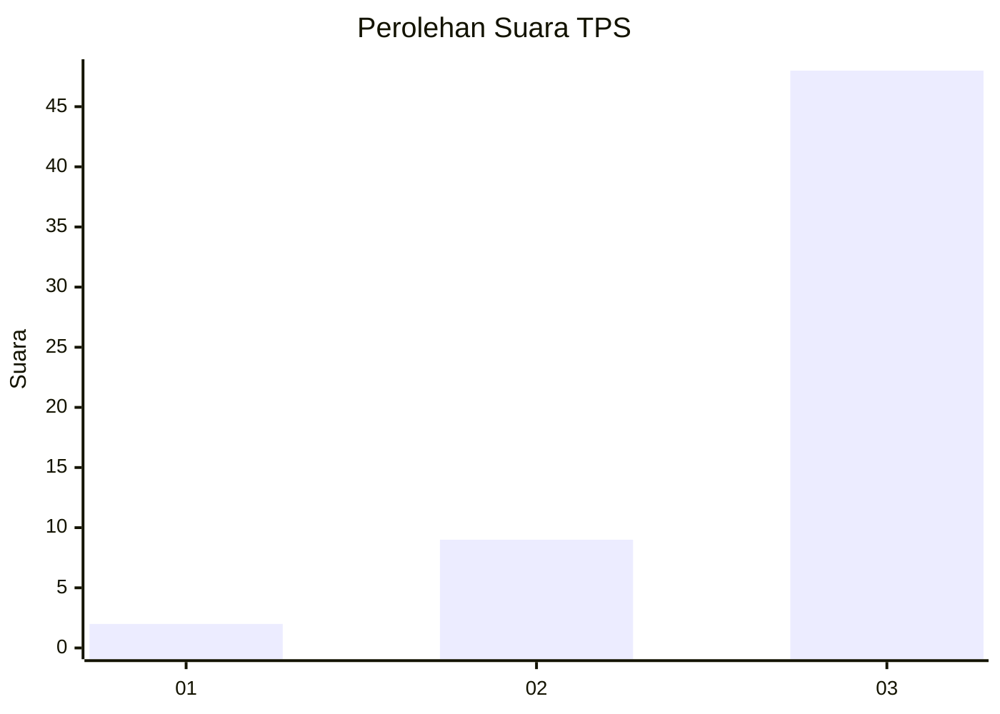
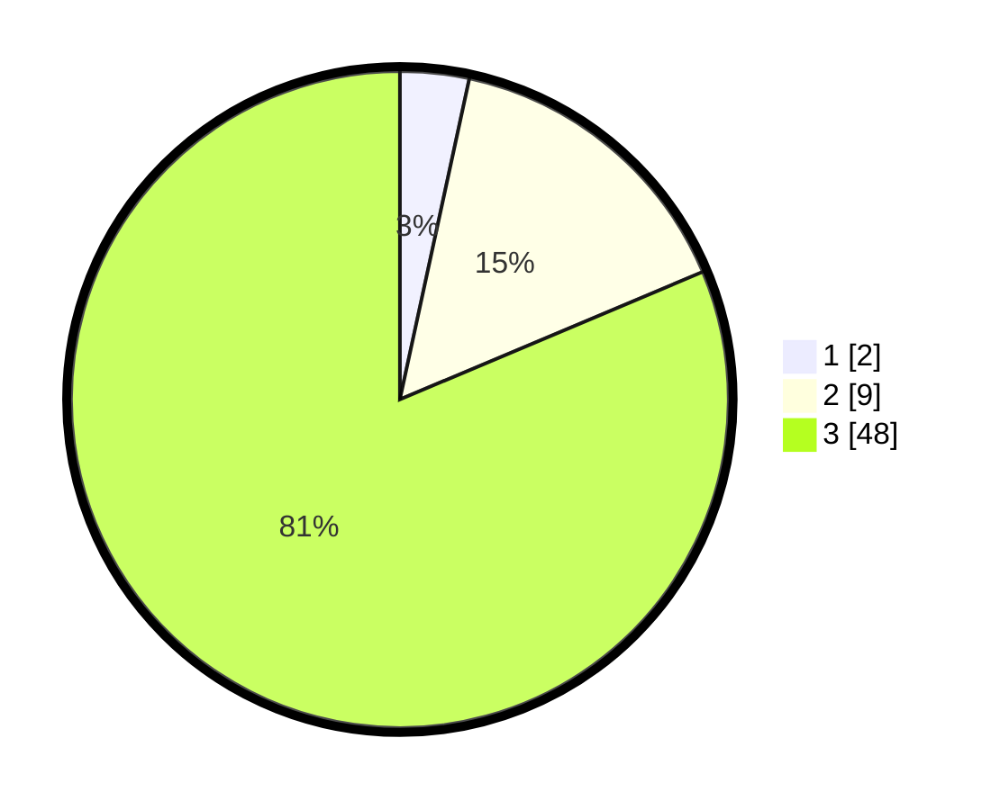

# Hasil

## Grafik

## Tabel

| No. | Nama Paslon    | Suara | Suara (raw) | Persentase |
|:--- |:-------------- | -----:| -----------:| ----------:|
| 1   | ANIES MUHAIMIN | 2     | [2][p-1]    | 3,39       |
| 2   | PRABOWO GIBRAN | 9     | [9][p-2]    | 15,25      |
| 3   | GANJAR MAHFUD  | 48    | [48][p-3]   | 81,36      |

[p-1]: https://github.com/gigit-pemilu/pemilu-2024-91-papua/blob/main/pilpres/hitung-suara/sub/91-papua/sub/15-waropen/sub/15-soyoi-mambai/sub/2008-dawoa/sub/001-tps/sub/paslon-1.txt
[p-2]: https://github.com/gigit-pemilu/pemilu-2024-91-papua/blob/main/pilpres/hitung-suara/sub/91-papua/sub/15-waropen/sub/15-soyoi-mambai/sub/2008-dawoa/sub/001-tps/sub/paslon-2.txt
[p-3]: https://github.com/gigit-pemilu/pemilu-2024-91-papua/blob/main/pilpres/hitung-suara/sub/91-papua/sub/15-waropen/sub/15-soyoi-mambai/sub/2008-dawoa/sub/001-tps/sub/paslon-3.txt

## Foto C Plano

https://sirekap-obj-formc.kpu.go.id/aea2/pemilu/ppwp/91/15/15/20/08/9115152008001-20240215-073309--84212abe-9b03-4eaf-a4f8-b8522b134907.jpg

https://sirekap-obj-formc.kpu.go.id/aea2/pemilu/ppwp/91/15/15/20/08/9115152008001-20240217-055746--5ab3d48f-1717-4d8d-9c19-db0b9b579357.jpg

https://sirekap-obj-formc.kpu.go.id/aea2/pemilu/ppwp/91/15/15/20/08/9115152008001-20240217-060634--49bc841f-a894-4e1d-abdd-7c8554bcd2ba.jpg

## Metadata

| Key        | Value               |
| ---------- | ------------------- |
| Time Stamp | 2024-02-17 06:30:03 |

## DATA PEMILIH TETAP

Jumlah pemilih dalam DPT: **68**.
 * L: **32**.
 * P: **36**.

## DATA PENGGUNA HAK PILIH

Jumlah pengguna hak pilih dalam DPT: **59**.
 * L: **28**.
 * P: **31**.

Jumlah pengguna hak pilih dalam DPTb: **0**.
 * L: **0**.
 * P: **0**.

Jumlah pengguna hak pilih dalam DPK: **0**.
 * L: **0**.
 * P: **0**.

Jumlah pengguna hak pilih: **59**.
 * L: **28**.
 * P: **31**.

## JUMLAH SUARA SAH DAN TIDAK SAH

JUMLAH SELURUH SUARA SAH: **59**.

JUMLAH SUARA TIDAK SAH: **0**.

JUMLAH SELURUH SUARA SAH DAN SUARA TIDAK SAH: **59**.

