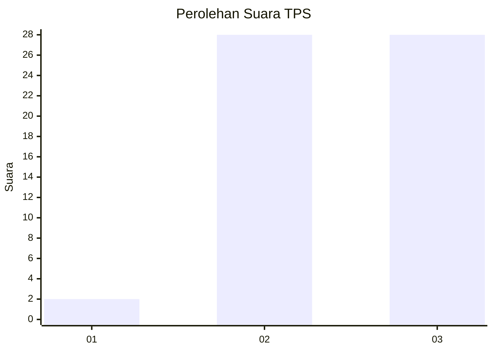
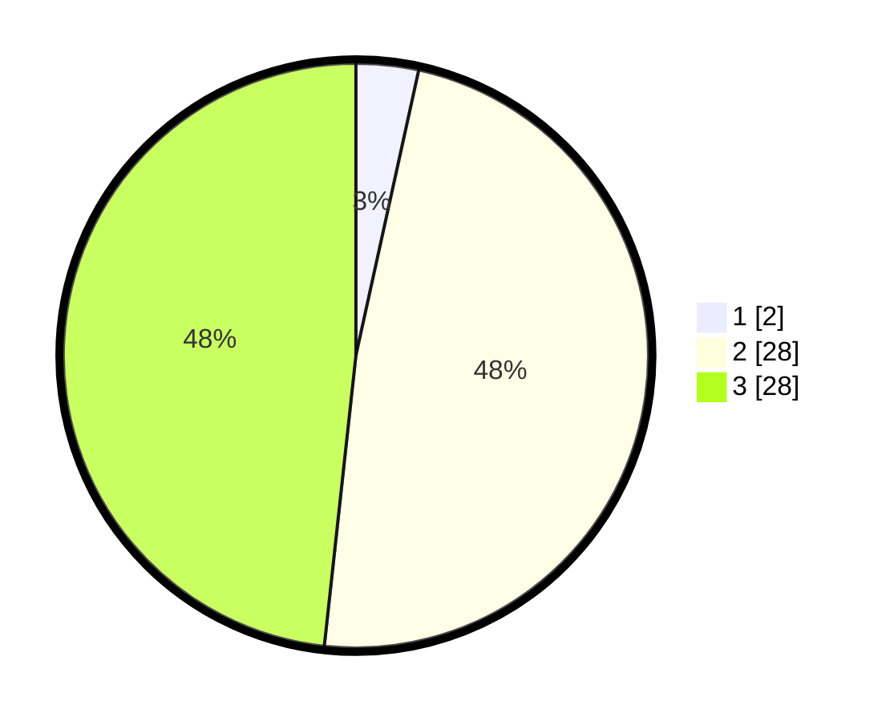

# Hasil

## Grafik

## Tabel

| No. | Nama Paslon    | Suara | Suara (raw) | Persentase |
|:--- |:-------------- | -----:| -----------:| ----------:|
| 1   | ANIES MUHAIMIN | 2     | [2][p-1]    | 3,45       |
| 2   | PRABOWO GIBRAN | 28    | [28][p-2]   | 48,28      |
| 3   | GANJAR MAHFUD  | 28    | [28][p-3]   | 48,28      |

[p-1]: https://github.com/gigit-pemilu/pemilu-2024-91-papua/blob/main/pilpres/hitung-suara/sub/91-papua/sub/15-waropen/sub/15-soyoi-mambai/sub/2009-sinabo/sub/001-tps/sub/paslon-1.txt
[p-2]: https://github.com/gigit-pemilu/pemilu-2024-91-papua/blob/main/pilpres/hitung-suara/sub/91-papua/sub/15-waropen/sub/15-soyoi-mambai/sub/2009-sinabo/sub/001-tps/sub/paslon-2.txt
[p-3]: https://github.com/gigit-pemilu/pemilu-2024-91-papua/blob/main/pilpres/hitung-suara/sub/91-papua/sub/15-waropen/sub/15-soyoi-mambai/sub/2009-sinabo/sub/001-tps/sub/paslon-3.txt

## Foto C Plano

https://sirekap-obj-formc.kpu.go.id/e6fd/pemilu/ppwp/91/15/15/20/09/9115152009001-20240217-123534--a67e3ddb-2411-4984-9e25-7eb161d7c73a.jpg

https://sirekap-obj-formc.kpu.go.id/e6fd/pemilu/ppwp/91/15/15/20/09/9115152009001-20240217-130032--a6622817-37de-4a2b-b854-3cf724b4fafa.jpg

https://sirekap-obj-formc.kpu.go.id/e6fd/pemilu/ppwp/91/15/15/20/09/9115152009001-20240216-060350--d7d70efa-080e-433c-9c3f-28858574d22a.jpg

## Metadata

| Key        | Value               |
| ---------- | ------------------- |
| Time Stamp | 2024-02-17 13:37:34 |

## DATA PEMILIH TETAP

Jumlah pemilih dalam DPT: **59**.
 * L: **32**.
 * P: **27**.

## DATA PENGGUNA HAK PILIH

Jumlah pengguna hak pilih dalam DPT: **59**.
 * L: **32**.
 * P: **27**.

Jumlah pengguna hak pilih dalam DPTb: **0**.
 * L: **0**.
 * P: **0**.

Jumlah pengguna hak pilih dalam DPK: **0**.
 * L: **0**.
 * P: **0**.

Jumlah pengguna hak pilih: **59**.
 * L: **32**.
 * P: **27**.

## JUMLAH SUARA SAH DAN TIDAK SAH

JUMLAH SELURUH SUARA SAH: **58**.

JUMLAH SUARA TIDAK SAH: **1**.

JUMLAH SELURUH SUARA SAH DAN SUARA TIDAK SAH: **59**.

