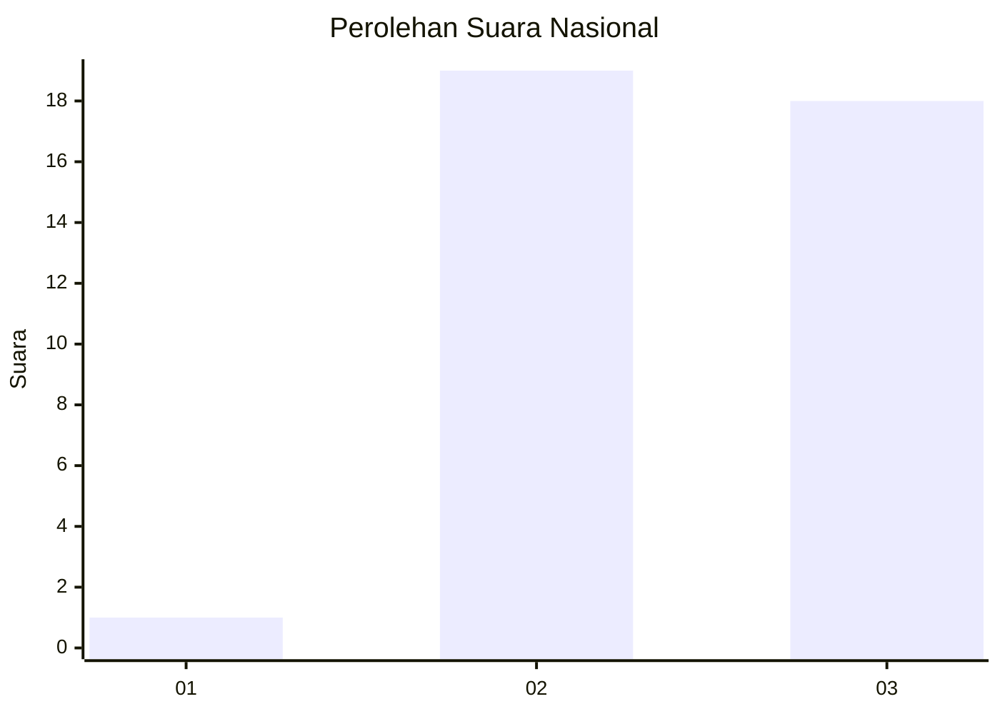
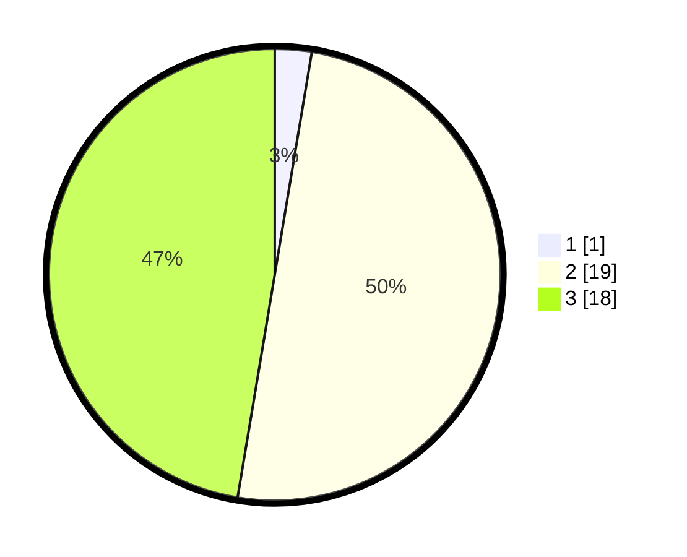

# Hasil

## Grafik

## Tabel

| No. | Nama Paslon    | Suara | Suara (raw) | Persentase |
|:--- |:-------------- | -----:| -----------:| ----------:|
| 1   | ANIES MUHAIMIN | 1     | [1][p-1]    | 2,63       |
| 2   | PRABOWO GIBRAN | 19    | [19][p-2]   | 50,00      |
| 3   | GANJAR MAHFUD  | 18    | [18][p-3]   | 47,37      |

[p-1]: https://github.com/gigit-pemilu/pemilu-2024/blob/main/pilpres/hitung-suara/sub/91-papua/sub/15-waropen/sub/15-soyoi-mambai/sub/2010-woinui/sub/001-tps/sub/paslon-1.txt
[p-2]: https://github.com/gigit-pemilu/pemilu-2024/blob/main/pilpres/hitung-suara/sub/91-papua/sub/15-waropen/sub/15-soyoi-mambai/sub/2010-woinui/sub/001-tps/sub/paslon-2.txt
[p-3]: https://github.com/gigit-pemilu/pemilu-2024/blob/main/pilpres/hitung-suara/sub/91-papua/sub/15-waropen/sub/15-soyoi-mambai/sub/2010-woinui/sub/001-tps/sub/paslon-3.txt

## Foto C Plano

https://sirekap-obj-formc.kpu.go.id/22b2/pemilu/ppwp/91/15/15/20/10/9115152010001-20240216-002112--e36e9fa5-a262-4307-ad84-d4bbb96bbec4.jpg

https://sirekap-obj-formc.kpu.go.id/22b2/pemilu/ppwp/91/15/15/20/10/9115152010001-20240216-002134--644255f1-c6fc-4e22-8bae-ef6a2bb96d97.jpg

https://sirekap-obj-formc.kpu.go.id/22b2/pemilu/ppwp/91/15/15/20/10/9115152010001-20240216-002152--12964ede-b9d3-4c34-962d-15342359cbc3.jpg

## Metadata

| Key        | Value               |
| ---------- | ------------------- |
| Time Stamp | 2024-02-16 00:30:27 |

## DATA PEMILIH TETAP

Jumlah pemilih dalam DPT: **47**.
 * L: **26**.
 * P: **21**.

## DATA PENGGUNA HAK PILIH

Jumlah pengguna hak pilih dalam DPT: **38**.
 * L: **22**.
 * P: **16**.

Jumlah pengguna hak pilih dalam DPTb: **0**.
 * L: **0**.
 * P: **0**.

Jumlah pengguna hak pilih dalam DPK: **0**.
 * L: **0**.
 * P: **0**.

Jumlah pengguna hak pilih: **38**.
 * L: **22**.
 * P: **16**.

## JUMLAH SUARA SAH DAN TIDAK SAH

JUMLAH SELURUH SUARA SAH: **38**.

JUMLAH SUARA TIDAK SAH: **9**.

JUMLAH SELURUH SUARA SAH DAN SUARA TIDAK SAH: **47**.

