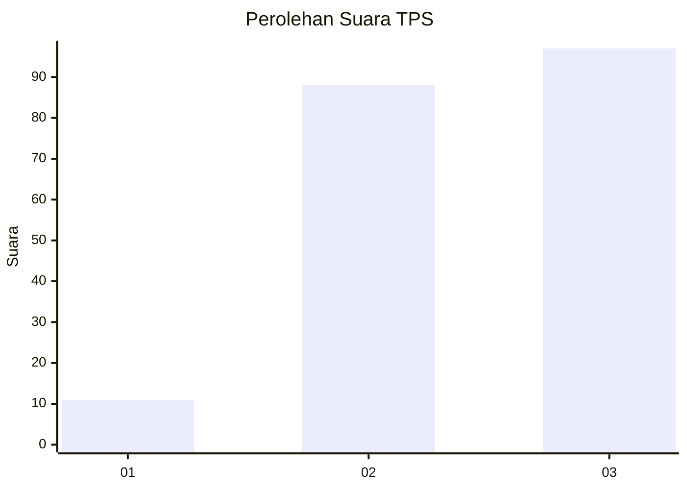
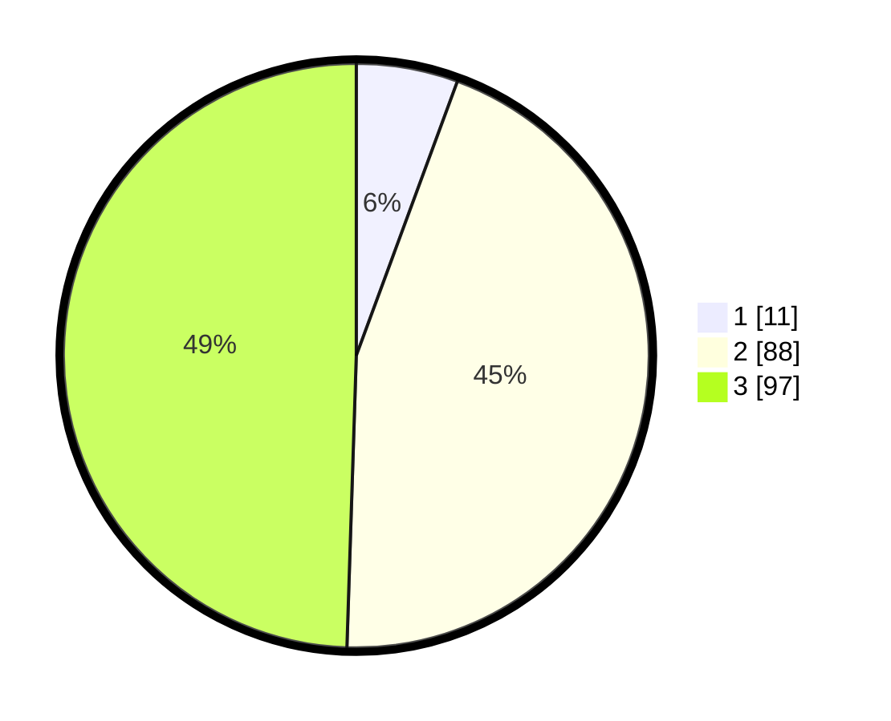

# Hasil

## Grafik

## Tabel

| No. | Nama Paslon    | Suara | Suara (raw) | Persentase |
|:--- |:-------------- | -----:| -----------:| ----------:|
| 1   | ANIES MUHAIMIN | 11    | [11][p-1]   | 5,61       |
| 2   | PRABOWO GIBRAN | 88    | [88][p-2]   | 44,90      |
| 3   | GANJAR MAHFUD  | 97    | [97][p-3]   | 49,49      |

[p-1]: https://github.com/gigit-pemilu/pemilu-2024-91-papua/blob/main/pilpres/hitung-suara/sub/91-papua/sub/19-supiori/sub/01-supiori-selatan/sub/2010-biniki/sub/001-tps/sub/paslon-1.txt
[p-2]: https://github.com/gigit-pemilu/pemilu-2024-91-papua/blob/main/pilpres/hitung-suara/sub/91-papua/sub/19-supiori/sub/01-supiori-selatan/sub/2010-biniki/sub/001-tps/sub/paslon-2.txt
[p-3]: https://github.com/gigit-pemilu/pemilu-2024-91-papua/blob/main/pilpres/hitung-suara/sub/91-papua/sub/19-supiori/sub/01-supiori-selatan/sub/2010-biniki/sub/001-tps/sub/paslon-3.txt

## Foto C Plano

https://sirekap-obj-formc.kpu.go.id/f358/pemilu/ppwp/91/19/01/20/10/9119012010001-20240222-122956--3c519c04-3863-4740-82ea-8302cbdb25da.jpg

https://sirekap-obj-formc.kpu.go.id/f358/pemilu/ppwp/91/19/01/20/10/9119012010001-20240222-123104--74707d1b-10cd-49c2-82ae-759f86f6eda5.jpg

https://sirekap-obj-formc.kpu.go.id/f358/pemilu/ppwp/91/19/01/20/10/9119012010001-20240222-123416--565d4a7e-56bc-4fdb-b974-42e3c23b622f.jpg

## Metadata

| Key        | Value               |
| ---------- | ------------------- |
| Time Stamp | 2024-02-24 22:31:28 |

## DATA PEMILIH TETAP

Jumlah pemilih dalam DPT: **193**.
 * L: **102**.
 * P: **91**.

## DATA PENGGUNA HAK PILIH

Jumlah pengguna hak pilih dalam DPT: **193**.
 * L: **102**.
 * P: **91**.

Jumlah pengguna hak pilih dalam DPTb: **4**.
 * L: **2**.
 * P: **2**.

Jumlah pengguna hak pilih dalam DPK: **0**.
 * L: **0**.
 * P: **0**.

Jumlah pengguna hak pilih: **197**.
 * L: **104**.
 * P: **93**.

## JUMLAH SUARA SAH DAN TIDAK SAH

JUMLAH SELURUH SUARA SAH: **196**.

JUMLAH SUARA TIDAK SAH: **1**.

JUMLAH SELURUH SUARA SAH DAN SUARA TIDAK SAH: **197**.

