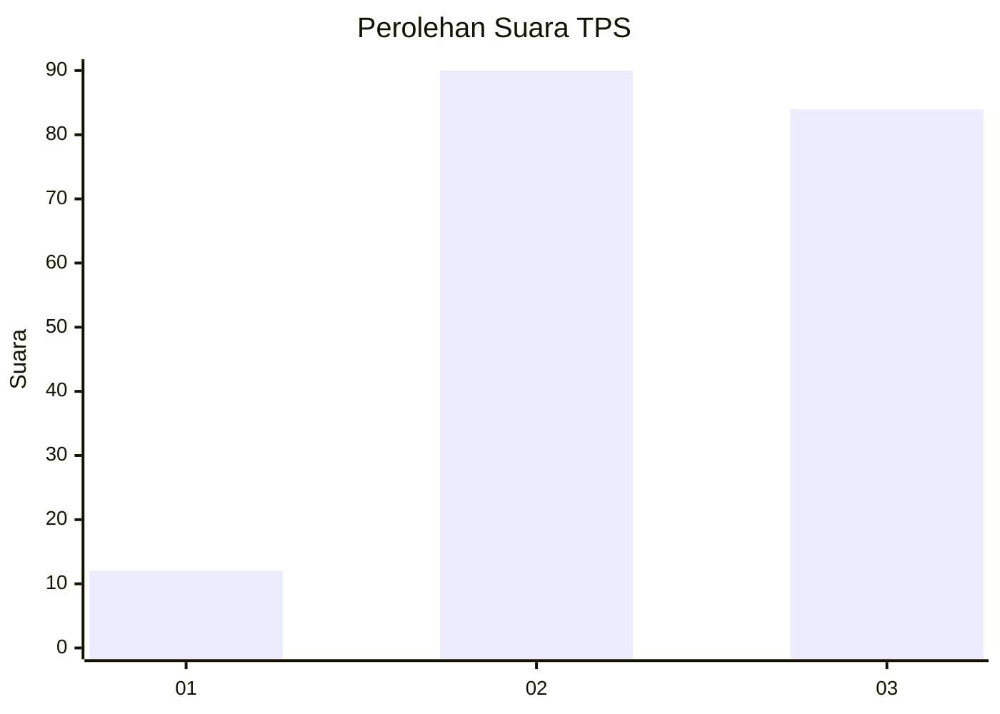
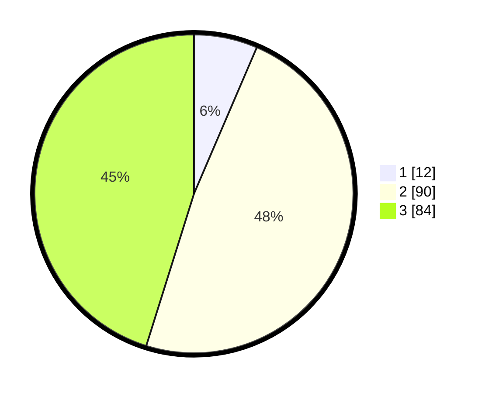

# Hasil

## Grafik

## Tabel

| No. | Nama Paslon    | Suara | Suara (raw) | Persentase |
|:--- |:-------------- | -----:| -----------:| ----------:|
| 1   | ANIES MUHAIMIN | 12    | [12][p-1]   | 6,45       |
| 2   | PRABOWO GIBRAN | 90    | [90][p-2]   | 48,39      |
| 3   | GANJAR MAHFUD  | 84    | [84][p-3]   | 45,16      |

[p-1]: https://github.com/gigit-pemilu/pemilu-2024-91-papua/blob/main/pilpres/hitung-suara/sub/91-papua/sub/19-supiori/sub/02-supiori-utara/sub/2008-warbor/sub/001-tps/sub/paslon-1.txt
[p-2]: https://github.com/gigit-pemilu/pemilu-2024-91-papua/blob/main/pilpres/hitung-suara/sub/91-papua/sub/19-supiori/sub/02-supiori-utara/sub/2008-warbor/sub/001-tps/sub/paslon-2.txt
[p-3]: https://github.com/gigit-pemilu/pemilu-2024-91-papua/blob/main/pilpres/hitung-suara/sub/91-papua/sub/19-supiori/sub/02-supiori-utara/sub/2008-warbor/sub/001-tps/sub/paslon-3.txt

## Foto C Plano

https://sirekap-obj-formc.kpu.go.id/74ab/pemilu/ppwp/91/19/02/20/08/9119022008001-20240220-124739--1ed81b48-58f7-4be4-8b7f-81815b45e406.jpg

https://sirekap-obj-formc.kpu.go.id/74ab/pemilu/ppwp/91/19/02/20/08/9119022008001-20240220-124341--2f141be3-6111-4338-879e-33ba6ebfde05.jpg

https://sirekap-obj-formc.kpu.go.id/74ab/pemilu/ppwp/91/19/02/20/08/9119022008001-20240220-124430--5989b783-0595-4beb-adb2-b3f32c957934.jpg

## Metadata

| Key        | Value               |
| ---------- | ------------------- |
| Time Stamp | 2024-02-22 09:00:00 |

