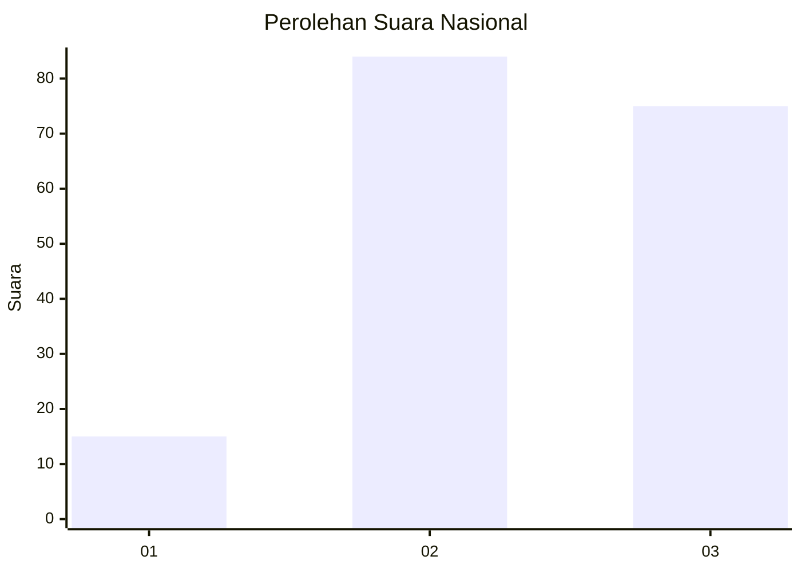
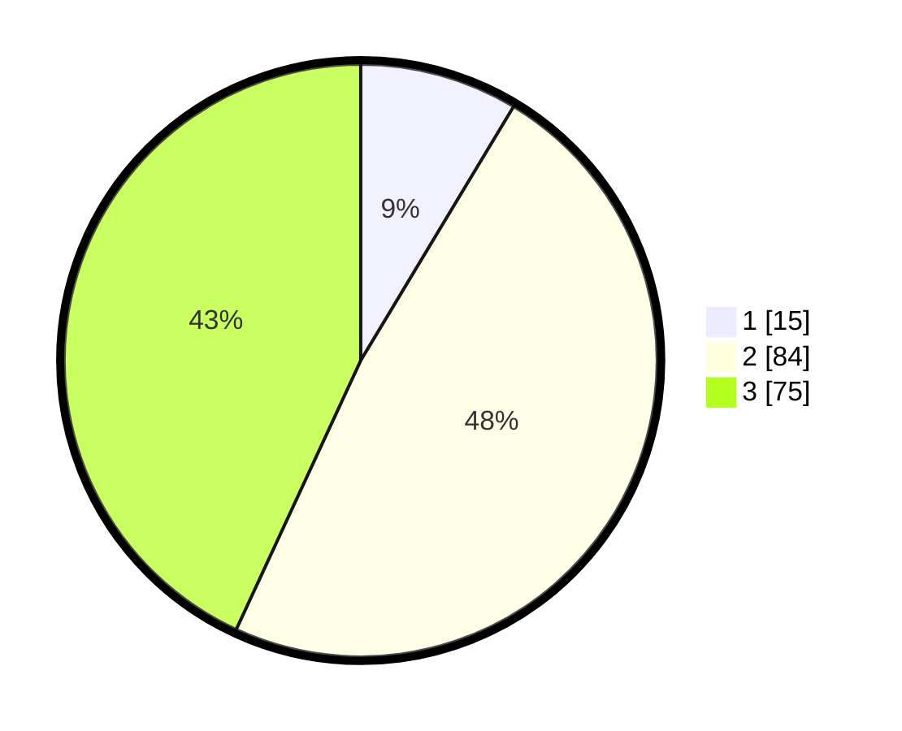

# Hasil

## Grafik

## Tabel

| No. | Nama Paslon    | Suara | Suara (raw) | Persentase |
|:--- |:-------------- | -----:| -----------:| ----------:|
| 1   | ANIES MUHAIMIN | 15    | [15][p-1]   | 8,62       |
| 2   | PRABOWO GIBRAN | 84    | [84][p-2]   | 48,28      |
| 3   | GANJAR MAHFUD  | 75    | [75][p-3]   | 43,10      |

[p-1]: https://github.com/gigit-pemilu/pemilu-2024/blob/main/pilpres/hitung-suara/sub/91-papua/sub/19-supiori/sub/03-supiori-timur/sub/2001-yawerma/sub/001-tps/sub/paslon-1.txt
[p-2]: https://github.com/gigit-pemilu/pemilu-2024/blob/main/pilpres/hitung-suara/sub/91-papua/sub/19-supiori/sub/03-supiori-timur/sub/2001-yawerma/sub/001-tps/sub/paslon-2.txt
[p-3]: https://github.com/gigit-pemilu/pemilu-2024/blob/main/pilpres/hitung-suara/sub/91-papua/sub/19-supiori/sub/03-supiori-timur/sub/2001-yawerma/sub/001-tps/sub/paslon-3.txt

## Foto C Plano

https://sirekap-obj-formc.kpu.go.id/907c/pemilu/ppwp/91/19/03/20/01/9119032001001-20240226-143456--221eb4cd-733f-41da-aef9-9ef4ac4bd1d0.jpg

https://sirekap-obj-formc.kpu.go.id/907c/pemilu/ppwp/91/19/03/20/01/9119032001001-20240226-143024--af91e44f-530f-46cf-9a83-d795c6425eb5.jpg

https://sirekap-obj-formc.kpu.go.id/907c/pemilu/ppwp/91/19/03/20/01/9119032001001-20240226-143213--c266c0d0-193c-4b87-bb69-c915f9ed2a95.jpg

## Metadata

| Key        | Value               |
| ---------- | ------------------- |
| Time Stamp | 2024-02-26 22:00:00 |

