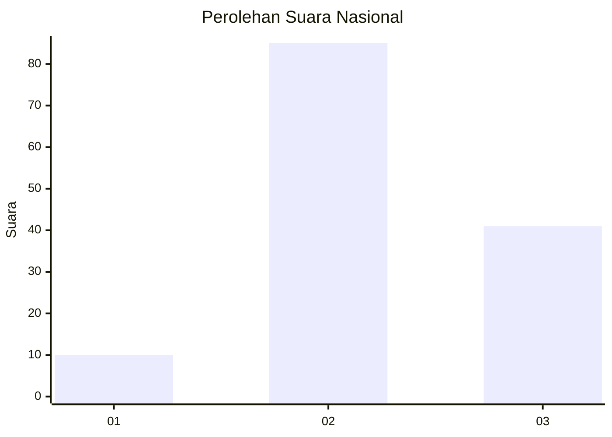
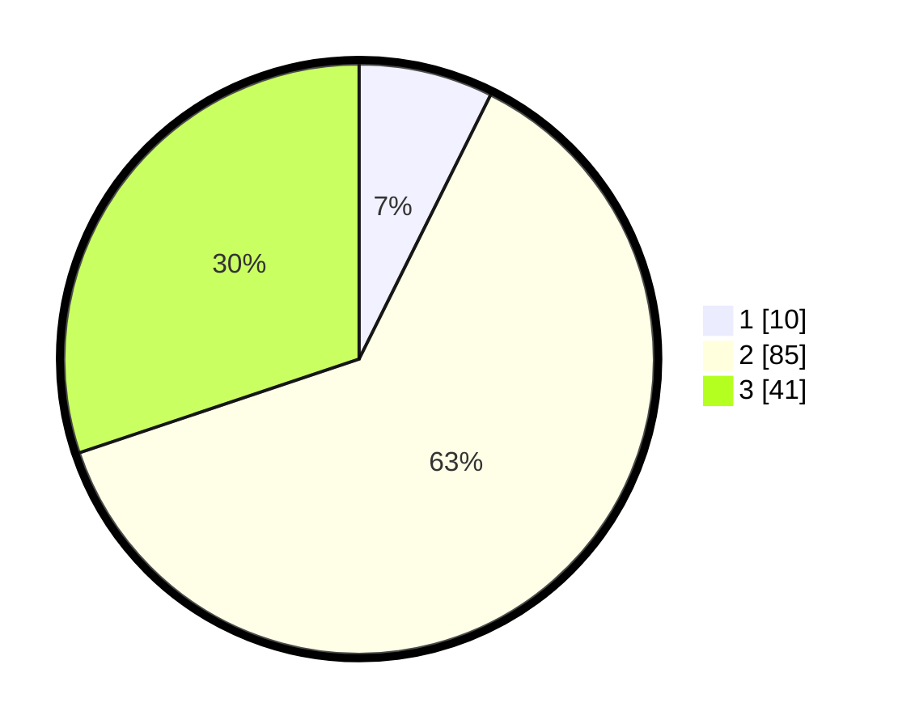

# Hasil

## Grafik

## Tabel

| No. | Nama Paslon    | Suara | Suara (raw) | Persentase |
|:--- |:-------------- | -----:| -----------:| ----------:|
| 1   | ANIES MUHAIMIN | 10    | [10][p-1]   | 7,35       |
| 2   | PRABOWO GIBRAN | 85    | [85][p-2]   | 62,50      |
| 3   | GANJAR MAHFUD  | 41    | [41][p-3]   | 30,15      |

[p-1]: https://github.com/gigit-pemilu/pemilu-2024/blob/main/pilpres/hitung-suara/sub/91-papua/sub/19-supiori/sub/03-supiori-timur/sub/2001-yawerma/sub/002-tps/sub/paslon-1.txt
[p-2]: https://github.com/gigit-pemilu/pemilu-2024/blob/main/pilpres/hitung-suara/sub/91-papua/sub/19-supiori/sub/03-supiori-timur/sub/2001-yawerma/sub/002-tps/sub/paslon-2.txt
[p-3]: https://github.com/gigit-pemilu/pemilu-2024/blob/main/pilpres/hitung-suara/sub/91-papua/sub/19-supiori/sub/03-supiori-timur/sub/2001-yawerma/sub/002-tps/sub/paslon-3.txt

## Foto C Plano

https://sirekap-obj-formc.kpu.go.id/6a2a/pemilu/ppwp/91/19/03/20/01/9119032001002-20240226-144321--44d65cd0-f64c-4c9f-9fc4-0a3fab834712.jpg

https://sirekap-obj-formc.kpu.go.id/6a2a/pemilu/ppwp/91/19/03/20/01/9119032001002-20240226-144216--b2151ebb-c3d3-469c-94fc-435696ecd6ce.jpg

https://sirekap-obj-formc.kpu.go.id/6a2a/pemilu/ppwp/91/19/03/20/01/9119032001002-20240226-144433--5ecbe073-f1cd-4193-b7f9-313908dfcef7.jpg

## Metadata

| Key        | Value               |
| ---------- | ------------------- |
| Time Stamp | 2024-02-29 03:00:00 |

