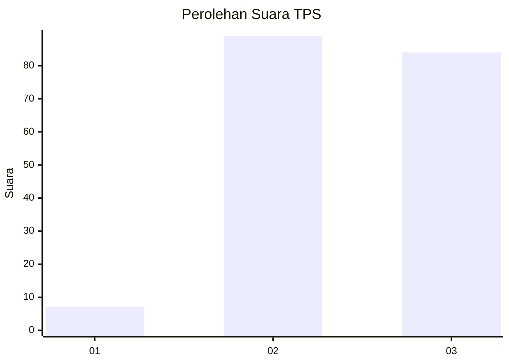
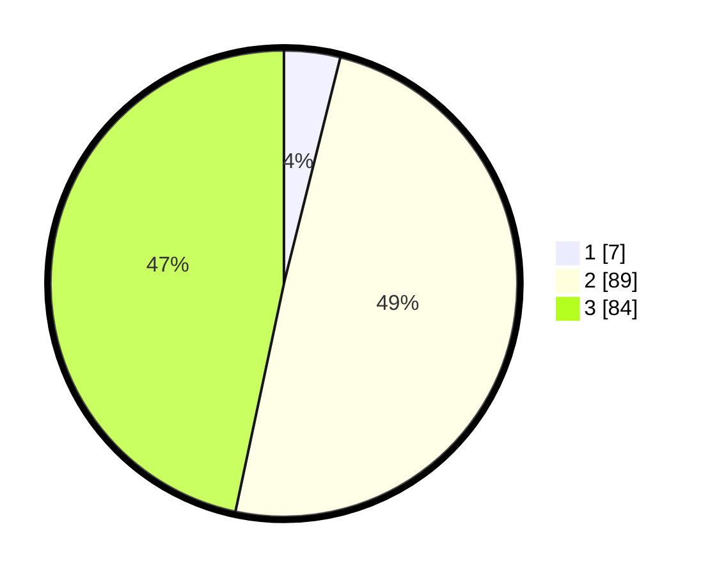

# Hasil

## Grafik

## Tabel

| No. | Nama Paslon    | Suara | Suara (raw) | Persentase |
|:--- |:-------------- | -----:| -----------:| ----------:|
| 1   | ANIES MUHAIMIN | 7     | [7][p-1]    | 3,89       |
| 2   | PRABOWO GIBRAN | 89    | [89][p-2]   | 49,44      |
| 3   | GANJAR MAHFUD  | 84    | [84][p-3]   | 46,67      |

[p-1]: https://github.com/gigit-pemilu/pemilu-2024-91-papua/blob/main/pilpres/hitung-suara/sub/91-papua/sub/19-supiori/sub/03-supiori-timur/sub/2002-wombonda/sub/001-tps/sub/paslon-1.txt
[p-2]: https://github.com/gigit-pemilu/pemilu-2024-91-papua/blob/main/pilpres/hitung-suara/sub/91-papua/sub/19-supiori/sub/03-supiori-timur/sub/2002-wombonda/sub/001-tps/sub/paslon-2.txt
[p-3]: https://github.com/gigit-pemilu/pemilu-2024-91-papua/blob/main/pilpres/hitung-suara/sub/91-papua/sub/19-supiori/sub/03-supiori-timur/sub/2002-wombonda/sub/001-tps/sub/paslon-3.txt

## Foto C Plano

https://sirekap-obj-formc.kpu.go.id/5a8e/pemilu/ppwp/91/19/03/20/02/9119032002001-20240226-142258--ae355e86-8b9e-4270-b275-ee98d391f114.jpg

https://sirekap-obj-formc.kpu.go.id/5a8e/pemilu/ppwp/91/19/03/20/02/9119032002001-20240226-142350--2eafc0f5-d919-4dbe-b91f-ec6d1e3439c3.jpg

https://sirekap-obj-formc.kpu.go.id/5a8e/pemilu/ppwp/91/19/03/20/02/9119032002001-20240220-151415--cae11895-e74b-4118-8d85-ba3f774a05b0.jpg

## Metadata

| Key        | Value               |
| ---------- | ------------------- |
| Time Stamp | 2024-02-27 07:00:00 |

## DATA PEMILIH TETAP

Jumlah pemilih dalam DPT: **185**.
 * L: **101**.
 * P: **84**.

## DATA PENGGUNA HAK PILIH

Jumlah pengguna hak pilih dalam DPT: **173**.
 * L: **97**.
 * P: **76**.

Jumlah pengguna hak pilih dalam DPTb: **0**.
 * L: **0**.
 * P: **0**.

Jumlah pengguna hak pilih dalam DPK: **12**.
 * L: **7**.
 * P: **5**.

Jumlah pengguna hak pilih: **185**.
 * L: **104**.
 * P: **81**.

## JUMLAH SUARA SAH DAN TIDAK SAH

JUMLAH SELURUH SUARA SAH: **180**.

JUMLAH SUARA TIDAK SAH: **4**.

JUMLAH SELURUH SUARA SAH DAN SUARA TIDAK SAH: **184**.

