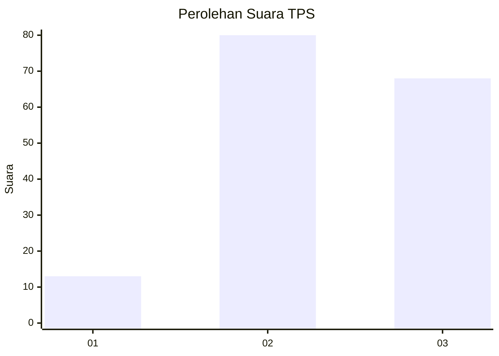
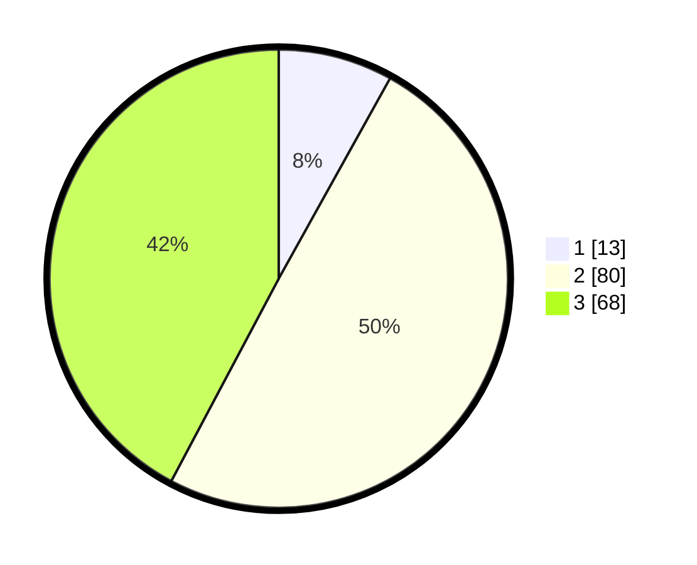

# Hasil

## Grafik

## Tabel

| No. | Nama Paslon    | Suara | Suara (raw) | Persentase |
|:--- |:-------------- | -----:| -----------:| ----------:|
| 1   | ANIES MUHAIMIN | 13    | [13][p-1]   | 8,07       |
| 2   | PRABOWO GIBRAN | 80    | [80][p-2]   | 49,69      |
| 3   | GANJAR MAHFUD  | 68    | [68][p-3]   | 42,24      |

[p-1]: https://github.com/gigit-pemilu/pemilu-2024-91-papua/blob/main/pilpres/hitung-suara/sub/91-papua/sub/19-supiori/sub/03-supiori-timur/sub/2002-wombonda/sub/002-tps/sub/paslon-1.txt
[p-2]: https://github.com/gigit-pemilu/pemilu-2024-91-papua/blob/main/pilpres/hitung-suara/sub/91-papua/sub/19-supiori/sub/03-supiori-timur/sub/2002-wombonda/sub/002-tps/sub/paslon-2.txt
[p-3]: https://github.com/gigit-pemilu/pemilu-2024-91-papua/blob/main/pilpres/hitung-suara/sub/91-papua/sub/19-supiori/sub/03-supiori-timur/sub/2002-wombonda/sub/002-tps/sub/paslon-3.txt

## Foto C Plano

https://sirekap-obj-formc.kpu.go.id/666c/pemilu/ppwp/91/19/03/20/02/9119032002002-20240226-141622--ea43da36-e258-4add-bd9f-d75de000c6d4.jpg

https://sirekap-obj-formc.kpu.go.id/666c/pemilu/ppwp/91/19/03/20/02/9119032002002-20240226-141640--8aa06857-06df-48a7-b6b4-5bcb1120824d.jpg

https://sirekap-obj-formc.kpu.go.id/666c/pemilu/ppwp/91/19/03/20/02/9119032002002-20240226-141713--0eecb279-6aa5-4db2-9ec8-27094d864c36.jpg

## Metadata

| Key        | Value               |
| ---------- | ------------------- |
| Time Stamp | 2024-02-26 17:00:04 |

