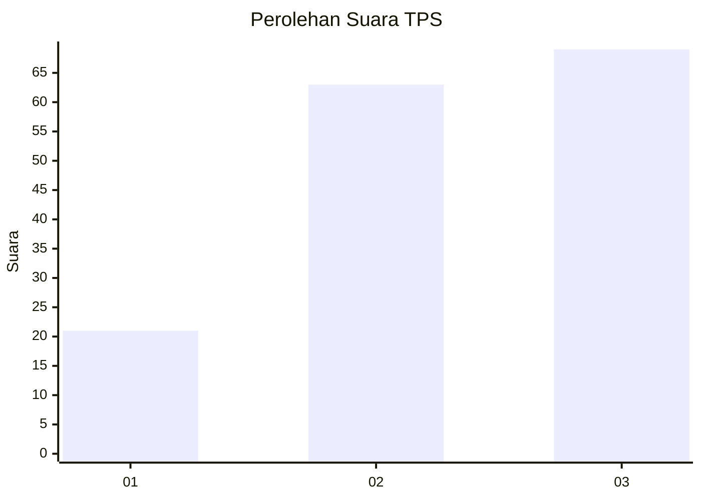
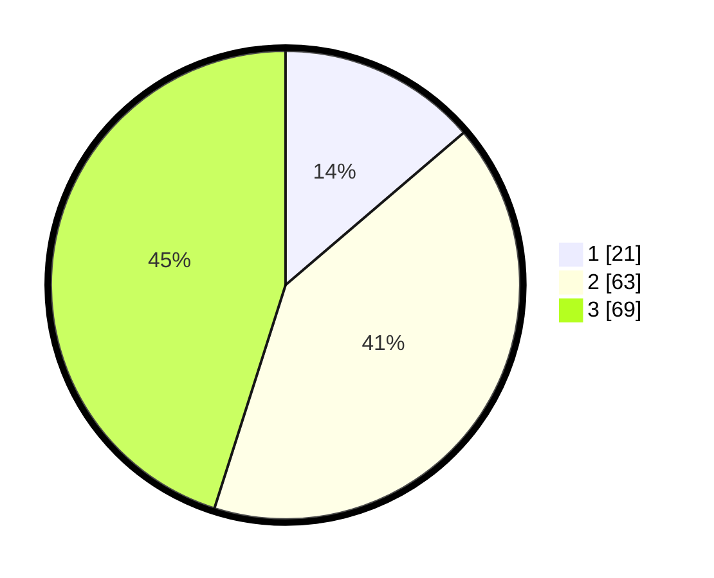

# Hasil

## Grafik

## Tabel

| No. | Nama Paslon    | Suara | Suara (raw) | Persentase |
|:--- |:-------------- | -----:| -----------:| ----------:|
| 1   | ANIES MUHAIMIN | 21    | [21][p-1]   | 13,73      |
| 2   | PRABOWO GIBRAN | 63    | [63][p-2]   | 41,18      |
| 3   | GANJAR MAHFUD  | 69    | [69][p-3]   | 45,10      |

[p-1]: https://github.com/gigit-pemilu/pemilu-2024-91-papua/blob/main/pilpres/hitung-suara/sub/91-papua/sub/19-supiori/sub/03-supiori-timur/sub/2004-duber/sub/003-tps/sub/paslon-1.txt
[p-2]: https://github.com/gigit-pemilu/pemilu-2024-91-papua/blob/main/pilpres/hitung-suara/sub/91-papua/sub/19-supiori/sub/03-supiori-timur/sub/2004-duber/sub/003-tps/sub/paslon-2.txt
[p-3]: https://github.com/gigit-pemilu/pemilu-2024-91-papua/blob/main/pilpres/hitung-suara/sub/91-papua/sub/19-supiori/sub/03-supiori-timur/sub/2004-duber/sub/003-tps/sub/paslon-3.txt

## Foto C Plano

https://sirekap-obj-formc.kpu.go.id/481f/pemilu/ppwp/91/19/03/20/04/9119032004003-20240225-225510--47d8fd1c-06d0-4e81-a1cf-c5178749d7e2.jpg

https://sirekap-obj-formc.kpu.go.id/481f/pemilu/ppwp/91/19/03/20/04/9119032004003-20240225-225546--662658c2-8ffe-4af4-b2e8-4966e7c3df2b.jpg

https://sirekap-obj-formc.kpu.go.id/481f/pemilu/ppwp/91/19/03/20/04/9119032004003-20240225-225608--92cd79a7-3a69-4145-86a5-7308489380ca.jpg

## Metadata

| Key        | Value               |
| ---------- | ------------------- |
| Time Stamp | 2024-02-28 20:00:00 |

