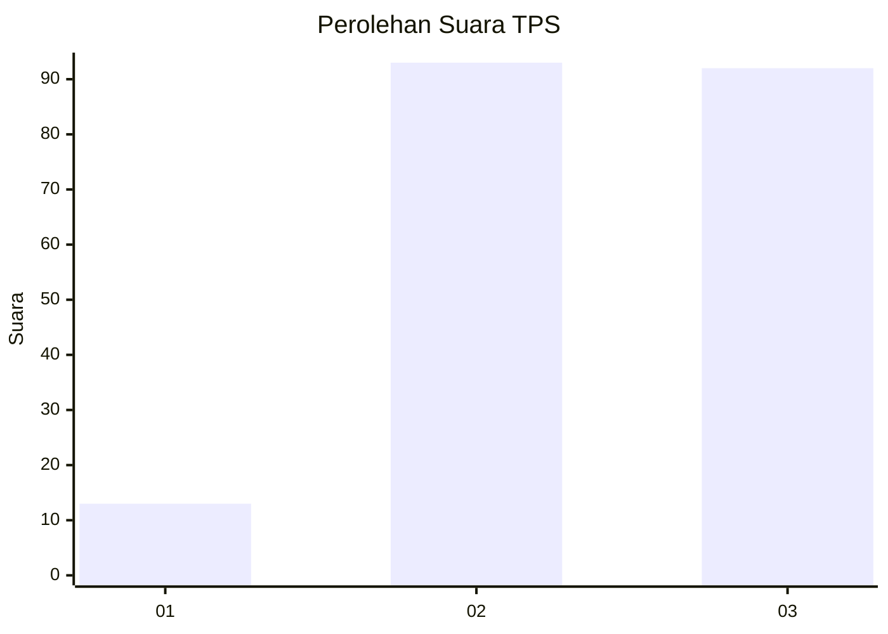
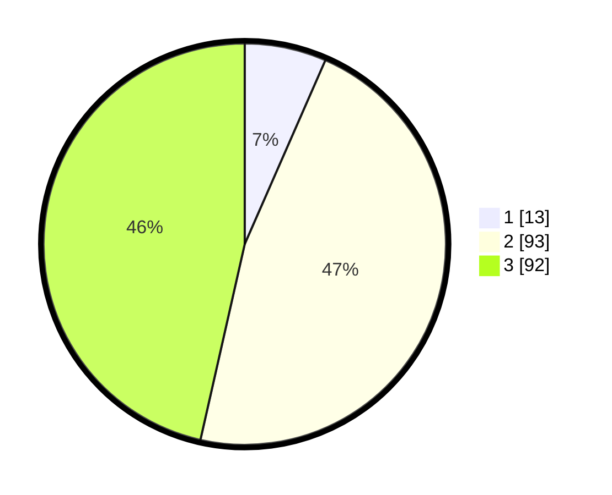

# Hasil

## Grafik

## Tabel

| No. | Nama Paslon    | Suara | Suara (raw) | Persentase |
|:--- |:-------------- | -----:| -----------:| ----------:|
| 1   | ANIES MUHAIMIN | 13    | [13][p-1]   | 6,57       |
| 2   | PRABOWO GIBRAN | 93    | [93][p-2]   | 46,97      |
| 3   | GANJAR MAHFUD  | 92    | [92][p-3]   | 46,46      |

[p-1]: https://github.com/gigit-pemilu/pemilu-2024-91-papua/blob/main/pilpres/hitung-suara/sub/91-papua/sub/19-supiori/sub/03-supiori-timur/sub/2005-sauyas/sub/001-tps/sub/paslon-1.txt
[p-2]: https://github.com/gigit-pemilu/pemilu-2024-91-papua/blob/main/pilpres/hitung-suara/sub/91-papua/sub/19-supiori/sub/03-supiori-timur/sub/2005-sauyas/sub/001-tps/sub/paslon-2.txt
[p-3]: https://github.com/gigit-pemilu/pemilu-2024-91-papua/blob/main/pilpres/hitung-suara/sub/91-papua/sub/19-supiori/sub/03-supiori-timur/sub/2005-sauyas/sub/001-tps/sub/paslon-3.txt

## Foto C Plano

https://sirekap-obj-formc.kpu.go.id/691e/pemilu/ppwp/91/19/03/20/05/9119032005001-20240226-135444--3dff1fc1-88a4-41a4-96eb-318b5deded34.jpg

https://sirekap-obj-formc.kpu.go.id/691e/pemilu/ppwp/91/19/03/20/05/9119032005001-20240226-135518--2f60ca2b-9828-40be-8078-d7ce4f0259cf.jpg

https://sirekap-obj-formc.kpu.go.id/691e/pemilu/ppwp/91/19/03/20/05/9119032005001-20240226-135620--14f6a382-6f2e-44b5-b19d-9068132a6981.jpg

## Metadata

| Key        | Value               |
| ---------- | ------------------- |
| Time Stamp | 2024-02-28 21:00:00 |

