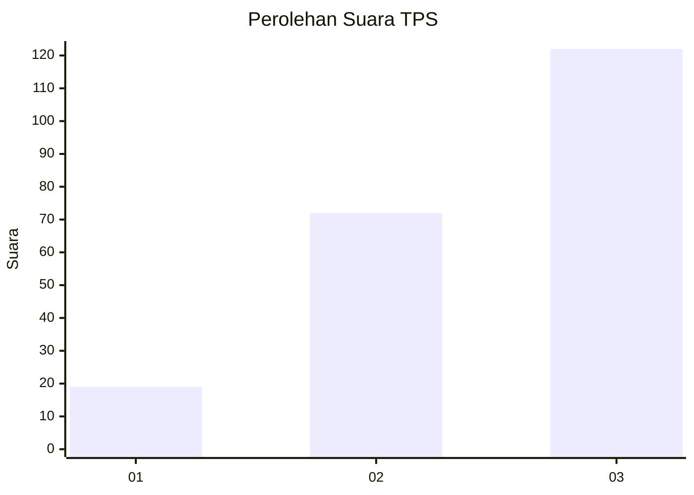
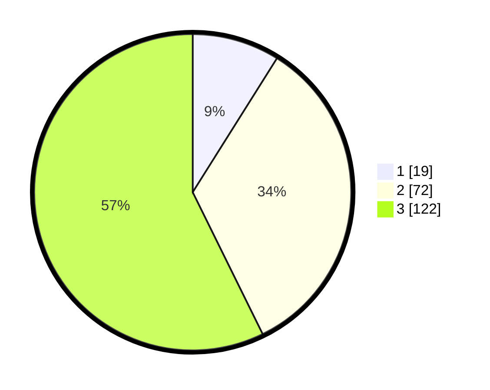

# Hasil

## Grafik

## Tabel

| No. | Nama Paslon    | Suara | Suara (raw) | Persentase |
|:--- |:-------------- | -----:| -----------:| ----------:|
| 1   | ANIES MUHAIMIN | 19    | [19][p-1]   | 8,92       |
| 2   | PRABOWO GIBRAN | 72    | [72][p-2]   | 33,80      |
| 3   | GANJAR MAHFUD  | 122   | [122][p-3]  | 57,28      |

[p-1]: https://github.com/gigit-pemilu/pemilu-2024-91-papua/blob/main/pilpres/hitung-suara/sub/91-papua/sub/19-supiori/sub/03-supiori-timur/sub/2006-wafor/sub/002-tps/sub/paslon-1.txt
[p-2]: https://github.com/gigit-pemilu/pemilu-2024-91-papua/blob/main/pilpres/hitung-suara/sub/91-papua/sub/19-supiori/sub/03-supiori-timur/sub/2006-wafor/sub/002-tps/sub/paslon-2.txt
[p-3]: https://github.com/gigit-pemilu/pemilu-2024-91-papua/blob/main/pilpres/hitung-suara/sub/91-papua/sub/19-supiori/sub/03-supiori-timur/sub/2006-wafor/sub/002-tps/sub/paslon-3.txt

## Foto C Plano

https://sirekap-obj-formc.kpu.go.id/a932/pemilu/ppwp/91/19/03/20/06/9119032006002-20240226-145804--7b81f199-0109-4943-bb47-ca91f048fea4.jpg

https://sirekap-obj-formc.kpu.go.id/a932/pemilu/ppwp/91/19/03/20/06/9119032006002-20240226-145624--e454d841-a454-4124-8bf6-3c5a58dbd8ce.jpg

https://sirekap-obj-formc.kpu.go.id/a932/pemilu/ppwp/91/19/03/20/06/9119032006002-20240226-145551--4257e6b8-3917-4e58-b4c2-f8b32099c27c.jpg

## Metadata

| Key        | Value               |
| ---------- | ------------------- |
| Time Stamp | 2024-02-28 22:00:00 |

