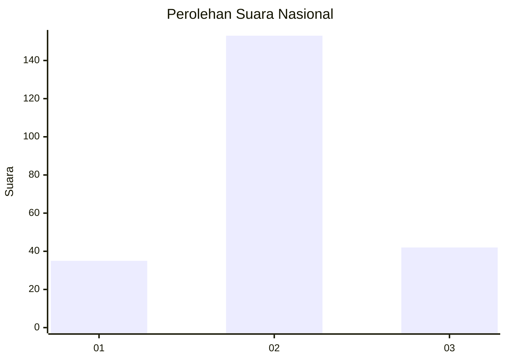
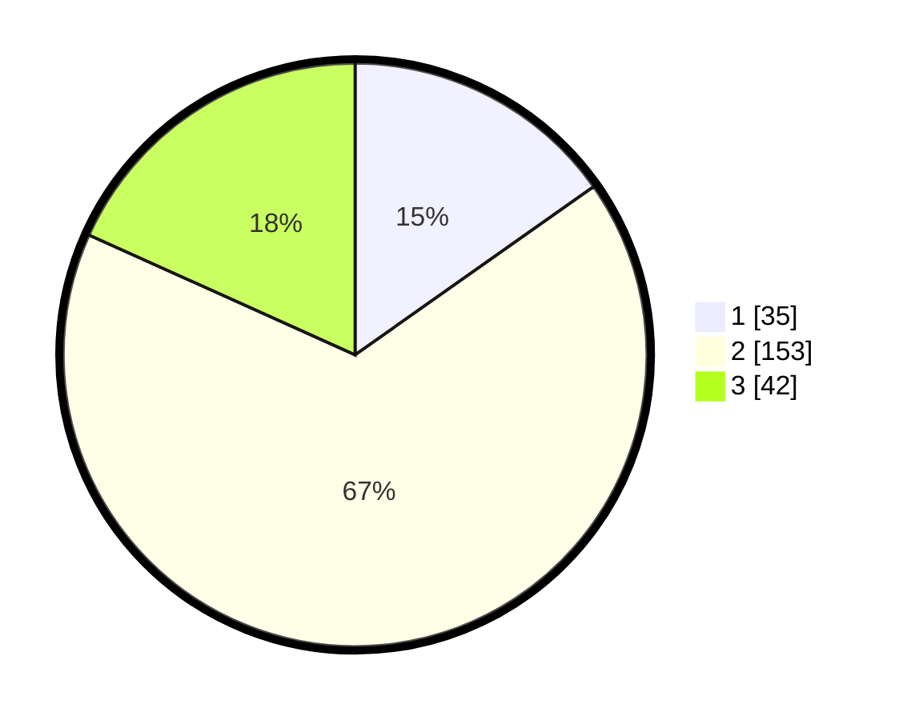

# Hasil

## Grafik

## Tabel

| No. | Nama Paslon    | Suara | Suara (raw) | Persentase |
|:--- |:-------------- | -----:| -----------:| ----------:|
| 1   | ANIES MUHAIMIN | 35    | [35][p-1]   | 15,22      |
| 2   | PRABOWO GIBRAN | 153   | [153][p-2]  | 66,52      |
| 3   | GANJAR MAHFUD  | 42    | [42][p-3]   | 18,26      |

[p-1]: https://github.com/gigit-pemilu/pemilu-2024/blob/main/pilpres/hitung-suara/sub/91-papua/sub/19-supiori/sub/03-supiori-timur/sub/2007-sorendidori/sub/002-tps/sub/paslon-1.txt
[p-2]: https://github.com/gigit-pemilu/pemilu-2024/blob/main/pilpres/hitung-suara/sub/91-papua/sub/19-supiori/sub/03-supiori-timur/sub/2007-sorendidori/sub/002-tps/sub/paslon-2.txt
[p-3]: https://github.com/gigit-pemilu/pemilu-2024/blob/main/pilpres/hitung-suara/sub/91-papua/sub/19-supiori/sub/03-supiori-timur/sub/2007-sorendidori/sub/002-tps/sub/paslon-3.txt

## Foto C Plano

https://sirekap-obj-formc.kpu.go.id/f79b/pemilu/ppwp/91/19/03/20/07/9119032007002-20240222-080754--363a76d3-c716-4594-96b0-7aaadafbc4ba.jpg

https://sirekap-obj-formc.kpu.go.id/f79b/pemilu/ppwp/91/19/03/20/07/9119032007002-20240220-211253--e8b2267b-c083-4ded-a64e-128e13ed33d2.jpg

https://sirekap-obj-formc.kpu.go.id/f79b/pemilu/ppwp/91/19/03/20/07/9119032007002-20240220-211321--b7f16264-1de9-4d98-a2b7-694f6ca4e855.jpg

## Metadata

| Key        | Value               |
| ---------- | ------------------- |
| Time Stamp | 2024-02-24 22:31:28 |

