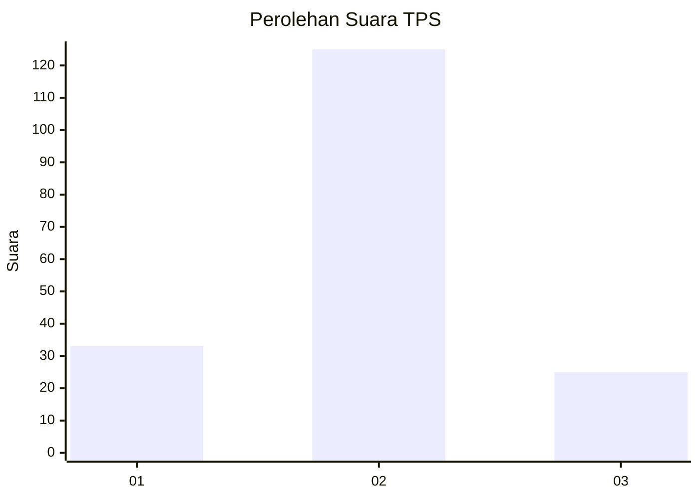
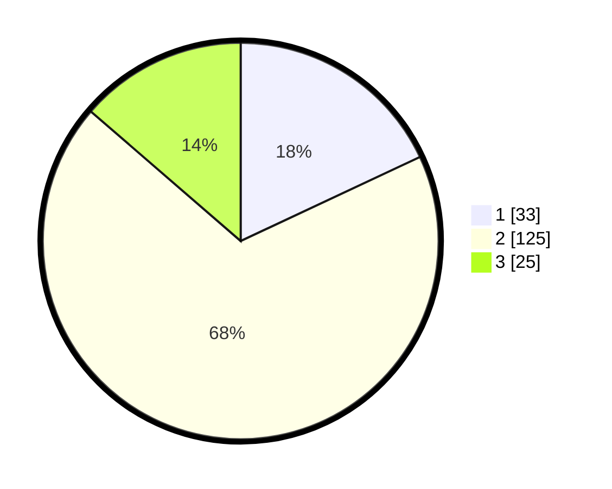

# Hasil

## Grafik

## Tabel

| No. | Nama Paslon    | Suara | Suara (raw) | Persentase |
|:--- |:-------------- | -----:| -----------:| ----------:|
| 1   | ANIES MUHAIMIN | 33    | [33][p-1]   | 18,03      |
| 2   | PRABOWO GIBRAN | 125   | [125][p-2]  | 68,31      |
| 3   | GANJAR MAHFUD  | 25    | [25][p-3]   | 13,66      |

[p-1]: https://github.com/gigit-pemilu/pemilu-2024-91-papua/blob/main/pilpres/hitung-suara/sub/91-papua/sub/71-kota-jayapura/sub/01-jayapura-utara/sub/1001-gurabesi/sub/004-tps/sub/paslon-1.txt
[p-2]: https://github.com/gigit-pemilu/pemilu-2024-91-papua/blob/main/pilpres/hitung-suara/sub/91-papua/sub/71-kota-jayapura/sub/01-jayapura-utara/sub/1001-gurabesi/sub/004-tps/sub/paslon-2.txt
[p-3]: https://github.com/gigit-pemilu/pemilu-2024-91-papua/blob/main/pilpres/hitung-suara/sub/91-papua/sub/71-kota-jayapura/sub/01-jayapura-utara/sub/1001-gurabesi/sub/004-tps/sub/paslon-3.txt

## Foto C Plano

https://sirekap-obj-formc.kpu.go.id/771e/pemilu/ppwp/91/71/01/10/01/9171011001004-20240214-224019--d98ce7bf-5062-4572-9935-a21ed7e2980e.jpg

https://sirekap-obj-formc.kpu.go.id/771e/pemilu/ppwp/91/71/01/10/01/9171011001004-20240214-224117--349c33f7-500f-4c60-a8b2-2f162561a48e.jpg

## Metadata

| Key        | Value               |
| ---------- | ------------------- |
| Time Stamp | 2024-02-25 00:00:00 |

