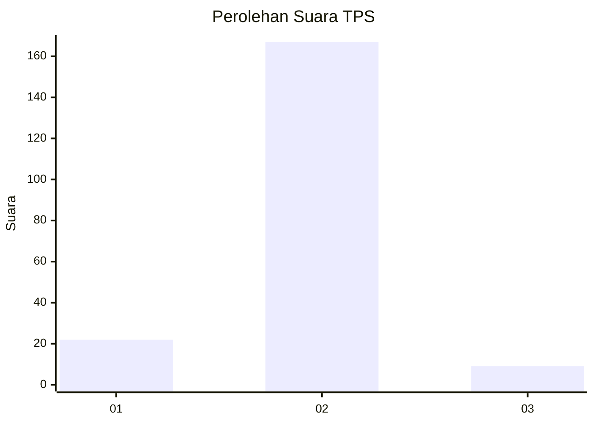
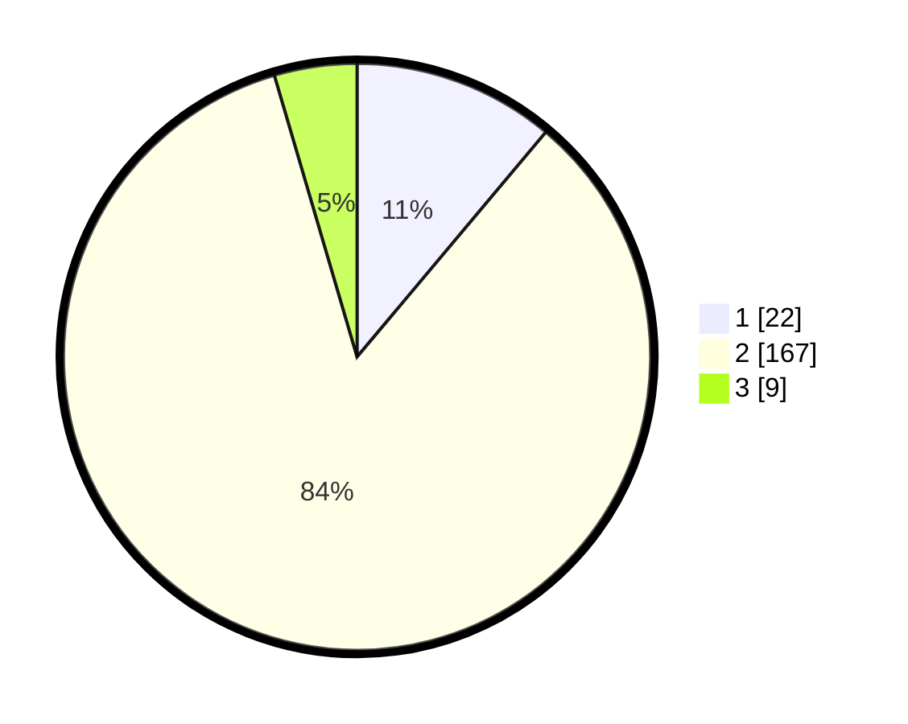

# Hasil

## Grafik

## Tabel

| No. | Nama Paslon    | Suara | Suara (raw) | Persentase |
|:--- |:-------------- | -----:| -----------:| ----------:|
| 1   | ANIES MUHAIMIN | 22    | [22][p-1]   | 11,11      |
| 2   | PRABOWO GIBRAN | 167   | [167][p-2]  | 84,34      |
| 3   | GANJAR MAHFUD  | 9     | [9][p-3]    | 4,55       |

[p-1]: https://github.com/gigit-pemilu/pemilu-2024-91-papua/blob/main/pilpres/hitung-suara/sub/91-papua/sub/71-kota-jayapura/sub/01-jayapura-utara/sub/1001-gurabesi/sub/013-tps/sub/paslon-1.txt
[p-2]: https://github.com/gigit-pemilu/pemilu-2024-91-papua/blob/main/pilpres/hitung-suara/sub/91-papua/sub/71-kota-jayapura/sub/01-jayapura-utara/sub/1001-gurabesi/sub/013-tps/sub/paslon-2.txt
[p-3]: https://github.com/gigit-pemilu/pemilu-2024-91-papua/blob/main/pilpres/hitung-suara/sub/91-papua/sub/71-kota-jayapura/sub/01-jayapura-utara/sub/1001-gurabesi/sub/013-tps/sub/paslon-3.txt

## Foto C Plano

https://sirekap-obj-formc.kpu.go.id/0684/pemilu/ppwp/91/71/01/10/01/9171011001013-20240214-141746--e0a68af1-86aa-4689-a36b-26a58658079d.jpg

https://sirekap-obj-formc.kpu.go.id/0684/pemilu/ppwp/91/71/01/10/01/9171011001013-20240214-141816--04c4aec5-65d6-4562-903d-747f3009252e.jpg

https://sirekap-obj-formc.kpu.go.id/0684/pemilu/ppwp/91/71/01/10/01/9171011001013-20240214-141934--27e7796d-66e0-4422-8b6b-6428de97f4a6.jpg

## Metadata

| Key        | Value               |
| ---------- | ------------------- |
| Time Stamp | 2024-02-16 08:00:28 |

