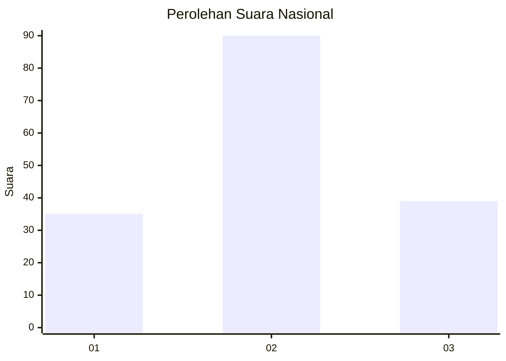
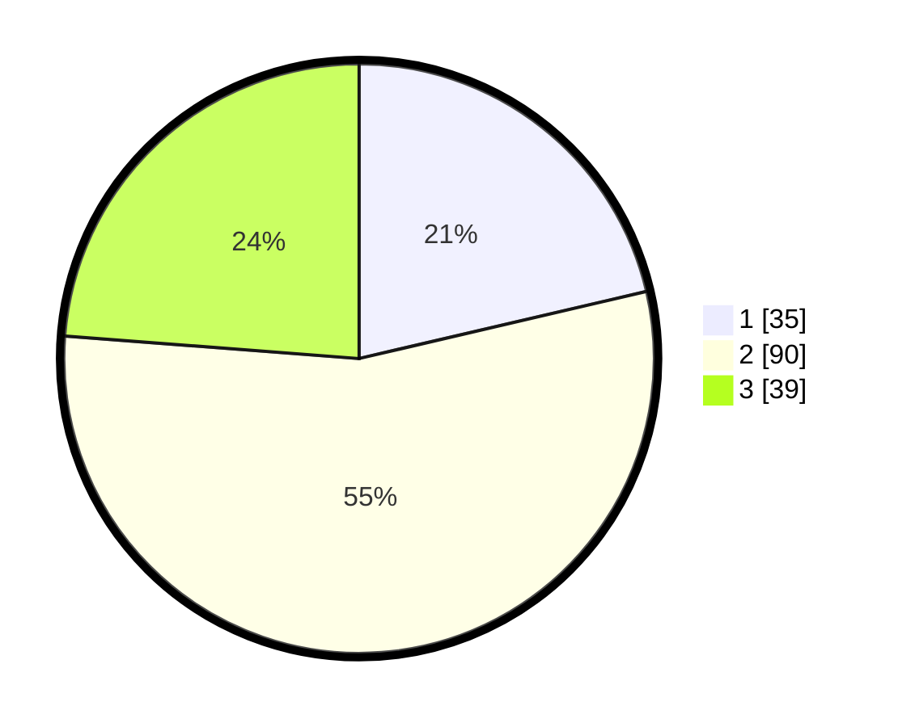

# Hasil

## Grafik

## Tabel

| No. | Nama Paslon    | Suara | Suara (raw) | Persentase |
|:--- |:-------------- | -----:| -----------:| ----------:|
| 1   | ANIES MUHAIMIN | 35    | [35][p-1]   | 21,34      |
| 2   | PRABOWO GIBRAN | 90    | [90][p-2]   | 54,88      |
| 3   | GANJAR MAHFUD  | 39    | [39][p-3]   | 23,78      |

[p-1]: https://github.com/gigit-pemilu/pemilu-2024/blob/main/pilpres/hitung-suara/sub/91-papua/sub/71-kota-jayapura/sub/01-jayapura-utara/sub/1001-gurabesi/sub/023-tps/sub/paslon-1.txt
[p-2]: https://github.com/gigit-pemilu/pemilu-2024/blob/main/pilpres/hitung-suara/sub/91-papua/sub/71-kota-jayapura/sub/01-jayapura-utara/sub/1001-gurabesi/sub/023-tps/sub/paslon-2.txt
[p-3]: https://github.com/gigit-pemilu/pemilu-2024/blob/main/pilpres/hitung-suara/sub/91-papua/sub/71-kota-jayapura/sub/01-jayapura-utara/sub/1001-gurabesi/sub/023-tps/sub/paslon-3.txt

## Foto C Plano

https://sirekap-obj-formc.kpu.go.id/65cb/pemilu/ppwp/91/71/01/10/01/9171011001023-20240214-231931--ce254207-e952-4fba-8424-4a35bf4dda93.jpg

https://sirekap-obj-formc.kpu.go.id/65cb/pemilu/ppwp/91/71/01/10/01/9171011001023-20240214-232043--9fec726d-4863-4b96-b94b-0408fa5e6705.jpg

https://sirekap-obj-formc.kpu.go.id/65cb/pemilu/ppwp/91/71/01/10/01/9171011001023-20240214-232145--c53ac46e-5946-41b7-82da-7cb8b0bfdda9.jpg

## Metadata

| Key        | Value               |
| ---------- | ------------------- |
| Time Stamp | 2024-02-22 13:00:00 |

