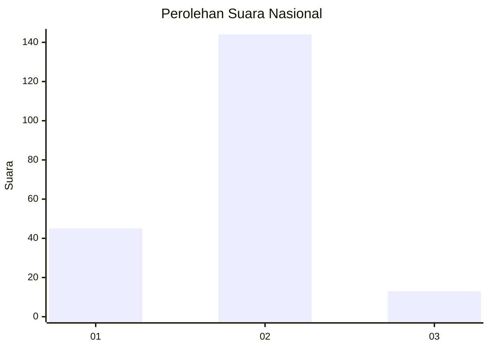

# Hasil

## Grafik

## Tabel

| No. | Nama Paslon    | Suara | Suara (raw) | Persentase |
|:--- |:-------------- | -----:| -----------:| ----------:|
| 1   | ANIES MUHAIMIN | 45    | [45][p-1]   | 22,28      |
| 2   | PRABOWO GIBRAN | 144   | [144][p-2]  | 71,29      |
| 3   | GANJAR MAHFUD  | 13    | [13][p-3]   | 6,44       |

[p-1]: https://github.com/gigit-pemilu/pemilu-2024/blob/main/pilpres/hitung-suara/sub/91-papua/sub/71-kota-jayapura/sub/01-jayapura-utara/sub/1001-gurabesi/sub/027-tps/sub/paslon-1.txt
[p-2]: https://github.com/gigit-pemilu/pemilu-2024/blob/main/pilpres/hitung-suara/sub/91-papua/sub/71-kota-jayapura/sub/01-jayapura-utara/sub/1001-gurabesi/sub/027-tps/sub/paslon-2.txt
[p-3]: https://github.com/gigit-pemilu/pemilu-2024/blob/main/pilpres/hitung-suara/sub/91-papua/sub/71-kota-jayapura/sub/01-jayapura-utara/sub/1001-gurabesi/sub/027-tps/sub/paslon-3.txt

## Foto C Plano

https://sirekap-obj-formc.kpu.go.id/e611/pemilu/ppwp/91/71/01/10/01/9171011001027-20240214-224134--b920c20d-c221-457c-b424-69735c26bbb3.jpg

https://sirekap-obj-formc.kpu.go.id/e611/pemilu/ppwp/91/71/01/10/01/9171011001027-20240214-224212--eea021ae-df3b-44f2-b1ef-08d434a6f7ce.jpg

https://sirekap-obj-formc.kpu.go.id/e611/pemilu/ppwp/91/71/01/10/01/9171011001027-20240214-224301--d9851901-0c60-49dc-af92-3e7680de3ce8.jpg

## Metadata

| Key        | Value               |
| ---------- | ------------------- |
| Time Stamp | 2024-02-16 08:00:28 |

