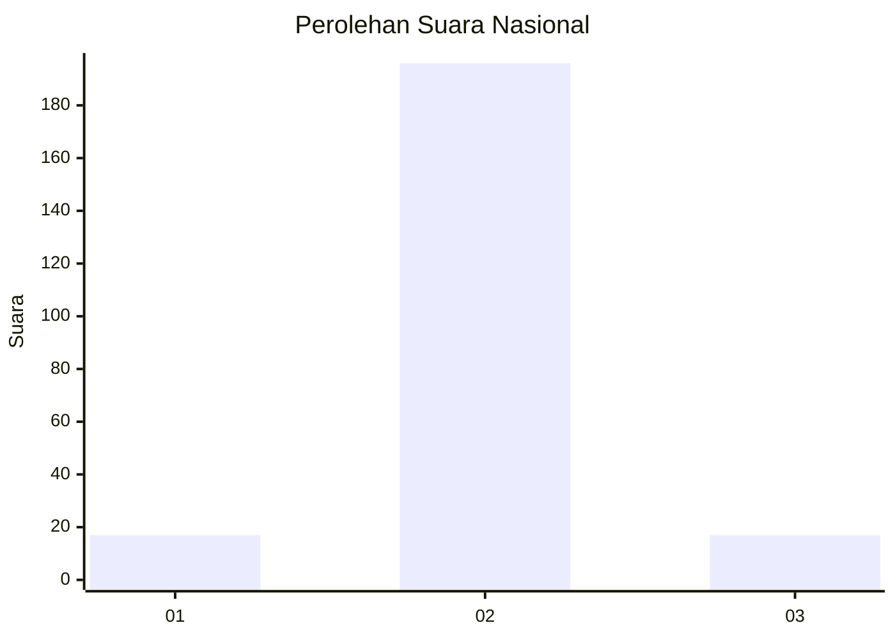
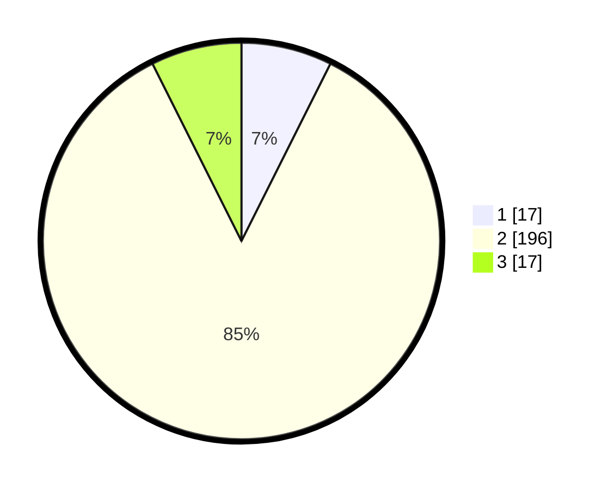

# Hasil

## Grafik

## Tabel

| No. | Nama Paslon    | Suara | Suara (raw) | Persentase |
|:--- |:-------------- | -----:| -----------:| ----------:|
| 1   | ANIES MUHAIMIN | 17    | [17][p-1]   | 7,39       |
| 2   | PRABOWO GIBRAN | 196   | [196][p-2]  | 85,22      |
| 3   | GANJAR MAHFUD  | 17    | [17][p-3]   | 7,39       |

[p-1]: https://github.com/gigit-pemilu/pemilu-2024/blob/main/pilpres/hitung-suara/sub/91-papua/sub/71-kota-jayapura/sub/01-jayapura-utara/sub/1001-gurabesi/sub/044-tps/sub/paslon-1.txt
[p-2]: https://github.com/gigit-pemilu/pemilu-2024/blob/main/pilpres/hitung-suara/sub/91-papua/sub/71-kota-jayapura/sub/01-jayapura-utara/sub/1001-gurabesi/sub/044-tps/sub/paslon-2.txt
[p-3]: https://github.com/gigit-pemilu/pemilu-2024/blob/main/pilpres/hitung-suara/sub/91-papua/sub/71-kota-jayapura/sub/01-jayapura-utara/sub/1001-gurabesi/sub/044-tps/sub/paslon-3.txt

## Foto C Plano

https://sirekap-obj-formc.kpu.go.id/e2d6/pemilu/ppwp/91/71/01/10/01/9171011001044-20240215-021138--ddc31161-83d7-44b5-ac78-fb825f14c1b5.jpg

https://sirekap-obj-formc.kpu.go.id/e2d6/pemilu/ppwp/91/71/01/10/01/9171011001044-20240215-021311--04d58b27-2a94-4872-bb4a-f6951e284715.jpg

https://sirekap-obj-formc.kpu.go.id/e2d6/pemilu/ppwp/91/71/01/10/01/9171011001044-20240215-021420--d9eab6a8-f1bf-444b-b292-47f20070ba4f.jpg

## Metadata

| Key        | Value               |
| ---------- | ------------------- |
| Time Stamp | 2024-02-24 22:31:28 |

