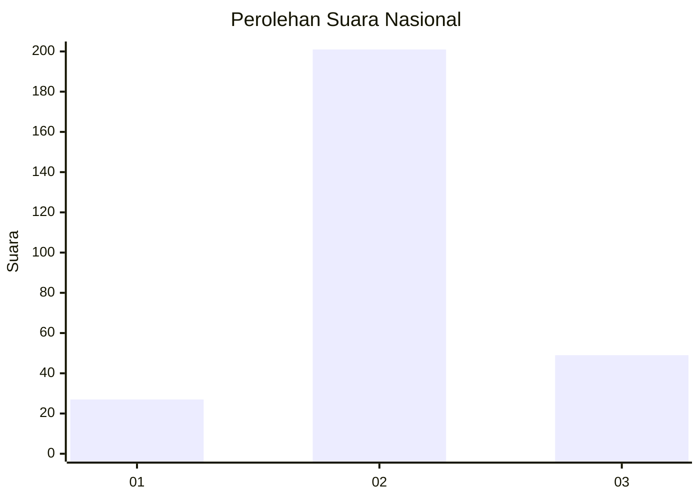
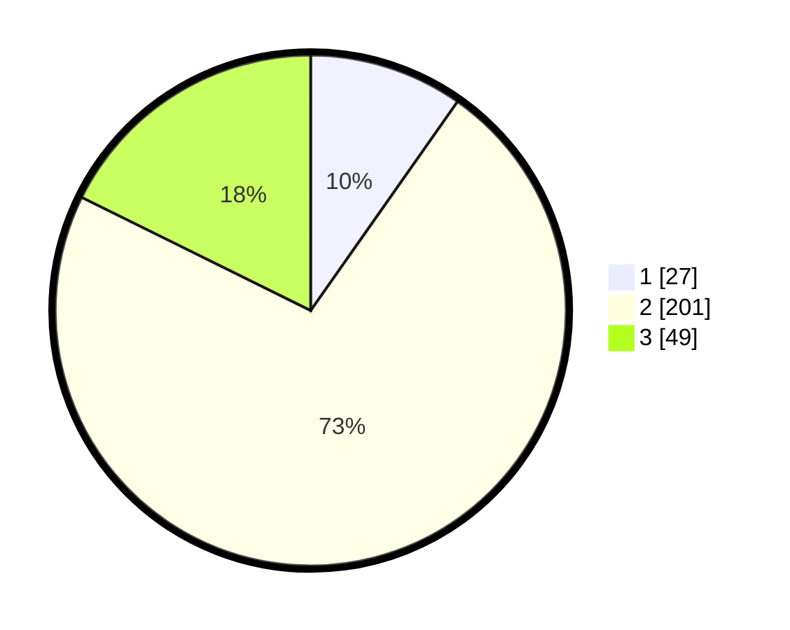

# Hasil

## Grafik

## Tabel

| No. | Nama Paslon    | Suara | Suara (raw) | Persentase |
|:--- |:-------------- | -----:| -----------:| ----------:|
| 1   | ANIES MUHAIMIN | 27    | [27][p-1]   | 9,75       |
| 2   | PRABOWO GIBRAN | 201   | [201][p-2]  | 72,56      |
| 3   | GANJAR MAHFUD  | 49    | [49][p-3]   | 17,69      |

[p-1]: https://github.com/gigit-pemilu/pemilu-2024/blob/main/pilpres/hitung-suara/sub/91-papua/sub/71-kota-jayapura/sub/01-jayapura-utara/sub/1001-gurabesi/sub/045-tps/sub/paslon-1.txt
[p-2]: https://github.com/gigit-pemilu/pemilu-2024/blob/main/pilpres/hitung-suara/sub/91-papua/sub/71-kota-jayapura/sub/01-jayapura-utara/sub/1001-gurabesi/sub/045-tps/sub/paslon-2.txt
[p-3]: https://github.com/gigit-pemilu/pemilu-2024/blob/main/pilpres/hitung-suara/sub/91-papua/sub/71-kota-jayapura/sub/01-jayapura-utara/sub/1001-gurabesi/sub/045-tps/sub/paslon-3.txt

## Foto C Plano

https://sirekap-obj-formc.kpu.go.id/52b9/pemilu/ppwp/91/71/01/10/01/9171011001045-20240214-234105--2efe9d66-7d2b-48cf-a1f6-480ca98d68b9.jpg

https://sirekap-obj-formc.kpu.go.id/52b9/pemilu/ppwp/91/71/01/10/01/9171011001045-20240214-234303--649dbfa9-85ec-44e2-a827-7bab4aad5bab.jpg

https://sirekap-obj-formc.kpu.go.id/52b9/pemilu/ppwp/91/71/01/10/01/9171011001045-20240214-234516--f184cc42-4f06-4f3f-ac3a-7d22fd9a05d2.jpg

## Metadata

| Key        | Value               |
| ---------- | ------------------- |
| Time Stamp | 2024-02-24 22:31:28 |

