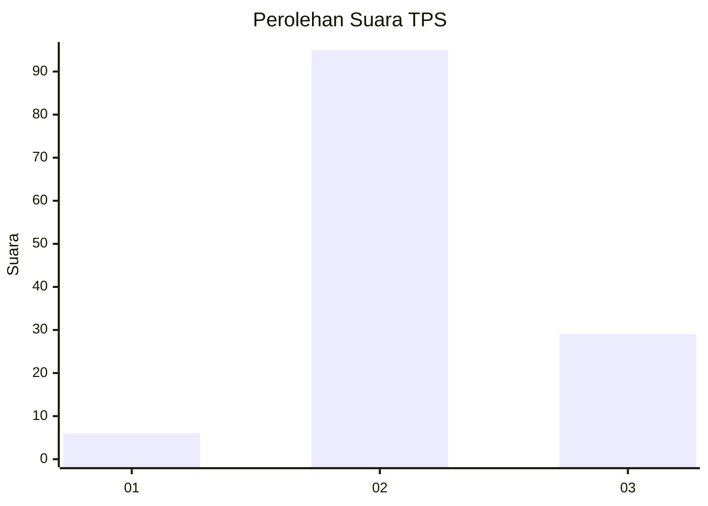
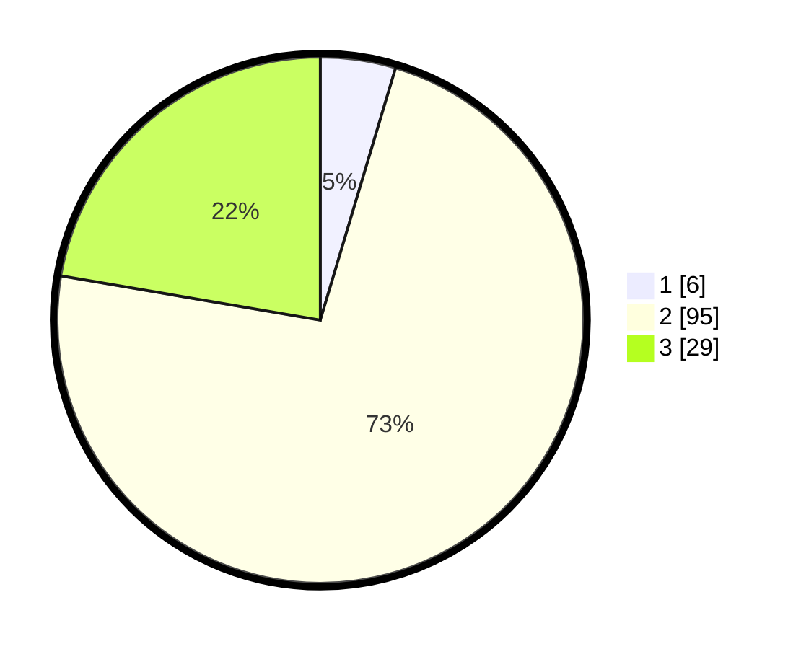

# Hasil

## Grafik

## Tabel

| No. | Nama Paslon    | Suara | Suara (raw) | Persentase |
|:--- |:-------------- | -----:| -----------:| ----------:|
| 1   | ANIES MUHAIMIN | 6     | [6][p-1]    | 4,62       |
| 2   | PRABOWO GIBRAN | 95    | [95][p-2]   | 73,08      |
| 3   | GANJAR MAHFUD  | 29    | [29][p-3]   | 22,31      |

[p-1]: https://github.com/gigit-pemilu/pemilu-2024-91-papua/blob/main/pilpres/hitung-suara/sub/91-papua/sub/71-kota-jayapura/sub/01-jayapura-utara/sub/1002-bayangkara/sub/001-tps/sub/paslon-1.txt
[p-2]: https://github.com/gigit-pemilu/pemilu-2024-91-papua/blob/main/pilpres/hitung-suara/sub/91-papua/sub/71-kota-jayapura/sub/01-jayapura-utara/sub/1002-bayangkara/sub/001-tps/sub/paslon-2.txt
[p-3]: https://github.com/gigit-pemilu/pemilu-2024-91-papua/blob/main/pilpres/hitung-suara/sub/91-papua/sub/71-kota-jayapura/sub/01-jayapura-utara/sub/1002-bayangkara/sub/001-tps/sub/paslon-3.txt

## Foto C Plano

https://sirekap-obj-formc.kpu.go.id/858b/pemilu/ppwp/91/71/01/10/02/9171011002001-20240215-004554--388e2587-737a-473a-a351-e64ce61af77b.jpg

https://sirekap-obj-formc.kpu.go.id/858b/pemilu/ppwp/91/71/01/10/02/9171011002001-20240215-004657--7647597f-0937-416a-9302-6f6aaaaf3dbf.jpg

https://sirekap-obj-formc.kpu.go.id/858b/pemilu/ppwp/91/71/01/10/02/9171011002001-20240215-004800--19be872b-656f-4730-ae06-31f1b4727587.jpg

## Metadata

| Key        | Value               |
| ---------- | ------------------- |
| Time Stamp | 2024-02-16 08:30:27 |

