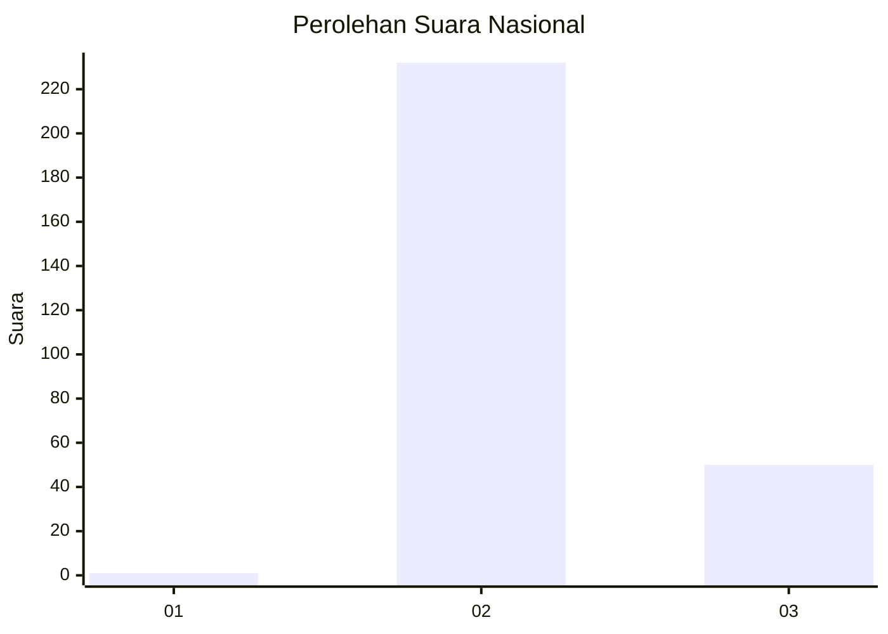
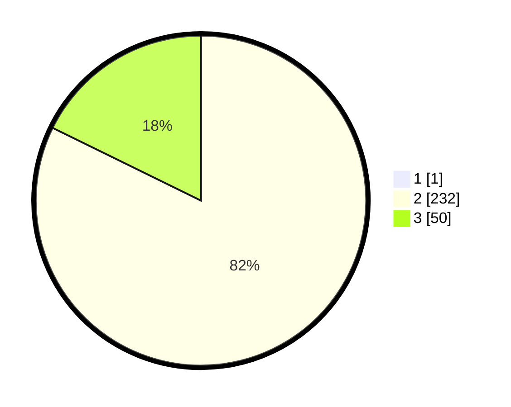

# Hasil

## Grafik

## Tabel

| No. | Nama Paslon    | Suara | Suara (raw) | Persentase |
|:--- |:-------------- | -----:| -----------:| ----------:|
| 1   | ANIES MUHAIMIN | 1     | [1][p-1]    | 0,35       |
| 2   | PRABOWO GIBRAN | 232   | [232][p-2]  | 81,98      |
| 3   | GANJAR MAHFUD  | 50    | [50][p-3]   | 17,67      |

[p-1]: https://github.com/gigit-pemilu/pemilu-2024/blob/main/pilpres/hitung-suara/sub/91-papua/sub/71-kota-jayapura/sub/01-jayapura-utara/sub/1002-bayangkara/sub/024-tps/sub/paslon-1.txt
[p-2]: https://github.com/gigit-pemilu/pemilu-2024/blob/main/pilpres/hitung-suara/sub/91-papua/sub/71-kota-jayapura/sub/01-jayapura-utara/sub/1002-bayangkara/sub/024-tps/sub/paslon-2.txt
[p-3]: https://github.com/gigit-pemilu/pemilu-2024/blob/main/pilpres/hitung-suara/sub/91-papua/sub/71-kota-jayapura/sub/01-jayapura-utara/sub/1002-bayangkara/sub/024-tps/sub/paslon-3.txt

## Foto C Plano

https://sirekap-obj-formc.kpu.go.id/bd9a/pemilu/ppwp/91/71/01/10/02/9171011002024-20240215-023640--be705985-0860-4725-b85d-d707608709a2.jpg

https://sirekap-obj-formc.kpu.go.id/bd9a/pemilu/ppwp/91/71/01/10/02/9171011002024-20240215-023901--98f7be6d-acce-418e-a59a-dee0943da2c2.jpg

https://sirekap-obj-formc.kpu.go.id/bd9a/pemilu/ppwp/91/71/01/10/02/9171011002024-20240215-024312--be95b2ac-b87f-4a44-b99c-9db2dd8003e5.jpg

## Metadata

| Key        | Value               |
| ---------- | ------------------- |
| Time Stamp | 2024-02-25 00:00:00 |

