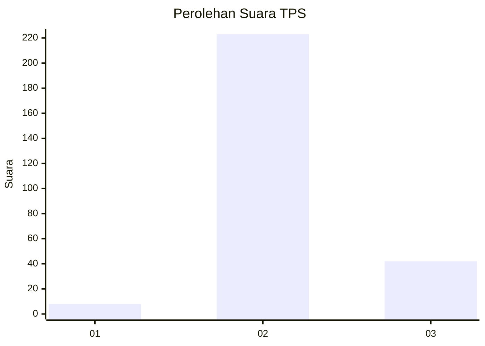
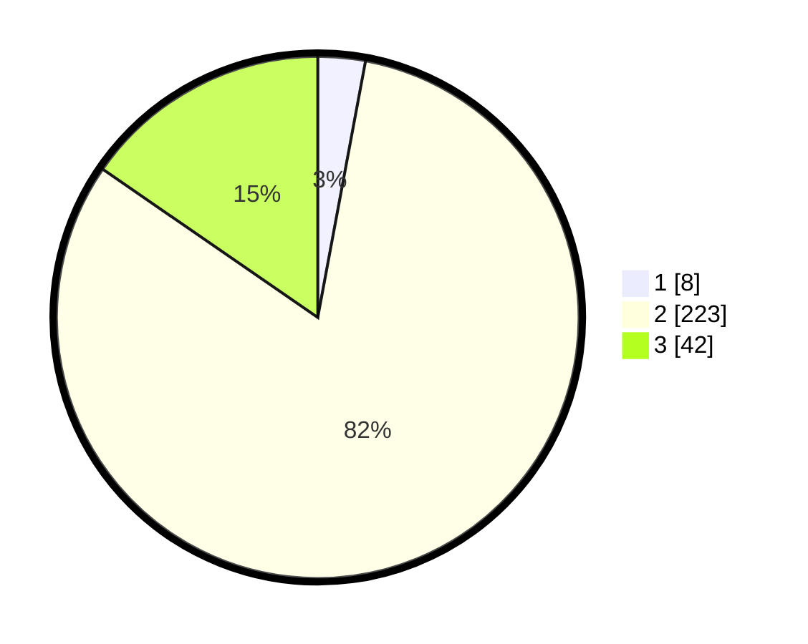

# Hasil

## Grafik

## Tabel

| No. | Nama Paslon    | Suara | Suara (raw) | Persentase |
|:--- |:-------------- | -----:| -----------:| ----------:|
| 1   | ANIES MUHAIMIN | 8     | [8][p-1]    | 2,93       |
| 2   | PRABOWO GIBRAN | 223   | [223][p-2]  | 81,68      |
| 3   | GANJAR MAHFUD  | 42    | [42][p-3]   | 15,38      |

[p-1]: https://github.com/gigit-pemilu/pemilu-2024-91-papua/blob/main/pilpres/hitung-suara/sub/91-papua/sub/71-kota-jayapura/sub/01-jayapura-utara/sub/1002-bayangkara/sub/039-tps/sub/paslon-1.txt
[p-2]: https://github.com/gigit-pemilu/pemilu-2024-91-papua/blob/main/pilpres/hitung-suara/sub/91-papua/sub/71-kota-jayapura/sub/01-jayapura-utara/sub/1002-bayangkara/sub/039-tps/sub/paslon-2.txt
[p-3]: https://github.com/gigit-pemilu/pemilu-2024-91-papua/blob/main/pilpres/hitung-suara/sub/91-papua/sub/71-kota-jayapura/sub/01-jayapura-utara/sub/1002-bayangkara/sub/039-tps/sub/paslon-3.txt

## Foto C Plano

https://sirekap-obj-formc.kpu.go.id/0511/pemilu/ppwp/91/71/01/10/02/9171011002039-20240214-190438--f85f3a67-8d9b-442c-83d6-81a38b47c901.jpg

https://sirekap-obj-formc.kpu.go.id/0511/pemilu/ppwp/91/71/01/10/02/9171011002039-20240214-185420--1e718a88-2f84-4f56-80e4-ac2346b49091.jpg

https://sirekap-obj-formc.kpu.go.id/0511/pemilu/ppwp/91/71/01/10/02/9171011002039-20240214-190005--b2308d9e-ea10-4935-aae3-1799a7f4b8c0.jpg

## Metadata

| Key        | Value               |
| ---------- | ------------------- |
| Time Stamp | 2024-02-25 00:00:00 |

