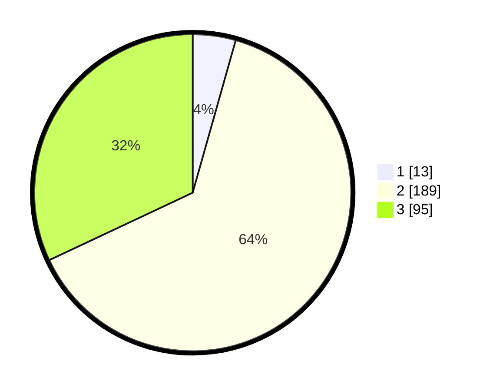

# Hasil

## Grafik

## Tabel

| No. | Nama Paslon    | Suara | Suara (raw) | Persentase |
|:--- |:-------------- | -----:| -----------:| ----------:|
| 1   | ANIES MUHAIMIN | 13    | [13][p-1]   | 4,38       |
| 2   | PRABOWO GIBRAN | 189   | [189][p-2]  | 63,64      |
| 3   | GANJAR MAHFUD  | 95    | [95][p-3]   | 31,99      |

[p-1]: https://github.com/gigit-pemilu/pemilu-2024-91-papua/blob/main/pilpres/hitung-suara/sub/91-papua/sub/71-kota-jayapura/sub/01-jayapura-utara/sub/1003-trikora/sub/013-tps/sub/paslon-1.txt
[p-2]: https://github.com/gigit-pemilu/pemilu-2024-91-papua/blob/main/pilpres/hitung-suara/sub/91-papua/sub/71-kota-jayapura/sub/01-jayapura-utara/sub/1003-trikora/sub/013-tps/sub/paslon-2.txt
[p-3]: https://github.com/gigit-pemilu/pemilu-2024-91-papua/blob/main/pilpres/hitung-suara/sub/91-papua/sub/71-kota-jayapura/sub/01-jayapura-utara/sub/1003-trikora/sub/013-tps/sub/paslon-3.txt

## Foto C Plano

https://sirekap-obj-formc.kpu.go.id/4ebc/pemilu/ppwp/91/71/01/10/03/9171011003013-20240215-003343--678f21a7-fae1-4a48-be5a-3c276288a906.jpg

https://sirekap-obj-formc.kpu.go.id/4ebc/pemilu/ppwp/91/71/01/10/03/9171011003013-20240215-003555--f496fe29-1198-4432-9ff4-b401935e88e6.jpg

https://sirekap-obj-formc.kpu.go.id/4ebc/pemilu/ppwp/91/71/01/10/03/9171011003013-20240215-003732--9e116600-9f20-421e-bd79-2b0342e892db.jpg

## Metadata

| Key        | Value               |
| ---------- | ------------------- |
| Time Stamp | 2024-02-25 00:00:00 |

