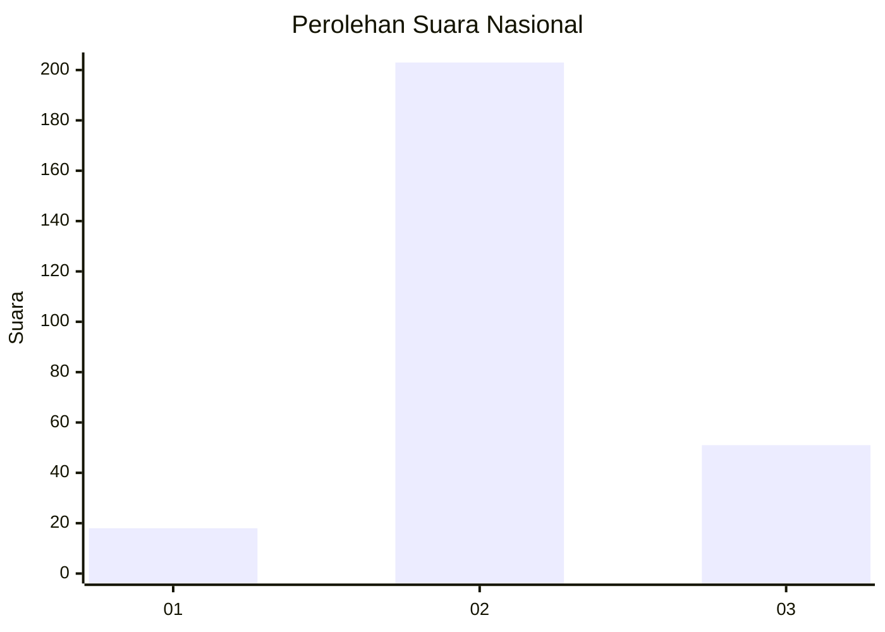
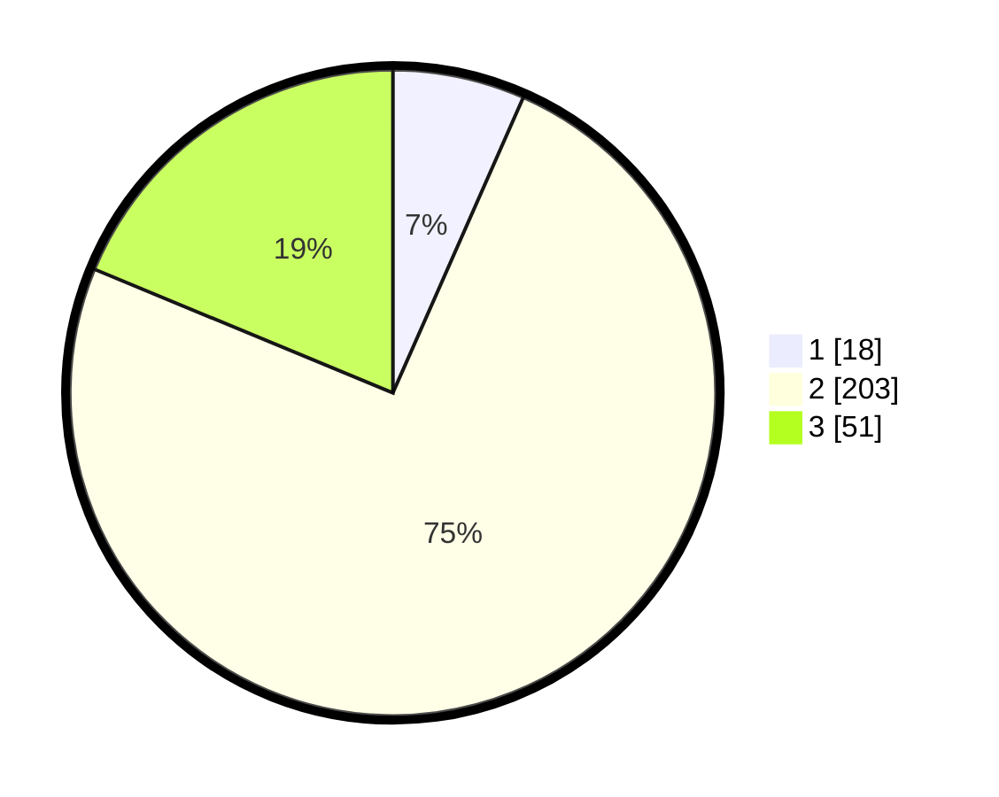

# Hasil

## Grafik

## Tabel

| No. | Nama Paslon    | Suara | Suara (raw) | Persentase |
|:--- |:-------------- | -----:| -----------:| ----------:|
| 1   | ANIES MUHAIMIN | 18    | [18][p-1]   | 6,62       |
| 2   | PRABOWO GIBRAN | 203   | [203][p-2]  | 74,63      |
| 3   | GANJAR MAHFUD  | 51    | [51][p-3]   | 18,75      |

[p-1]: https://github.com/gigit-pemilu/pemilu-2024/blob/main/pilpres/hitung-suara/sub/91-papua/sub/71-kota-jayapura/sub/01-jayapura-utara/sub/1004-imbi/sub/004-tps/sub/paslon-1.txt
[p-2]: https://github.com/gigit-pemilu/pemilu-2024/blob/main/pilpres/hitung-suara/sub/91-papua/sub/71-kota-jayapura/sub/01-jayapura-utara/sub/1004-imbi/sub/004-tps/sub/paslon-2.txt
[p-3]: https://github.com/gigit-pemilu/pemilu-2024/blob/main/pilpres/hitung-suara/sub/91-papua/sub/71-kota-jayapura/sub/01-jayapura-utara/sub/1004-imbi/sub/004-tps/sub/paslon-3.txt

## Foto C Plano

https://sirekap-obj-formc.kpu.go.id/fcb6/pemilu/ppwp/91/71/01/10/04/9171011004004-20240215-121043--ceb5d173-6f44-441f-8f8f-a7a7d4224a43.jpg

https://sirekap-obj-formc.kpu.go.id/fcb6/pemilu/ppwp/91/71/01/10/04/9171011004004-20240215-121133--5271ac45-6035-4e9a-b1a7-942a064678db.jpg

https://sirekap-obj-formc.kpu.go.id/fcb6/pemilu/ppwp/91/71/01/10/04/9171011004004-20240215-121246--fab6d859-f085-45e9-b552-3bc1699a627e.jpg

## Metadata

| Key        | Value               |
| ---------- | ------------------- |
| Time Stamp | 2024-02-16 08:30:27 |

