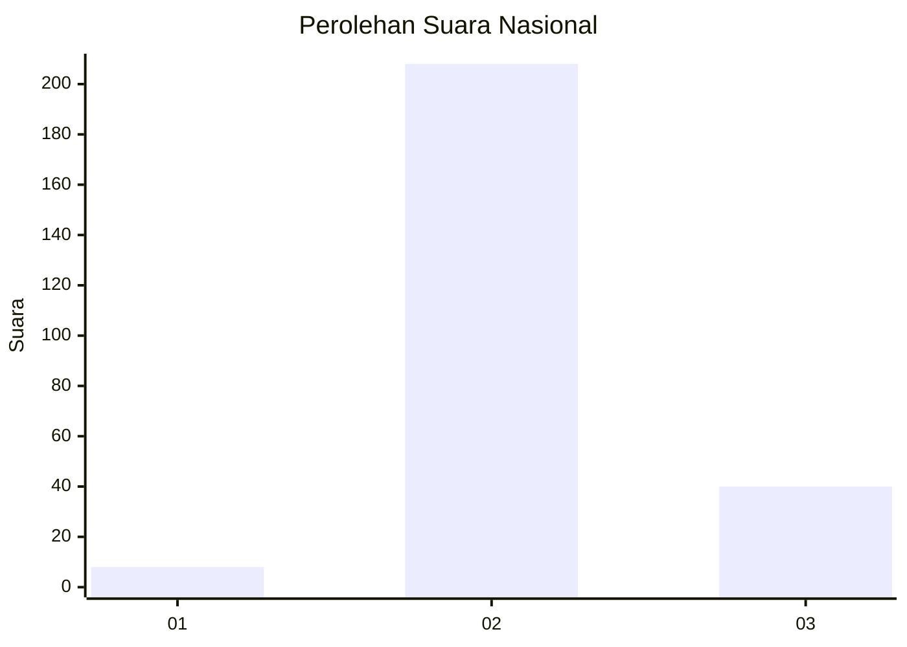
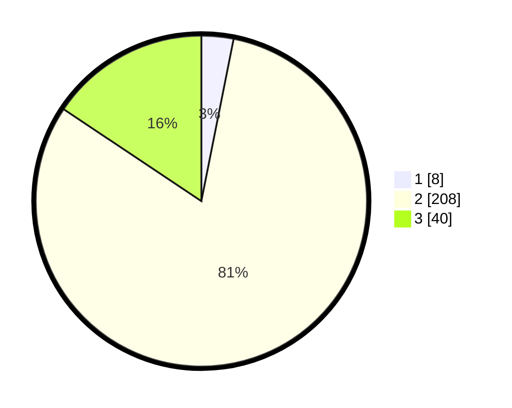

# Hasil

## Grafik

## Tabel

| No. | Nama Paslon    | Suara | Suara (raw) | Persentase |
|:--- |:-------------- | -----:| -----------:| ----------:|
| 1   | ANIES MUHAIMIN | 8     | [8][p-1]    | 3,13       |
| 2   | PRABOWO GIBRAN | 208   | [208][p-2]  | 81,25      |
| 3   | GANJAR MAHFUD  | 40    | [40][p-3]   | 15,63      |

[p-1]: https://github.com/gigit-pemilu/pemilu-2024/blob/main/pilpres/hitung-suara/sub/91-papua/sub/71-kota-jayapura/sub/01-jayapura-utara/sub/1004-imbi/sub/008-tps/sub/paslon-1.txt
[p-2]: https://github.com/gigit-pemilu/pemilu-2024/blob/main/pilpres/hitung-suara/sub/91-papua/sub/71-kota-jayapura/sub/01-jayapura-utara/sub/1004-imbi/sub/008-tps/sub/paslon-2.txt
[p-3]: https://github.com/gigit-pemilu/pemilu-2024/blob/main/pilpres/hitung-suara/sub/91-papua/sub/71-kota-jayapura/sub/01-jayapura-utara/sub/1004-imbi/sub/008-tps/sub/paslon-3.txt

## Foto C Plano

https://sirekap-obj-formc.kpu.go.id/6465/pemilu/ppwp/91/71/01/10/04/9171011004008-20240215-024758--7e5d7c99-2ecc-406c-9c20-a35600a9a834.jpg

https://sirekap-obj-formc.kpu.go.id/6465/pemilu/ppwp/91/71/01/10/04/9171011004008-20240215-025009--01182db0-befb-451e-b96e-d12080d39880.jpg

https://sirekap-obj-formc.kpu.go.id/6465/pemilu/ppwp/91/71/01/10/04/9171011004008-20240215-025208--ec9103d2-831b-484f-9446-3ae17a6f3169.jpg

## Metadata

| Key        | Value               |
| ---------- | ------------------- |
| Time Stamp | 2024-02-25 00:00:00 |

