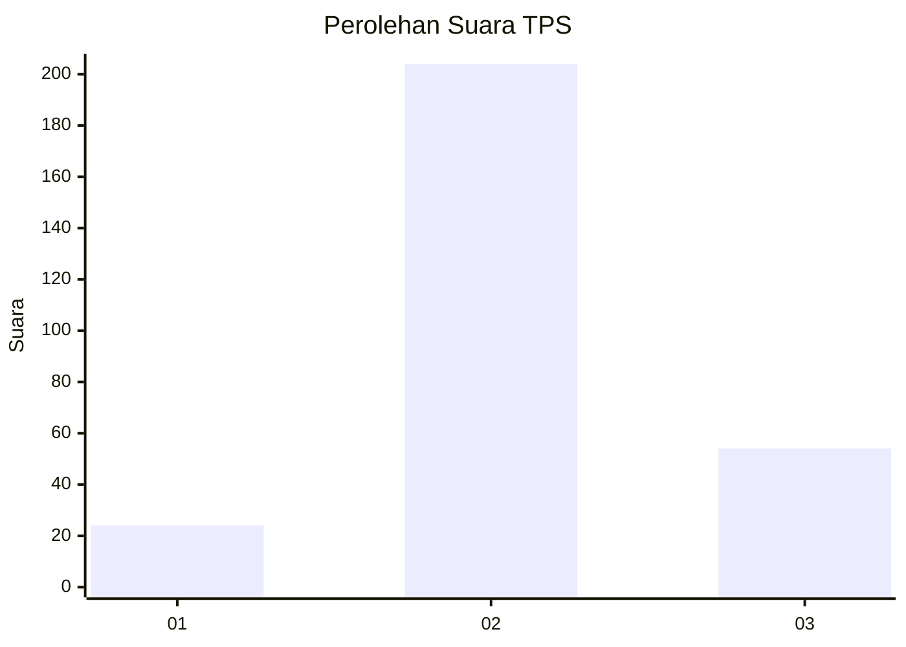
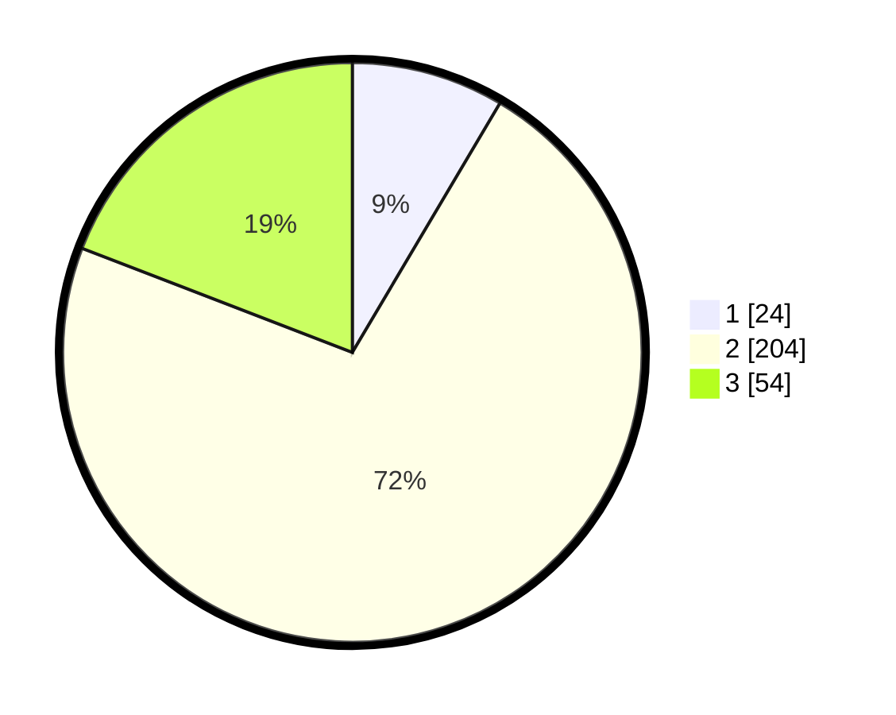

# Hasil

## Grafik

## Tabel

| No. | Nama Paslon    | Suara | Suara (raw) | Persentase |
|:--- |:-------------- | -----:| -----------:| ----------:|
| 1   | ANIES MUHAIMIN | 24    | [24][p-1]   | 8,51       |
| 2   | PRABOWO GIBRAN | 204   | [204][p-2]  | 72,34      |
| 3   | GANJAR MAHFUD  | 54    | [54][p-3]   | 19,15      |

[p-1]: https://github.com/gigit-pemilu/pemilu-2024-91-papua/blob/main/pilpres/hitung-suara/sub/91-papua/sub/71-kota-jayapura/sub/01-jayapura-utara/sub/1004-imbi/sub/021-tps/sub/paslon-1.txt
[p-2]: https://github.com/gigit-pemilu/pemilu-2024-91-papua/blob/main/pilpres/hitung-suara/sub/91-papua/sub/71-kota-jayapura/sub/01-jayapura-utara/sub/1004-imbi/sub/021-tps/sub/paslon-2.txt
[p-3]: https://github.com/gigit-pemilu/pemilu-2024-91-papua/blob/main/pilpres/hitung-suara/sub/91-papua/sub/71-kota-jayapura/sub/01-jayapura-utara/sub/1004-imbi/sub/021-tps/sub/paslon-3.txt

## Foto C Plano

https://sirekap-obj-formc.kpu.go.id/2453/pemilu/ppwp/91/71/01/10/04/9171011004021-20240215-032738--847c6e02-68c9-4678-a3f5-d2157c9f8040.jpg

https://sirekap-obj-formc.kpu.go.id/2453/pemilu/ppwp/91/71/01/10/04/9171011004021-20240215-034441--919402be-ac6e-4584-999d-598dd924a6ed.jpg

https://sirekap-obj-formc.kpu.go.id/2453/pemilu/ppwp/91/71/01/10/04/9171011004021-20240215-034802--fd8d59d5-499c-46b6-b2c7-487f1c41ecff.jpg

## Metadata

| Key        | Value               |
| ---------- | ------------------- |
| Time Stamp | 2024-02-15 17:30:25 |

