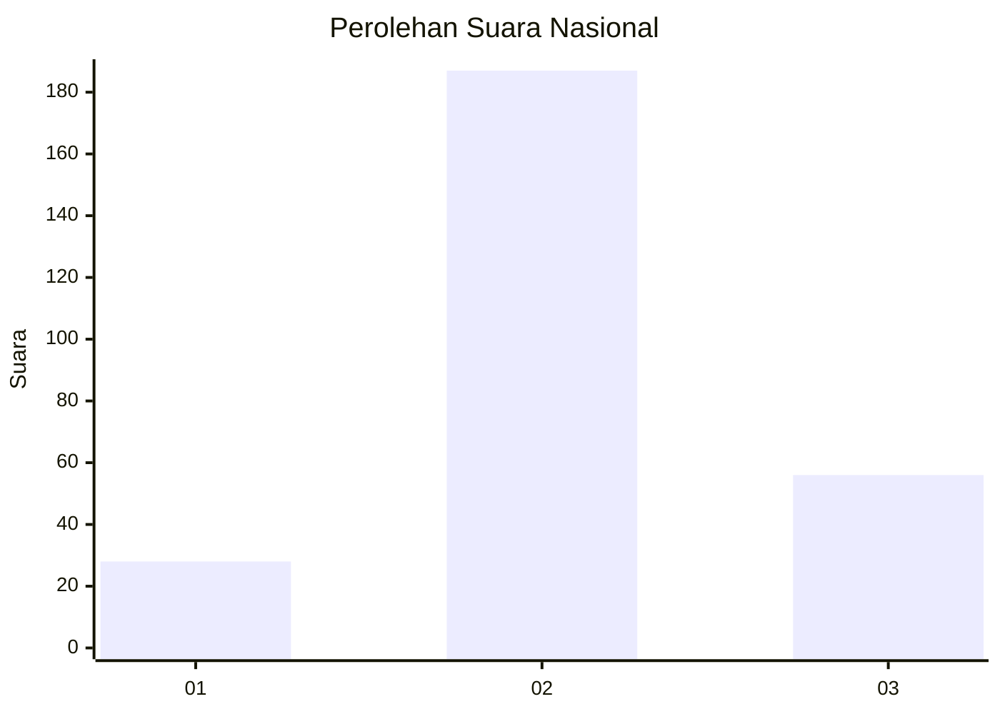
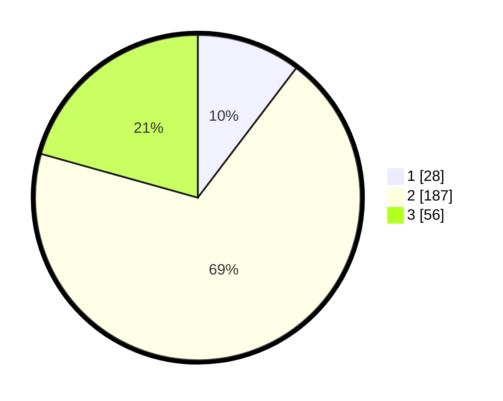

# Hasil

## Grafik

## Tabel

| No. | Nama Paslon    | Suara | Suara (raw) | Persentase |
|:--- |:-------------- | -----:| -----------:| ----------:|
| 1   | ANIES MUHAIMIN | 28    | [28][p-1]   | 10,33      |
| 2   | PRABOWO GIBRAN | 187   | [187][p-2]  | 69,00      |
| 3   | GANJAR MAHFUD  | 56    | [56][p-3]   | 20,66      |

[p-1]: https://github.com/gigit-pemilu/pemilu-2024/blob/main/pilpres/hitung-suara/sub/91-papua/sub/71-kota-jayapura/sub/01-jayapura-utara/sub/1004-imbi/sub/027-tps/sub/paslon-1.txt
[p-2]: https://github.com/gigit-pemilu/pemilu-2024/blob/main/pilpres/hitung-suara/sub/91-papua/sub/71-kota-jayapura/sub/01-jayapura-utara/sub/1004-imbi/sub/027-tps/sub/paslon-2.txt
[p-3]: https://github.com/gigit-pemilu/pemilu-2024/blob/main/pilpres/hitung-suara/sub/91-papua/sub/71-kota-jayapura/sub/01-jayapura-utara/sub/1004-imbi/sub/027-tps/sub/paslon-3.txt

## Foto C Plano

https://sirekap-obj-formc.kpu.go.id/93d2/pemilu/ppwp/91/71/01/10/04/9171011004027-20240215-093800--6c50a4e0-eae2-4636-84f2-6a7a725f31cb.jpg

https://sirekap-obj-formc.kpu.go.id/93d2/pemilu/ppwp/91/71/01/10/04/9171011004027-20240214-215912--da7cec80-79c6-4d70-958d-0eff58ad83aa.jpg

https://sirekap-obj-formc.kpu.go.id/93d2/pemilu/ppwp/91/71/01/10/04/9171011004027-20240215-094111--2bd77fb1-6b1a-47fb-833b-4a0feec3e1e3.jpg

## Metadata

| Key        | Value               |
| ---------- | ------------------- |
| Time Stamp | 2024-02-15 16:30:25 |

